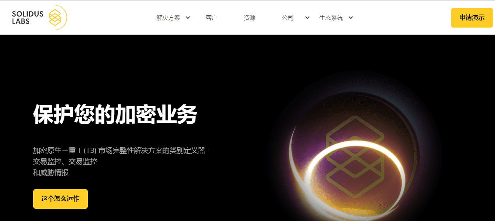
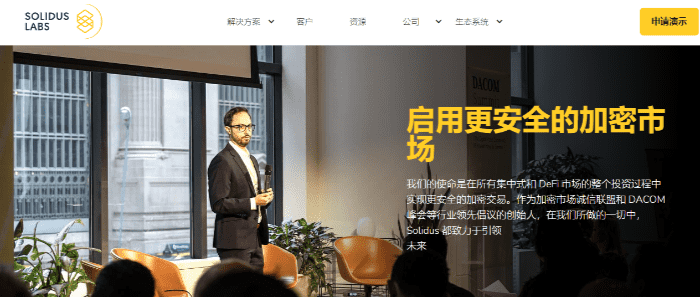
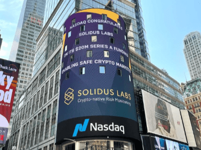

# 元宇宙市场监控平台推荐——Solidus Labs

元宇宙市场监控平台推荐——[Solidus Labs](https://www.metabd.cc/navigation/solidus-labs/)。

保护您的加密业务，加密原生三重 T (T3) 市场完整性解决方案的类别定义器-交易监控、交易监控和威胁情报。

[Solidus Labs](https://www.metabd.cc/navigation/solidus-labs/) 的同名 - “Solidus” - 是晚期罗马帝国的金本位币，一种创新铸造的硬币，使全球商业得以延续千年。

（网站页面截图）

**Solidus Labs介绍**

Solidus 市场监控平台，由前高盛 [Solidus Labs](https://www.metabd.cc/navigation/solidus-labs/) 金融技术工程师设计，利用机器学习技术帮助发现、解决、调查和报告数字资产交易中的市场操纵行为。

[Solidus Labs](https://www.metabd.cc/navigation/solidus-labs/)的使命是在所有中心化和 DeFi 市场的整个投资过程中实现更安全的加密交易。 作为加密市场完整性联盟和 DACOM 峰会等行业领先倡议的创始人，在我们所做的每一件事中，Solidus 都致力于引领未来的金融市场。

**公司，团队信息**

Asaf Meir、Praveen Kumar 和 Chen Arad——一个由前高盛工程师和网络安全专业人士组成的团队，于 2018 年创立了 Solidus Labs，以弥合加密货币与传统金融世界之间的监管、风险和合规性差距。

在该行业的早期，他们认为加密货币使金融服务更具包容性、透明性、流动性和效率的潜力将取决于降低其新风险的能力，但传统的风险系统是无效的。

他们着手建立第一个为数字资产量身定制的加密原生市场监控和风险监控中心。

总部设在纽约华尔街，在华盛顿特区、特拉维夫和伦敦设有办事处——今天，我们通过每天监控超过一万亿个事件，积极保护全球数百万零售和机构实体，继续致力于让每个加密市场更安全和每一天。

**[Solidus Labs](https://www.metabd.cc/navigation/solidus-labs/)的价值：我们所做的每一件事，都将我们的灵魂融入。**

