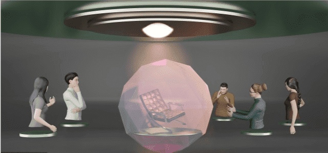
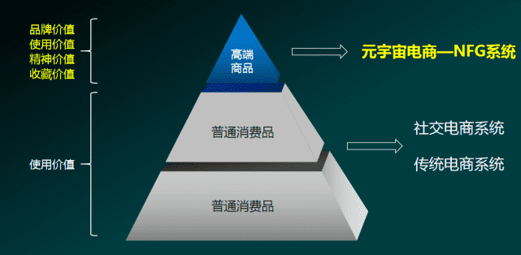
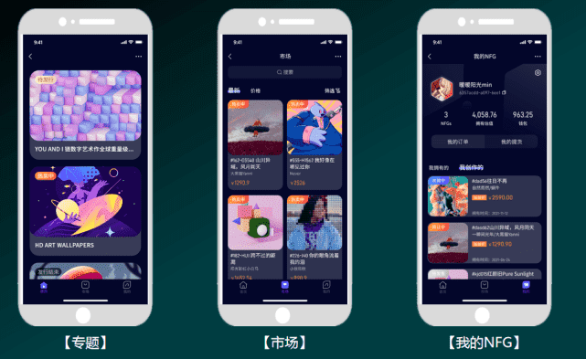
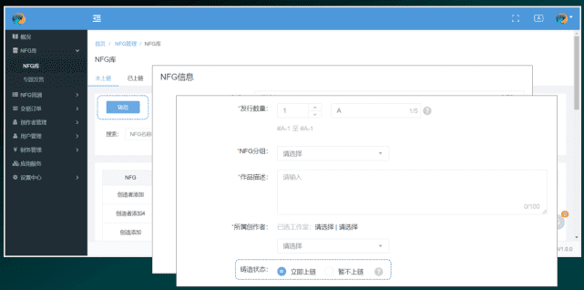

# 元宇宙电商-NFG系统，助力企业发行数字藏品

随着今年的全球软件开发大会在广州完美收官，本次主题围绕“数字化”、“云原生”、“国产化”三个关键词展开探讨和分享，并就实时互动技术实践、人工智能前沿应用、Web 3.0 基础设施等热议话题进行深度解析。

Web3.0时代，NF*是第一应该级别的场景。**元宇宙电商系统—NFG**是基于“元宇宙”理念下，以腾讯云区块*L技术、VR技术为基础，结合社交和电商零售，实现元宇宙的商业化应用销售系统，帮助企业品牌打造“非同质化商品（Non-Fungible Goods）“的交易、流通和溯源。简单理解就是其“非同质化”意味着每一个NFG都是独一无二、不可分割的，当一件作品被铸成NFG之后，这个作品拥有区块链上独一无二的标识。

**元宇宙电商-NFG**的初衷就是为产品溯源、为价值溯源、为信誉溯源。其特点是通过区块L技术赋予商品独一无二的且不可篡改的标识。商品在交易过程中即可完成确权。元宇宙混杂了种种的概念，同时又集合了众多的新技术。

**元宇宙电商-NFG**玩法：

在元宇宙框架下应用现有的成熟区块L、VR等互联网技术，赋能实体企业，解决高端商品交易的溯源难题，实现数字经济与实体经济的深度融合，VR技术为基础，结合社交和电商零售帮助企业品牌打造“非同质化商品”的交易、流通和溯源。

**元宇宙电商-NFG系统的作用：**

应用现有成熟的区块*L、VR等互联网技术，赋能实体企业

解决高端商品交易的溯源难题，用时间和权益、重构品牌生态

最终实现数字经济与实体经济的深度融合！

**元宇宙电商-NFG系统溯源特点：**

通过区块*L技术赋予商品独一无二且不可篡改的标识，商品在交易过程中即可完成确权；一旦经过确权上链，上链的信息在后续将无法篡改，并且链上每一笔交易的节点都能有效跟踪流通，公开透明，让伪品无所遁形，大大降低鉴别成本；可以对商品、拥有者以及流通价值进行全方位有效溯源，实现真正的防伪。

NFG系统技术已经不仅仅局限于艺术品了，在很多古玩、奢侈品等领域进行赋能，藏品元数据跟发行、铸造、交易等信息均可公开验证，助力于企业发行数字藏品，提高IP影响力。每一个用户的所有权NFG信息都公开透明，能更好的提升藏品交易与流动性。基于链上智能合约无法被篡改，对藏品进行数字化溯源，交易方的权益都受保障，元数据及交易基于加密区块存储，交易过程中更不会被操纵或篡改。

**元宇宙电商-NFG系统解决哪些需求？**

1.首先要有一套NFG电商系统，它可以为你的每一个商品铸成唯一的NFG序列号（你可以把它理解为唯一的“身份证”）；

2.假设现在你手上有一个古董/名画，你可以用这个NFT电商系统给他生成一个专属NFG，独一无二的存在价值 然后就可以发布到平台交易了；

3.用户在平台（手机端）看到这个NFT古董/名画，有两个选择，一是直接购买，可以提货，平台寄送，放家里收藏；二是买了之后直接在这个平台上挂售出去，如果有其他人买了的话，那平台和这个卖家都能盈利（如果是创作者发布的古董，那意味三方都可以赚钱）；

4.只要在这个平台流通，就会产生价值，流通即价值！

本文意在分享，如需完整方案，软件开发，模式策划，需要了解更多相关信息可以多多关注。
