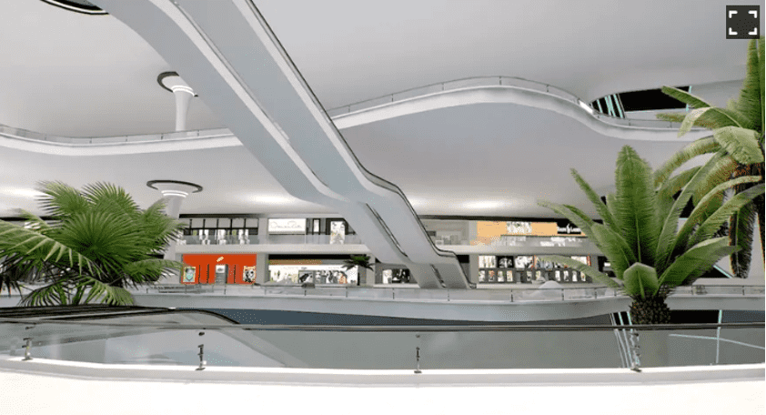
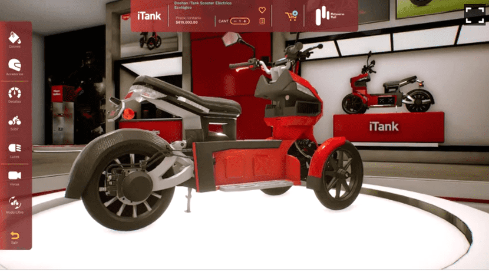
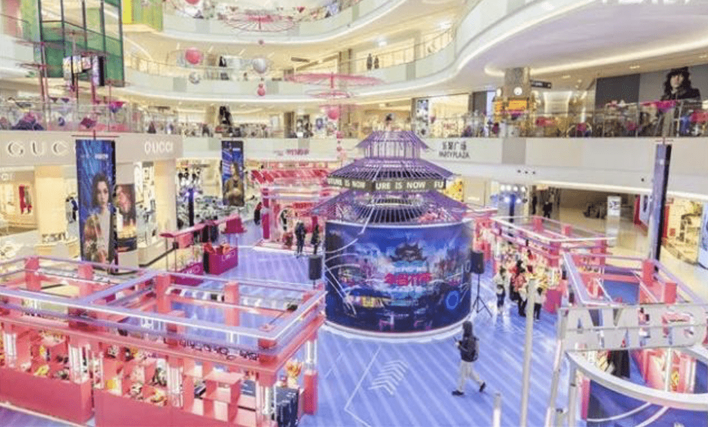
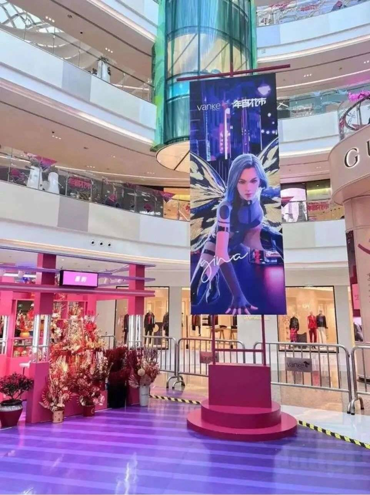
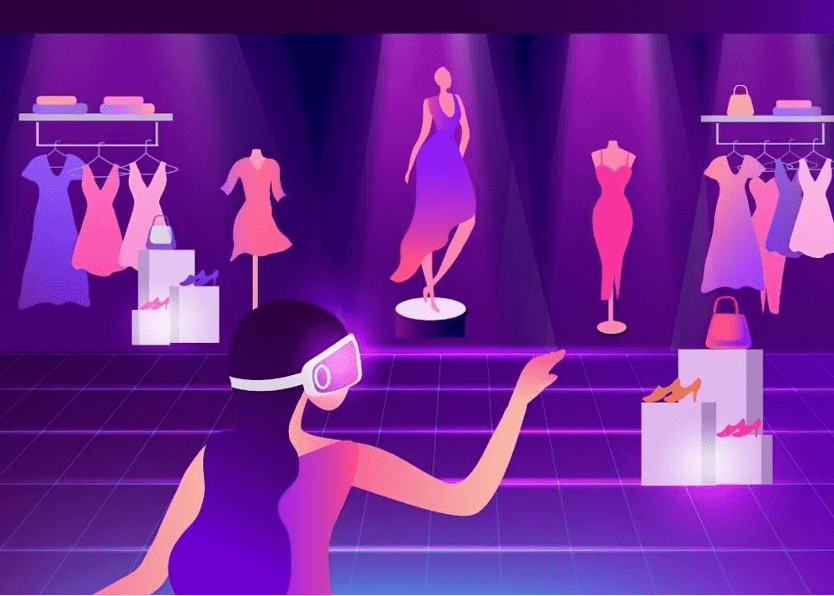
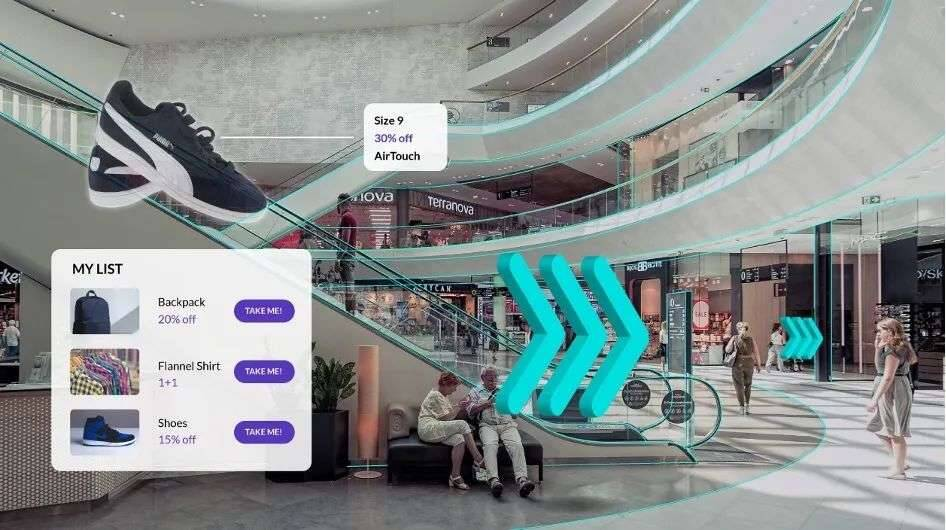

# 元宇宙购物中心的N种打开方式

不知从何时开始，人们去商场不再是单纯去“买买买”，也不知从何时开始，商场的概念逐渐变成了购物中心，成为了人们去逛街、看电影、吃饭、遛娃、喝下午茶的目的地。

如今，作为大众线下社交生活重要“基地”的购物中心，依然在不断进化中，商业地产品牌也越来越重视数字化升级，以数字技术为基础构建场景体验，成为购物中心正在发展的趋势与未来要争夺的风口。

## **阿根廷：虚拟购物中心**

想象一下，如同玩游戏《我的世界》，和朋友在元宇宙逼真的虚拟商店里闲逛和消费，会是什么样的感受？

阿根廷就打造了一座沉浸式虚拟购物中心。通过3D技术，虚拟购物中心还原了现实的购物场景，人们可以在这里逛街，选择心仪的商品，通过线上支付方式下单，实物商品就会送到家中。

阿根廷虚拟购物中心

与传统的线上购物相比，虚拟购物中心提供的产品信息可以更加立体地展现在消费者面前，该购物中心设计师Koglot 介绍，借助数字孪生技术，所有实物商品都1比1复刻成虚拟商品，如果您想买一辆摩托车，不仅可以多角度观察它，还可以测试车灯、喇叭，甚至可以发现在实体店都无法注意到的细节。同时，虚拟销售人员还会提供各种购买建议，这是一种完全实时的互动购物体验。

据悉，这座虚拟购物中心计划于今年招揽10家国际品牌入驻，每个品牌需支付1万美元入驻费用，用于打造虚拟店铺和产品，购物中心的运营方还会根据品牌的推广计划向其推送潜在购买客户。

根据当地的市场数据推算，虚拟购物中心的商品购买率在实体店和线上购物之间，但成本却远低于实体店，覆盖率与在线购物持平。

除了纯粹的虚拟购物，元宇宙也在通过虚实结合的方式推动消费与社交回归线下，为传统商业、场景、体验带来全新升级。

## 成都仁和新城：虚拟互动拉近与用户距离

购物中心的核心是线下场景，越来越多的购物中心通过元宇宙将购物之旅转变为愉快的外出活动。

成都仁和新城

成都仁和新城b

成都仁和新城的中庭成为了消费者打卡的圣地，这里有一块特殊的LED大屏，消费者可以跟屏幕里的动画进行实时互动。

成都仁和新城

当憨态可掬的虚拟动物与现实的人一起出现在屏幕上，给人一种走进动物园的错觉，新奇的体验打造了一个全新的游、购、娱场景。

## **上海七宝万科广场：融合虚拟偶像的线下活动**

上海七宝万科广场在自创新春IP活动——第六届年宵花市中，联手虚拟偶像GINA，打造了首个“商业地产+元宇宙+AI数字虚拟偶像”的线下场景。

上海七宝万科广场

在由传统新春元素布置的市集中心，设置了赛博朋克风格巨大屏幕，以等比身高打造的裸眼3D版GINA为人们带来特别表演，传统与超现实风格的交融，碰撞出了全新的视觉感受。

上海七宝万科广场

此外，在声波祈福站，顾客还可以写下新年愿望，折成千纸鹤放入装置中，虚拟偶像GINA会作为使者将祝福传送至元宇宙空间。

既注重传统，也不乏积极的创新尝试，这种全新构建的新颖场景，对传统实体商业实现在更广泛消费群体中的“破圈”，无疑十分有利。

## **构建更高效“人、货、场”**

“元宇宙”带来的技术赋能，让空间的意义不再局限在“物理空间”，而是“物理空间”和“虚拟空间”结合，为购物中心的创新带来了无限延展性，为商业破局存量时代提供了全新思路。

WGSN Insights 的高级策略师 Cassandra Napoli 表示，虚拟世界可能需要一段时间才能彻底改变我们的工作、娱乐、交流和学习方式。单购物中心和零售商现在就应该考虑进入元宇宙的“切入点”，而“人、货、场”就是很好的切入点。

“人”，商业元宇宙为每一位消费者构建出一套可沉浸式交互的个人商业场景。以智能导览导购为基础，汇聚公私域流量，融入娱乐、社交、直播等场景，实现面向个人的数字空间体验聚合和场景式需求触发。消费场景数字化将带来用户数字化，进而沉淀更多数字资产，驱动用户增值，提升复购和粘性。

“货”，商业元宇宙也带来了产品服务陈列、营销的全新升级。消费者购买决策依据之一是商品信息，越详尽的信息越接近真实的购买体验。用数字模拟真实的最佳手段就是再造一个真实：由3D渲染引擎和智能感知带来的全真性与交互性，将大幅提升商品信息质量和丰富度，为消费者带来差异化、全感官的体验。

“场”，元宇宙拓展了商业场景的时空体验，通过线上线下虚实融合把数字世界的效率、便捷与线下场景的体验、时效在同一个场景内打通，突破物理空间限制，将传统商业空间运营升级为数字空间多维运营，持续提升运营效率。

人货场的有机结合，让虚拟购物中心与现实世界一样，也可以成为让人们相聚、社交、娱乐的场所。

