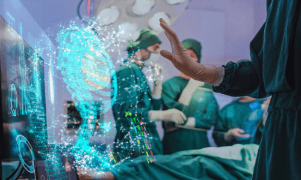

# 如何看待元宇宙医疗五大场景爆发前夜

元宇宙虚拟世界与真实世界交互共生将经历三个发展阶段：真实世界的仿真和数字化；全面数字孪生化；全行业全生命周期的元宇宙化。

元宇宙医疗是最先爆发的行业或领域之一。未来元宇宙将改变当前医院连接模式，同时也将彻底改变目前就医逻辑以及医患关系。可能在不远的未来，人们触及元宇宙医疗的获得感，将比元宇宙娱乐来得更为真实与迫切。

元宇宙作为引爆科技前沿的颠覆性探索方向，其迭代将经历三个阶段。在众多方向中，元宇宙医疗将率先成为影响人们生活的领域之一，在个人应用、家庭、社区中心、第三方检测中心、医院五大场景下，元宇宙医疗激发出的新赛道、新产业链、新服务链有望迸发出创新活力，将重构患者与医院的关系，重塑下一代数字医疗。

元宇宙带来新一轮技术革命浪潮，正引发科技界、投资界、产业界乃至更广泛领域人士的关注，元宇宙所构建的虚拟与现实所交互的世界会如何改变我们的生活？

“世界必然会变得不同，但变化必须基于当今的世界。”彼得·蒂尔在《从0到1》中这样表达科技与创新的逻辑。

在元宇宙概念火热以及诸多政策利好加持的背后，元宇宙所引发的文娱、医疗、教育、工业生产等行业领域的新秩序、新模式、新消费理念的想象与重构，当下需要用理性的视角，来洞察元宇宙带来的颠覆与美好。

**元宇宙迭代进化的“三个阶段”**

元宇宙自2021年爆火之后，涌现出非常多且具有创新力的产品，目前正从概念加速进入产品阶段，虚拟现实、人工智能、区块链、云计算、数字孪生等新技术，将进一步赋能并重新定义未来世界。

元宇宙一方面加速上述前沿技术的应用，推进从概念向底层核心技术的研发与演化，另一方面带来在感知交互层面的新型设备与虚拟场景的打造，促进虚拟现实世界共生成为可能。

元宇宙将为世界带来哪些改变？元宇宙将是下一代数字世界与真实世界混合的虚实共生的世界。元宇宙不仅仅是人们认知“新数字世界”的参照系，还将成为打开现实世界新生活、新生产方式的一把钥匙。

元宇宙虚拟世界与真实世界交互共生将经历三个发展阶段：

第一阶段，真实世界的仿真和数字化。这一阶段的主要创新活动仍将在真实世界发生，元宇宙世界是真实世界的一种映射。

第二阶段，全面数字孪生化。元宇宙世界和真实世界将互相影响和作用，共同创新，伴生发展。通过计算、显示(AR/VR)、人机交互、通信等元宇宙基础设施的部署，元宇宙世界将不只是单向映射真实世界，元宇宙中的变化也将同步影响真实世界。元宇宙中的孪生实验和创新结果将引导真实世界的产品设计，真实世界的产品使用数据将进一步推动元宇宙世界的创新，实现双向交互。

第三个阶段，全行业全生命周期的元宇宙化。由于元宇宙世界已经拥有了各行各业数字化运行的全周期数据，将成为比真实世界更便捷高效的创新土壤。届时，多数行业的研发和创新活动将在元宇宙世界中完成，真实世界将成为元宇宙世界的线下环节，承担生产、制造、流通、服务等功能。最终元宇宙世界将拥有超越现实世界更为丰富的场景和时空。

当前，元宇宙行业仍处于“新基建”时期，由此催生诸多具有吸引力的软硬件细分市场，如通信技术、云计算、边缘计算、物联网、区块链、人工智能、混合现实等等，这些细分市场都将因元宇宙直接或间接受益。

在元宇宙“新基建”完成后，将衍生出的更多内容和应用，如同移动互联网时代智能手机普及所带来井喷式应用的爆发，未来通过各行业研发与人工智能、AR/VR/MR的叠加，游戏、文化创意、医疗健康、远程教育、远程办公、新零售、城市治理、数字资产、数字货币、NFT、工业生产等在内的行业应用、内容创作以及由此引发的新业态、新模式终将超越元宇宙基础建设的市场规模，蕴藏着无限的机会和可能。

**资本涌入元宇宙医疗，独角兽闪现**

在众多领域中，元宇宙医疗是最先爆发的行业或领域之一。基于5G、云计算、人工智能、虚拟现实等技术的成熟，正促进元宇宙基础层技术难点突破向元宇宙医疗应用层突破迈进，加速医疗健康检测、监测设备的完善与医疗数字生态的建造，元宇宙医疗第一阶段的特征显现。

在临床医学中，VR/AR、人工智能等技术的应用已经成为一种趋势，虚拟现实技术让医生可以开展模拟手术，能够在元宇宙初级阶段在虚拟手术室进行手术预演，医学培训通过VR让学生身临其境地学习。人工智能也将发挥更大的作用，从智能导诊、辅助/自动诊断，到甚至可以完成一些基础的自动治疗。2022年6月9日，国家卫健委发布《医疗机构门诊质量管理暂行规定》，强调加强医疗机构门诊质量管理，提高门诊医疗服务质量，其中量化了门诊效率的指标要求，要求提高患者到院30分钟内的就诊率。新技术、元宇宙“新基建”的介入都可以减少患者的到院就医频次，进而缩短到院患者就医的等待时间。

随着元宇宙从第一阶段进入到第二阶段，医疗体系或将得以重构——围绕患者体验，建立起现实与虚拟之间的联系，最终实现元宇宙中全民健康的愿景。虽然元宇宙的发展尚处于萌芽阶段，随着相关技术如5G、云计算、XR及生态体系的培育，其有望在未来十年进入成熟阶段。目前元宇宙元素在健康医疗各个领域的应用已现雏形，越来越多的企业及资本正涌入赛道，独角兽企业正在孕育中。

根据CBinsights数据，2021年全球人工智能相关投资金额高达668亿美元，较2020年增长108%。其中，医疗健康相关的人工智能占总金额的18%，达120亿美元。另一方面，根据德勤《元宇宙系列白皮书之健康医疗行业应用初探》数据显示，2021年全球数字健康结合AR/VR技术的初创公司正逐渐兴起，其融资金额达到了12.9亿元人民币，较2020年增长115%。

从我们触及元宇宙的可能性与现实性来看，元宇宙医疗并不是想象当中那样的遥远。德勤在报告中也指出，临床手术、医疗机器人、医疗教学、药物和医疗器械研发，AI超级医生这五大应用已经“小荷初露”。元宇宙医疗已经在真实世界数字化和全面数字孪生化阶段迈开步伐。

从当前医疗影像应用实例来看，医疗设备的智能化升级能够极大地缩短检查、诊疗环节的时间。西门子、飞利浦、GE、联影等影像行业龙头企业均已开始元宇宙医疗的探索和布局。以联影的天眼CT系统为例，有望在元宇宙医疗领域为影像医学的无人化、线上化打下软硬件基础。联影天眼CT硬件上仅比传统CT增加一个摄像头，通过背后强大的智能辅助摆位和定位框自适应两大AI算法平台，就可以实现基于视觉认知的智能自动定位，使检查前的准备更精准、更高效。检查完成后，人工智能还将对影像报告进行辅助分析，大幅简化操作者专业技术门槛的同时，也极大地降低了影像科医生的工作负荷和整体检查所需的时间，为元宇宙世界的数字孪生提供基础支撑，进而为数字人的诊断治疗建立影像数字平台。

AI超级医生正在成为疾病治疗与预防的得力助手。从疾病防治的角度来看，基于人工智能、数字孪生，以及虚拟现实技术，可以提高复杂疾病的分析诊断效率，并逐步实现对各病种的全生命周期管理，最终降低发病率、提升患者生存率并改善其康复后的生活质量。

以脑卒中为例，在疾病发生前，AI超级医生可以通过区域高危人群大数据管理中心、智能脑血管疾病风险评估等早筛联防机制，进行风险提示和筛查导诊，做到“防未病”。在疾病发生后，一站式智能辅诊可以极大加快影像检查和图像重建工作，智能危急分诊可以自动生成患者病况量化信息，为争取宝贵的救治时间争分夺秒。在疾病治疗中，模拟诊疗可以提供试错冗余；数字手术室可以提升手术治疗精确度；远程协同会诊可以提升复杂情形下的疾病诊断效率。在疾病治愈之后，预后随访系统可以全程智能追踪患者预后情况，并可通过医疗元宇宙中的数据信息形成预后预测，有效降低复发风险。

从长远来看，元宇宙医疗基础层、技术层、应用层的全面推进，将为医生与患者、家庭与医院之间带来新的诊断与治疗的变革，也将重塑下一代数字医疗。

**医院去中心化，五大场景深化分级诊疗**

现在的医院体系是由各医院在本地区以中心化的形式存在，各医院在信息数据共享和患者互通上非常有限，更多是各自为阵。虽然互联网医院模式异军突起，但是仍难重构当前医患关系。

互联网医院的兴起，目标是为了缩短患者与医生的距离，解决医疗资源不平衡，缩短就医等待时间。但在一些特定场景下，互联网医院的普及降低了患者获取头部三甲医疗资源的门槛，在基层医疗无法满足患者需求的情况下，进一步加剧头部集聚效应，将原本线下的拥挤和排队转移到线上。

如果说互联网医院是一个平面式的互联互通，那元宇宙医院就是在此基础上加入传感设备和虚拟现实场景的空间式链接。未来元宇宙将改变当前医院连接模式，同时也将彻底改变目前就医逻辑以及医患关系。

伴随元宇宙“新基建”的完善，元宇宙未来将助力医院向去中心化转型，形成分布式的问诊、检查、诊疗节点。结合区块链的数据存储和加密技术，数据将加速互通、加速互认。患者的医疗记录将更完整、准确、可信，这对于疾病的治疗、随访、创新药和器械的研发、医疗保险的精准定制都将带来很大的帮助。

在医院内，元宇宙在院内医疗领域的应用场景丰富，包括协同会诊、术前模拟、术中定位、远程手术、机器人智慧医疗、仿真教学、公共卫生事件应对等等。在医院外以及患者生活场景下，预计元宇宙医疗也将落地诸多应用，其中元宇宙医学检测、健康监测设备的落地速度将最为迅速。

智能化检测设备，便携式、无感化的健康监测设备将成为元宇宙医疗“新基建”，如血液、尿液、血糖等医疗检测设备，心电图、血压等生理指标动态记录的健康监测设备，将根据其具体功能、适用人群、使用频次分别部署至5大场景，进一步赋能院外检测，为医患关系建立一种新的就医诊疗程序。

第一大场景，可穿戴、无感化健康监测设备适用于个人；第二大场景，便携式检测、监测设备适用于家庭；第三代场景，使用频次高、操作门槛低、更为便利、多中心布点的检测设备将出现在社区医院；第四大场景，常规、便利、使用具有一定门槛的检测设备部署于第三方检测中心；第五大场景，使用频次低、使用门槛高的高精尖设备在医院部署。

实际从当前监测、检测设备的发展来看，第一场景的应用已经初具规模，华为、苹果、三星等可穿戴设备持续迭代。7月27日，华为最新发布可穿戴设备智能手表WATCH 3 Pro new，支持ECG心电分析，配合获得药品监督管理局二类医疗器械注册证的华为心电分析提示软件，可提示成人窦性心律、心房颤动、室性早搏和房性早搏。而自2020年以来，华为智能穿戴业务在国内已经取得了四张医疗器械注册证，腕部心电血压记录仪、心电分析系统、心率失常分析系统、腕部单导心电采集器，这对建立个人健康智慧中心提供有力的支持。

未来随着AR/VR等混合现实技术的发展，患者还可以远程获得自助检测的技术支持，医疗检测的门槛将得以进一步降低，将有更多的设备走出医院进行分布式部署。可穿戴便携式无感化设备的出现，与移动互联网相融合，起到可达万物的数字化枢纽，为元宇宙医疗的建设提供底层数据源。

当这五大场景的健康数据收集新基建完成后，分级诊疗将加速推进，医疗资源将进一步下沉，就医关系与医学研究都将迎来重塑。三甲医院的医疗资源挤兑将得以缓解，坐诊医生的时间将得到更合理的分配。医生将有更多的时间和精力投入到复杂疾病的诊断、学术研究以及创新工作中。

实时健康监测、家庭检测、社区就近检测将可以满足大部分非急症患者和慢病患者需求。未来，当这部分患者在发生医疗需求时，将第一时间由人工智能医生为其进行智能诊断，判断医学检测需求。患者的医学检测将视具体情况，由可穿戴设备、家庭便携式设备、社区设备、第三方检测中心或医院完成。人工智能医生将根据患者具体病情和医学检测指标实时进行评估诊断：对于病情较轻、较标准化的患者可直接出具诊断意见并开具处方，患者可通过线上平台实现配药到家，实现全程智能及自主化操作。对于病情较为复杂的患者，人工智能医生将发起远程人工助诊完成诊断。对于仍无法准确诊断的复杂病情患者给予线下转诊导流并一键完成预约。

从消除城乡就医差距来看，城市患者的医院现场就诊频次将大大降低，乡村患者的异地就医压力也将大幅缓解，在人工智能诊断、云端诊断等技术的帮助下，小病不出村，大病不出县的分级诊疗目标也将更好的实现。

与监测、检测类设备的发展格局相类似，辅助治疗及康复设备的智能化也正迅速发生，后续也同样会按上述五大场景进行下沉、重新部署和覆盖。

**消费级与医疗级产品边界逐渐模糊**

见微以知萌，见端以知末。有人会认为元宇宙医疗距离我们还很遥远，然而行业创新的影响会先从我们生活中得以体现。

从近在眼前的创新来说，可以看到健康监测类传感器正在加速铺开，消费级产品和医疗级产品的边界将逐渐模糊。

智能手表，无论是成人手表、手环还是儿童手表，正在向健康监测加速延伸，其专业化程度也在向医疗级迅速靠拢。消费电子的头部品牌已经发布了多款带有血氧饱和度、ECG、血压、血糖监测的智能手表、手环。苹果、华为，以及数家国产品牌都分别有软硬件通过了NMPA医疗器械审批。这些健康监测可穿戴设备的用户数量已轻松突破千万级别。

智能耳机也正在同步升级运动健康监测功能，已有一些功能正向医疗级靠拢，如心率监测、运动状态识别、颈部姿势识别等等。这些可穿戴设备的监测、检测功能也正同时向着无感化发展，将进一步降低用户接受门槛。

预计在不远的未来，元宇宙医疗检测、监测设备将陆续融入区块链技术和身份识别技术后，用户可以选择将检测信息与其真实身份绑定，形成多方认可的标准化医疗数据。后续在解决微型化、功耗、续航、防水等问题后，更专业的健康监测和检测功能将在消费级产品中进一步铺开。

这些设备需要兼备便携性、可得性、低成本、可靠性、专业性等特点，还要向小型化、微型化、智能化、复合功能等方向进一步快速发展，未来将会形成新的赛道、新的产业链和新的服务链。

对于可以实现低成本、小型化的设备，将向移动化、家庭化发展，如近年来发展迅速的家用手持超声设备等。

对于暂无法快速实现低成本、小型化，或者有特定场地要求的设备，如CT、MR等大型影像设备，将通过第三方检测机构进行区域、分布式布局。

虽然距离元宇宙终极目标尚有一段距离，但在元宇宙医疗升级进化当中，基于上述各类设备的发展，未来将完成从“数据化”、“数字化”到“智能化”的迭代，从“数据人”到“数字人”再到“数智人”的进化。

“数据人”诞生的基础是各类传感设备的完善布局，及其带来的多维度、全生命周期医疗数据。未来，每个人从出生开始就将拥有自己的“数据人”，即包括了全面医疗记录的个人数据集。“数据人”将为预防疾病、健康管理、医疗诊断提供全面的数据支撑。经个人数据脱敏处理，在健全的数据安全及隐私保护框架下，也将成为全社会的创新药物及器械研发、疾病诊疗等领域的可靠数据来源，加速精准医疗、疾病预测筛查、人工智能辅助诊断与治疗、创新药与器械研发等前沿领域拓展。

“数字人”则是以“数据人”为基石，可以反映、体现个人健康检测数据和医学检测指标的1:1 3D人物模型。除了“数据人”多维度、全生命周期的医疗数据之外，“数字人”还将集合个人客观环境中的跨时空数据，和个人心理状态、情绪变化等主观数据。“数字人”将使得虚拟治疗和个性化计量调整成为可能，疑难杂症及重大疾病将具备无限的试错空间，同时也可以为个人在健康管理，甚至工作生活中的决策提供参考依据。成熟的“数字人”系统将进一步推动医疗诊断线上化、虚拟化，甚至连中医的“望、闻、问、切”都有望在元宇宙中进行。

“数智人”是“数字人”的智能化形态，将与人呈现一种伴生关系，它的出现标志着元宇宙医疗最终形态的到来。“数智人”拥有自主学习和自我迭代的能力，通过元宇宙全域数据进行自主分析判断，有能力主动为个人提供全方位的健康建议。在医疗健康领域之外，“数智人”将凭借其远超本体的算力，融合到人们日常生活中的各个领域，并成长为形态各异的个人数字孪生体，为生活和工作带来更多便利。随着脑机接口等交互技术的发展，未来“数智人”的自主学习迭代也有可能反哺真实世界，成为真实世界的重要信息数据输入源。

在如此全新的行业和模式下，将迫切需要一批既懂医疗需求、又懂人工智能，还有一定智能设备、工程设计基础的跨行业复合型人才，参与到设计、研发、生产、商业管理等各个环节中。

大学和科研院所应该加紧进行跨学科交叉研究，培养输出更多的元宇宙跨界人才。创业企业也应该尽早针对元宇宙进行研发尝试和拓展布局。对于医学工作者，也需要尽早尽快地更新知识储备以适应元宇宙医疗带来的行业变革和冲击。

除了医疗领域的应用之外，元宇宙在其他各个领域都有诸多应用空间，总体行业具有相当大的潜力。我们回想20年前的信息革命，在移动通讯时代之前，凡事都是线下进行。移动通讯时代到来后，电话通信、短信分流了部分场景。到了互联网和智能手机时代，更多的内容转到了线上。在10年前，电商购物、网络外卖还属于很麻烦的事，需要多个步骤连接上网，再进行繁琐的线上操作，便利程度远不如电话。正如今天，我们可能会感到医学检测、监测设备的种种不足，普适性的元宇宙医疗离我们还很遥远。但随着相关设备和基础建设的急速发展，健康数据的获取途径将逐步简化到甚至几乎无感化。可能在不远的未来，元宇宙医疗也会像我们现在打开手机点餐一样方便、快捷，人们触及元宇宙医疗的获得感，将比元宇宙娱乐来得更为真实与迫切。
