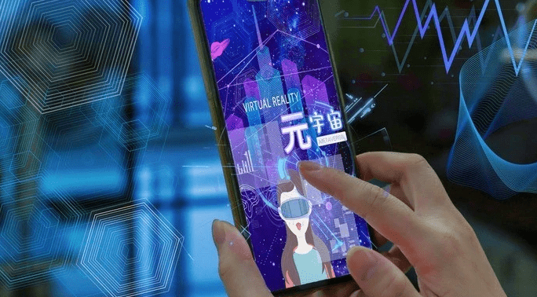

# 科学布局文旅元宇宙，推动数字消费再升级

近日，上海市人民政府办公厅印发《上海市培育“元宇宙”新赛道行动方案（2022—2025年）》，将培育“虚实交互新文旅”纳入元宇宙数字业态升级行动内容，明确开发“上海元旅新模式”、促进虚拟演艺赛事发展等任务。这既是对推进元宇宙建设的敏锐把握，也是对文旅产业探索“文旅元宇宙”新模式的科学引领。

**从“元宇宙”到“文旅元宇宙”**

自2021年初美国游戏公司Roblox以“元宇宙第一股”上市以来，元宇宙（Metaverse）经历了从科技巨头领跑到产业主体加码再到当前地方政府定调的一系列“认知价值化”过程，其将对人类社会发展产生深刻而长远的影响已成为共识。但目前“何为元宇宙”尚无确切定义。《元宇宙通证》一书将元宇宙核心技术归纳为“BIGANT”，即区块链技术（Blockchain）、交互技术（Interactivity）、电子游戏技术（Game）、人工智能技术（AI）、网络及运算技术（Network）及物联网技术（Internet of Things）。技术之外，元宇宙还拥有基于区块链的闭环经济系统，具备持续交互、去中心化等特征。

元宇宙是现实世界与虚拟世界的集合，是未来能够承载人类生产生活的全新三维空间。作为元宇宙重要应用方向之一，元宇宙的空间设计、技术基建及经济逻辑同样适用于元宇宙的产业子集——文旅元宇宙，也就是说，文旅元宇宙将在元宇宙“世界观”之上植入文旅要素以实现文旅产业的“元宇宙转型”。

**文旅元宇宙未来已来**

文旅产业探索文旅元宇宙新模式一方面是产业内部促进文旅深度融合、实现全面数字化的自我发展要求，另一方面则是来自于消费者对文旅产业高质量产品、沉浸式体验等需求升级的驱动。此外，新冠肺炎疫情致使文旅产业遭遇较大打击，但同时也助推部分消费者开始尝试虚拟型旅游。这为疫后文旅产业复苏提供了重要突破口。因此，基于技术进步与认知突破的文旅元宇宙必将推动文旅产业进入发展新阶段，为文旅产业供需两侧带来新的革新。

需求侧的变革主要在于“体验”与“创造”。文旅元宇宙将打造突破时空、跨越虚实的三维文旅场景。消费者既可通过使用高分辨率、低延迟且符合人体工程学的头显设备等进入现实世界的数字孪生体，以虚拟身份实现“异地同游”；又可借助增强现实技术等手段，获得直接叠加于现实空间之上的立体虚拟画面，实现现实与虚拟的有机互动。文旅元宇宙将进一步激活“创作者经济”。易操作的代码工具将为消费者生产优质文旅UGC提供极大的便利，同时区块链将实现内容资产确权并保障消费者资产交易的安全性。

供给侧的变革关键在于“融合”与“重塑”。文旅元宇宙将推动传统文旅产业市场主体不断从技术发展红利中汲取养分，通过虚实交互的表现手法在新的空间中更好地落实“以文塑旅，以旅彰文”。以文旅元宇宙为载体，市场主体将打破上下游信息沟通不畅的硬约束，有利于文旅要素的优化配置，丰富文旅市场的产品供给。进一步地，文旅产业生态也将依据元宇宙规则进行重塑，包括形成全新组织形态、商业模式等。《上海市数字经济发展“十四五”规划》提出的“支持龙头企业探索NFT（非同质化代币）交易平台建设”即是鼓励市场主体变革产业生态的重要举措。

**科学布局文旅元宇宙**

目前，市场上已经有了一些关于构建文旅元宇宙的初步探索，如设立景区元宇宙研究中心、启动文旅数字藏品计划等，其效果如何仍有待观察。但随着利好政策的不断推出，加之Z世代群体对元宇宙话题与文旅新体验的高度关注，文旅元宇宙将是一片具有极大的研发前景与探索价值的新蓝海。

推进文旅元宇宙建设是一项长期性任务，需要遵循技术发展的客观规律，也要做好经历产业发展调适期的准备，更要制定出符合我国国情的“文旅元宇宙方案”。所有实践都应有理论探索、市场分析等前置性研究的指导，都应有政产学研界的共同参与。同时也要关注在发展过程中潜在的各类问题，包括如何保证隐私与数据安全、如何建立和谐秩序、如何实现技术到产品的转化等。
