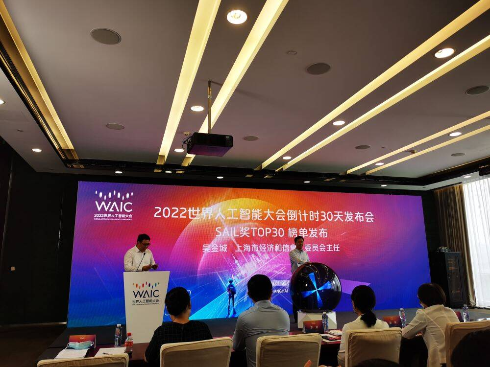
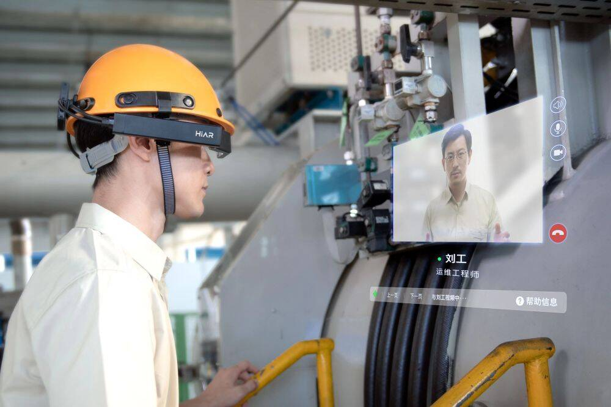

# 如约而至！当世界人工智能大会碰撞“元宇宙”

2022世界人工智能大会（WAIC）将于9月1日至3日以线上线下(30.590, 0.49, 1.63%)双线联动的方式举行，这是今年上海进入常态化疫情防控下举办的第一个“世界级盛会”，“元宇宙”成为大会“主角”。

经过四年的成长和发展，世界人工智能大会已成为全球人工智能的“科技风向标、应用展示台、产业加速器、治理议事厅”，国际影响力和引力场效应正在日益提升。去年大会在线观看人数达到了3.83亿人次，展现了新形象、汇聚了重要资源、引领了新潮流，目前大会各项筹备工作进入冲刺阶段，将和全球观众来一场“窥见未来”的约会。

**“世界级盛会”获顶会认可**

“今年世界人工智能大会上，人工智能国际五大顶级行业组织和学术组织的代表都将参与重要活动，这一方面说明我们的大会在国际舞台上打响品牌，另一方面说明大会日益得到业界专业人士的认可。”在2日下午召开的2022世界人工智能大会倒计时30天发布会上，上海市经济和信息化委副主任张英说，国际人工智能联合会2024年会议举办权已敲定上海。

**倒计时发布会现场**

据介绍，今年将有300余位嘉宾前来，近百场论坛覆盖技术创新、产业应用、法治伦理和生态建设四大领域30多个专业话题；此外，1.5万平方米展区参展企业近200家，首次参展企业超过30%，上海以外地区企业和国外企业占比超40%，一批新品将首发首秀首展，国内外2000多支队伍角逐SAIL奖等多个赛事。

值得一看的是，在今年大会申报SAIL奖的项目中，既有全球头部企业踊跃申报，国际知名高校、科研机构纷纷献宝，也有智能芯片、AI大模型等热门赛道集结。从目前公布的SAIL奖TOP30榜单看，包括友道智途5G+L4级智能重卡在洋山深水港的商业化应用、儿童白血病细胞学人工智能创新识别方法研发、极视角AI视觉算法商城等。

既有产业应用的“百花齐放”，也有基础科研的“秀肌肉”。上海市经信委人工智能发展处副处长孙跃说，大会国内外“朋友圈”越做越大，不仅体现了技术应用百花齐放，也折射了基础研究茁壮成长，形成良性循环，在国外的顶会上，也有上海的代表前往参加。

**“元宇宙”将唱主角**

本届大会的特色，是元宇宙将正式“唱主角”。大会以“智联世界、元生无界”为主题，将充分展现人工智能新技术与元宇宙新赛道的硬核新科技、产业新集群、超级新场景和敏捷新治理，通过群智赋能、虚实融合、共创分享，热情拥抱数字化转型下智能时代的美好图景。

**一位工程师利用一款5G+AR智能眼镜在远程专家的协助下维修设备**

“大会展览展示量质齐升，重点将呈现元宇宙核心展。”张英说，考虑到疫情防控需要，今年大会展览将在世博中心和张江科学会堂分流举办。一大批领军企业和新锐企业将集中亮相，参展企业比去年更广，展示的新成果也更多。元宇宙核心展将结合WAIC五周年成果，从虚拟体验和现实展示两个维度，集中呈现上海人工智能产业和元宇宙新赛道发展情况，“十大镇馆之宝”也将重磅亮相。

坚持用最新技术办AI大会，大会主办方以“星球元宇宙”为灵感进行整体设计，打造线上元宇宙会展新平台，提升观众线上参会体验度和感受度；围绕会场周边的智能化应用体验，重点打造AI元宇宙示范区。同时将在近几年发布洋山无人驾驶港口、申通智能指挥交通系统等重大场景的基础上，在大会开幕式上发布人工智能元宇宙重大应用场景。

“元宇宙是一个技术创新的浪潮，其意义可能和移动互联网带给我们的意义是一样的。如果能在这个点上夺得先机，将充分激发上海在数字经济方面的巨大潜能。”上海哔哩哔哩科技有限公司董事长兼首席执行官陈睿说，上海在元宇宙领域有自身优势，“具备全国领先产业基础条件，也有开路先锋的基因。”

**发力新赛道“鸣枪起跑”**

今年7月，上海制定并发布了绿色低碳、元宇宙、智能终端产业三个“新赛道”发展的行动方案，争取到2025年三个产业总规模突破1.5万亿元。

上海市经济和信息化委员会主任吴金城表示，元宇宙是未来虚拟世界和现实社会交互的重要平台，将坚持虚实结合、以虚强实等价值导向，发挥上海在5G、数据要素、应用场景等方面优势，推动元宇宙更好赋能经济、生活、治理数字化转型。

吴金城表示，元宇宙可以在产品、场景、产业孵化上做文章，但是不能泡沫化，更不能恶意炒作甚至误导市民，对于不法行为要予以监管打击。

值得期待的是，今年上海正在推动制定人工智能地方性法规，将在推动产业创新、促进应用赋能、保障要素资源、加强治理规范等方面为产业集群建设“保驾护航”。

“本次大会是新赛道鸣枪起跑的盛会，对展示上海发展成果，构建未来上海产业生态，都具有非常重要的意义。”孙跃说，将促进上海推进数字孪生、拓展现实、人机交互、虚拟数字人(9.460, 0.06, 0.64%)等核心技术攻关，推动元宇宙融入和支撑城市治理，一起推动全球“共创、共建、共荣、共治、共享”。
