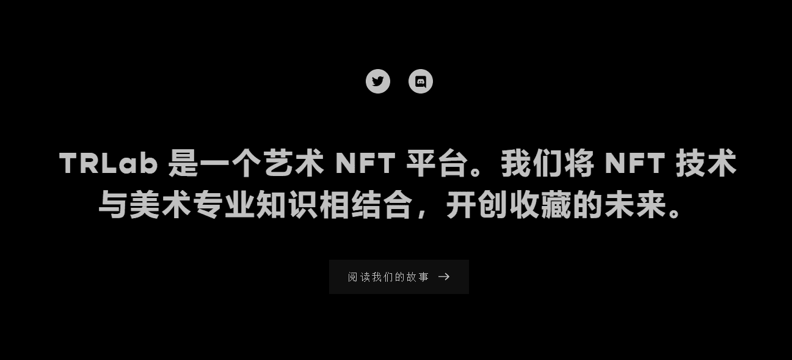
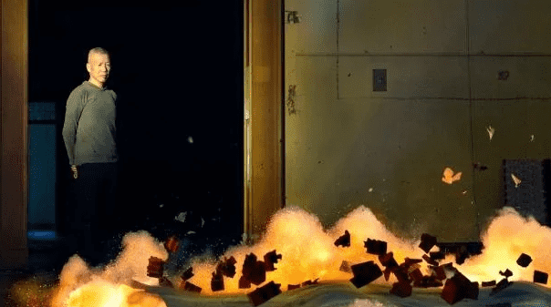
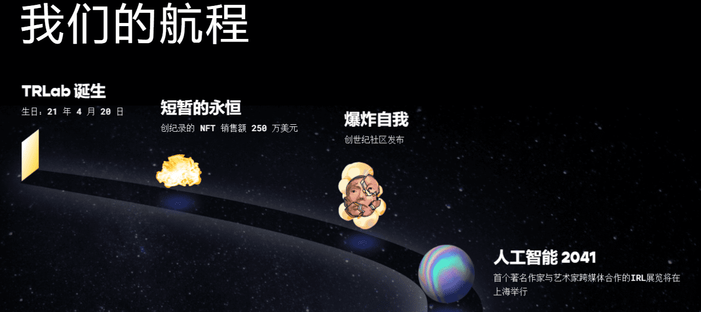

# TRLab，带你一起探索元宇宙数藏未来！

[TRLab](https://www.metabd.cc/navigation/trlab/)是一个美术NFT平台。我们将NFT技术与美术专业知识相结合，开创收藏的未来。

TRlab致力于发现、收藏并与全球一线艺术家合作的策展型NFT艺术平台TRLab，今天宣布完成420万美元融资，由艺术市场和科技领域的重要投资人领投，汇集了在全球艺术市场中推动数字藏品发展。

传统艺术家，如艺术家蔡国强，他们之前没有数字艺术或区块链技术的经验，由于这种方法，以及该平台与艺术家合作实现他们的想法的事实，被[TRLab](https://www.metabd.cc/navigation/trlab/)所吸引。

**7月，蔡国强的《瞬息万变的永恒——火药画的101次点火》通过TRLab拍卖会售出250万美元。**

**在去年NFT计划的爆炸式增长中，希望从加密艺术热潮中获利，您如何脱颖而出？**

成立六个月的[TRLab](https://www.metabd.cc/navigation/trlab/)（拉丁语为“tabula rasa”或空白石板）认为它有答案，新手艺术家和经验丰富的艺术界明星经过深思熟虑，专注于建立真正社区的措施 - 最重要的是，一个强大的领导团队。

TRLab是一个以不可替代代币（NFT）形式收集艺术品的平台，在一轮融资中筹集了420万美元，以使其收藏多样化。

联合创始人Xin Li-Cohen也是佳士得的非执行副主席，他分享了对加薪的见解，佳士得作为TRLab营销合作伙伴的角色以及2022年值得关注的NFT趋势的见解。

了解更多平台信息可直接戳链接查看https://www.metabd.cc/navigation/trlab/。
