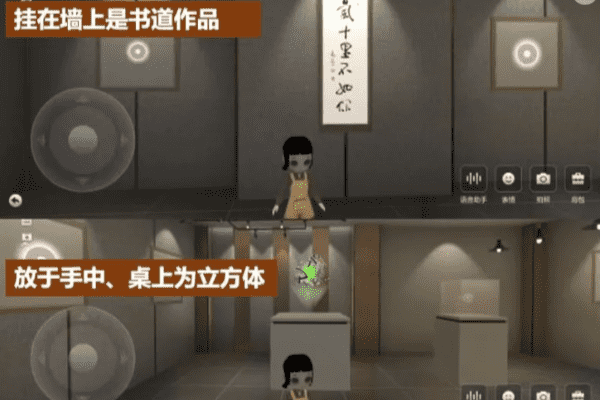

# 冯唐首个数字藏品在希壤元宇宙发售，与其元宇宙艺术作品“元立方”合二为一

7月8日，冯唐的首个数字藏品“春风十里不如你”在百度希壤商城、小度寻宇正式发售，限量2000份，自预告发售起，就获得超过18000人提前预约，在正式发售后秒光。据悉，依托百度超级链，每份“春风十里不如你”数字藏品都具有唯一的链上序列号，即独立的、不可篡改的、可实时查验的ID，代表着其独一无二的收藏价值。

针对元宇宙未来的发展及所带来的沉浸感，冯唐向蓝鲸财经记者表示，他的判断是元宇宙这个趋势势不可挡，就像Web1.0、Web2.0一旦出现，不要看它现在的应用场景还比较小，但它一定会加速的渗入到我们的生活和工作中来。

同时，展望未来场景，他所能想象的比较美好的状态，应该是线上线下、元宇宙和宇宙、个人的真实生活和虚拟生活，能够达到无缝进出和连接。

据发售信息显示，“春风十里不如你”将与冯唐首件元宇宙艺术作品“元立方”合二为一。将其挂在墙上，它就是一幅“春风十里不如你”的书道作品；将其置于手中或摆放在桌上，它就会变成一个三维六面的书道元立方——在希壤元宇宙世界中，平面与立体自由变换，具备超强的互动感和审美意趣。而在未来，它还将展现出更多模态，解锁出更多的艺术作品创作展示的可能。

据了解，2021年8月，希壤联手冯唐打造“色空”展，戴上VR头盔，调整步伐，即可漫步一个由书画构成的“色空世界”，并在北京、杭州设置实体展馆；在百度Create2021大会上，冯唐作为特邀嘉宾，在希壤发布了自己的首件元宇宙艺术作品——《元立方》，为AI+艺术的创作可能开拓了思路。

希壤商城是百度希壤在-5.5版本中的重要功能上新，是百度希壤打造元宇宙基础设施的重要组成一环。其将近来火热的数字藏品带入到了元宇宙的虚拟时空中，创造了全新的应用场景与互动体验。相比web2.0“卡牌式”的单一展现，希壤则打通百度超级链、小度寻宇数字藏品平台的能力，提供了集发行、售卖、运营、展示为一体的元宇宙数字藏品功能，开辟Web3.0时代的沉浸式体验。

据悉，作为小度官方数字藏品平台，小度寻宇也将与百度希壤在元宇宙中展开持续地联动——从本月开始，在小度寻宇数字藏品平台领取或购买的部分数字藏品，经用户授权后，将可以同步到希壤元宇宙世界中的数字藏馆和背包，进行查看、布置及拍照等交互操作。同时，拥有特定数字藏品的用户，未来还可以在希壤内领取限定款小度道具，并在希壤个人空间中使用。

