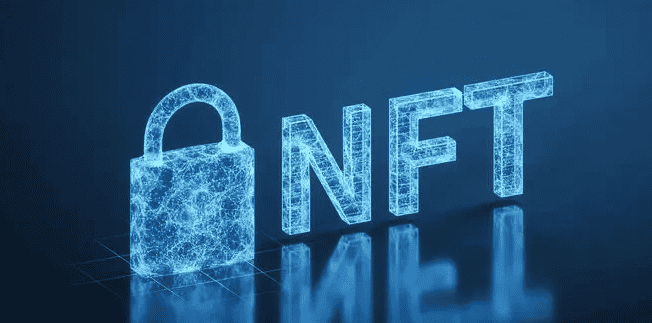
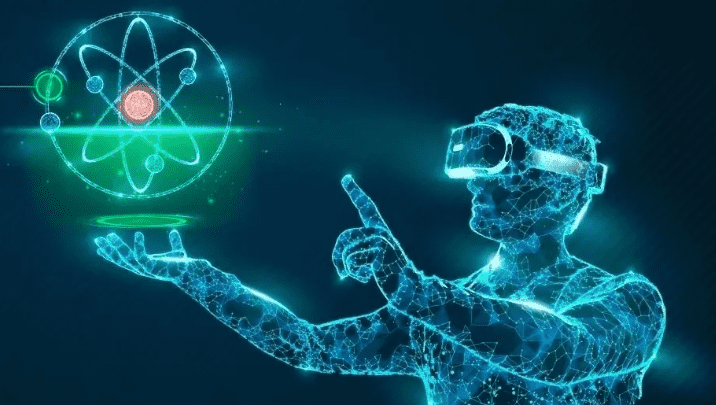

# 元宇宙：什么是数字藏品？

数字藏品其实就是阉割版的NFT，为什么说是阉割版呢？这是因为里面少了一个T，T就是token的意思。在国内，被翻译成通证或者代币，在我们国家加密货币是被禁止的，不能够说NFT，所以人们就想尽了各种办法来代替NFT，就比如这个NFR DAEW，但最终啊，证明为数字藏品，今天啊，咱们就来聊一聊什么是数字藏品。

NFT是在FT的基础上发展起来的，怎么理解呢？就比如你有一块钱和我有一块钱的钢蹦一样，咱俩呢，可以随意的交换，这就是FT是同质化通证，其实就是加密货币，典型代表就是比特币和以太坊。在FT前面加个N的意思就是非同质化代币，就像你有一幅齐白石的画和我有一幅齐白石的画，这就不能随意的换，价值肯定是不同的。就比如在以前，我发给你一个图片或者word文件，那咱俩的文件呢，是一模一样的，你再发给张三，又是一模一样的一份了，这就是互联网很牛的地方，实现这个信息的互通、互联和共享。

但是你有没有发现一个问题，信息时代产生的都是数字的内容，而不是数字资产，有了这个NFT呢，就有点儿意思了，它可以把千篇一律的数字内容变成了数字资产，那它又是怎么变的？

不得不说区块儿链，区块儿链就是一个去中心化的数据库，将你的数字内容登记到区块儿链中，你付一点手续费，全世界的旷工啊，就争先恐后地帮你记录并打包到区块链中。因为旷工是分布在全世界各地的各个角落，所以这个数据也是去中性化的，就在被记录到区块链的那一刻起，原来的数字内容变成了数字资产，它就是有价值的。

咱们举个例子，原来我用ipad画CAD画，然后我发给你，和你说给我1000块钱，这就算给你了，如果这个买卖成立了，要么是你是傻，要么我傻。但是我把这幅画NFT化之后，在NFT交易平台上卖1000元轻轻松松的就卖掉了。就这么神奇，因为原来是同质化的数字内容，现在是非同质化的数字资产。

所谓的资产，就是有所有权和唯一性的，就比如你家房子，因为你家房本儿上写的是你的名字，签这个地址是唯一的，这就是一个资产，是资产就可以被交易，被交易就有流通性，这就是国外NFT，能被炒作的根本的原因，和炒房子是一个原理。

在2021年六月份，支付宝率先在蚂蚁的粉丝粒上推出了这个敦煌九色鹿皮肤的NFT，粉丝粒就是阿里鲸探的前身，发布当天就被秒光了。原本九块九发布的NFT，第二天在市场上就被炒到150万，然后监管部门勒令在二级市场上下架这些炒作，类似在闲鱼，淘宝，58上都搜不出来任何关于NFT的内容，NFT也变成了一个敏感词。

然后就没有二级市场了，各个平台都是战战兢兢的在发行NFT，尝试着各种改名字来绕开这个NFT的敏感词，有的叫NFR，有的叫DAWs，还有要说的数字藏品，NFT万万也没有想到，到了中国，还有这么多小名。直到2021年的12月24日，新华社在他的APP上发行了一个新闻数字藏品，这一下子，官方把NFT取了一个正式的中国名字，他就是数字藏品。

这下子你就闹明白数字藏品的前生今世了吧，它与NFT相同的地方都是跑在区块链上，都有这种可溯源，唯一性和人为设置这种稀缺性。不同的是，NFT是跑在这个公链儿上，你就比如以太坊，数字藏品跑在是联盟链上，你就比如这个鲸探是在蚂蚁链上，混合是在知识链上，NFT是自带这种金融属性，而数字藏品是去金融属性的，二级市场上交易也是受到限制的。最后问大家一个问题，你的第一份NFT或者数字藏品是什么呢？
