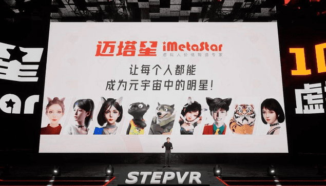
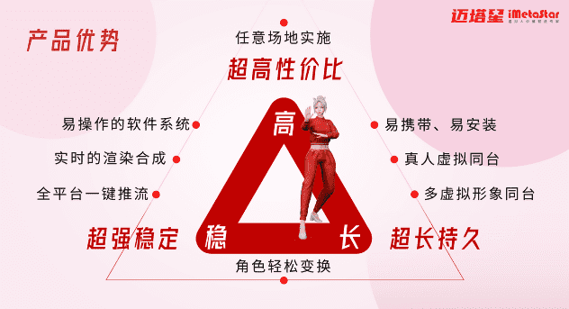

# 迈塔星启动万名虚拟人星计划：让每个人都能成为元宇宙的明星 

元宇宙是虚拟人的元宇宙，也是自然人的元宇宙。对于每一个人来说，虚拟人提供了一个绝佳的机会，只要你有才艺禀赋，一技之长，就能闪亮人性的光辉，成为元宇宙里的明星。

8月4日消息，STEPVR旗下的专业虚拟人动捕设备商迈塔星iMetaStar召开了一场极具新意的虚拟发布会，宣布启动“10000+虚拟人星计划”，并联合微博、抖音等媒体平台，提供流量、运营、商业变现等全方位支持。STEPVR合伙人、高级副总裁张振华介绍，该计划通过提供动捕设备、运营加持、IP曝光、商业变现四大赋能手段，让一万人提前实现商业化，跑步进入元宇宙。

**开启万人星计划，四大赋能助力虚拟人成长**

从许安一、平头哥到爱夏，越来越多的虚拟人脱颖而出，不仅收获了庞大的粉丝，还在短时间内获得了不菲的商业回报。但虚拟人的出现，最大的亮点在于让更多普通人离明星更近一步，这在现实世界里是很难实现的。但目前，从虚拟人的制作、渲染到驱动、运营的全链条来看，即便普通人拥有潜力和挖掘空间，进入的门槛依然较高，如果缺乏专业指导的话，更容易走弯路。

“10000+虚拟人星计划”的启动，提供了全链条的支持政策，让虚拟人从野蛮生长走向专业运营，以更低门槛、更高水平推动虚拟人行业发展，助力虚拟人更快成长和商业变现。

在该计划中，迈塔星将联合微博、抖音两大合作平台，在全球范围内招募“虚拟人形象”设计师、中之人、主播达人、MCN机构、品牌主，通过专家、导师组成的评审团海选的中之人、虚拟人形象，将直接进入星计划支持名单，官方将给予大礼包支持，该礼包包括形象定位、主播培训、内容策划、运营培训、IP打造等，以及四大赋能政策支持：免费提供迈塔星动捕设备及软件、运营培训、IP曝光和商业变现等四大维度的支持。

发布会现场，迈塔星iMetaStar联合微博、抖音等合作方宣布，万名虚拟人星计划正式启动，微博已开辟“万名虚拟人星计划”话题页，官网提报通道也已打开，即日起可报名并提交资料。

**全链支持，创造更高精神价值**

能够出圈的虚拟人IP，往往有鲜明的人设，丰富的精神表达，能够与粉丝建立情感上的连接，在精神世界上达成共鸣。这就需要专业的IP原力挖掘、多样化的内容输出。

这样的例子不胜枚举，虚拟主播、现象级变现IP许安一在100天时间内，吸引43万粉丝；平头哥账号粉丝碰到增长瓶颈后，使用迈塔星的动捕设备进行直播后，粉丝增长重回上升通道，一个月涨粉近30万；舞后Aimi只花了7天时间，实时在线人数近万人……除了在IP塑造、运营上的专业操盘外，也离不开迈塔星独有的“激光定位+惯性”动捕技术的加持。

“操作5分钟，直播5小时”，迈塔星动捕设备采用STEPVR独家研发的激光定位+惯性动捕技术及软件系统，具有超强稳定性、超长持久、超高性价比三大优势，任意场地可实施，支持多虚拟形象同台，全平台一键推流，实时渲染合成，同时还搭载了丰富的场景、服装、道具可以切换，以及炫酷特效、弹幕互动游戏等功能，为虚拟主播提供了更大的舞台和发挥空间，有了这些工具，能更快、更高效地打通与粉丝的连接通道。

从动捕设备、直播软件到全产业链运营、变现资源与经验，将注入到“10000+虚拟人星计划”中，以能力模块的方式输出，赋能孵化出更多虚拟人IP。

“虚拟人注定是一场草根运动，是给大众用的工具，对天生不完美的人有巨大的补充作用。有了虚拟人这个工具，你就可以找到喜欢你的那群人，成为某一领域的网红。”STEPVR公司创始人、CEO郭成博士表示，“10000+虚拟人星计划”就是这样的圆梦之旅，让每一个普通人都拥有了成为元宇宙明星的机会，都能拥有一批喜欢自己的人，实现更高层次的精神价值。
