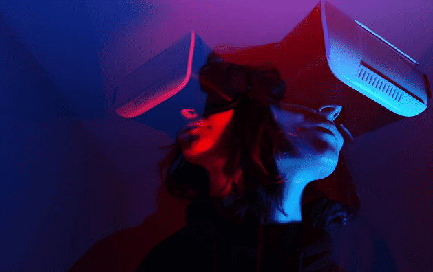
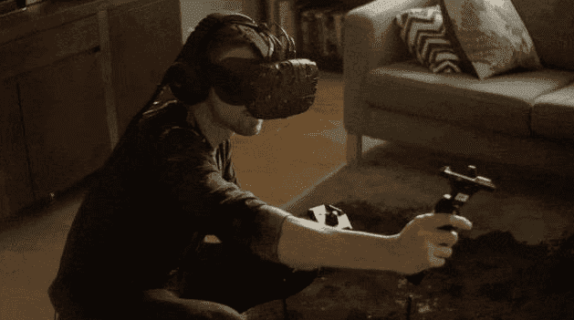
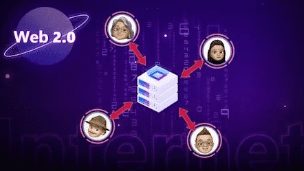
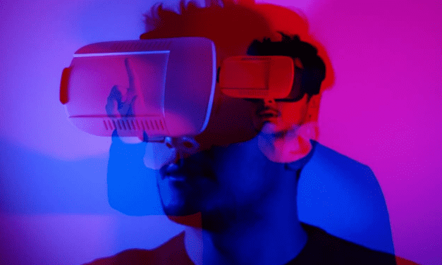

# 看见元宇宙的两面，何谓全真互联网和价值互联网？ 

对于普通大众来说，“全真互联网”一词还是一个相对不太熟悉的词汇，但对于科技和互联网从业者来说，全真互联网这一概念是比较关心的话题。

随着元宇宙逐渐为人熟知，围绕区块链、NFT、DAO组织的相继涌现，价值互联网又被重新关注和谈论。全真互联网和价值互联网是什么关系，它们和元宇宙又有什么联系？这些概念逐渐让人疑惑不解。本文是对厘清这一疑惑的解答。

# 一、 全真互联网

**全真互联网从何而来？**

“全真互联网”一词从何时开始出现呢？

2020年12月，在腾讯的年刊《三观》中，CEO马化腾提出了互联网未来的趋势和转变，讲到了互联网行业的“大洗牌”，表示“随着VR等新技术、新的硬件和软件在各种不同场景的推动，又一场大洗牌即将开始。

就像移动互联网转型一样，上不了船的人将逐渐落伍”。而腾讯面对这一趋势和转变，马化腾给出的方向是“全真互联网”。

马化腾认为，互联网发展到今天，从实时通信到影音视频等一系列基础技术都已经非常成熟，包括计算能力的快速提升推动着信息接触、人机交互的模式发生丰富的变化，而这个变化趋势就是“全真互联网”。

马化腾说，“现在，一个令人兴奋的机会正在到来，移动互联网十年发展，即将迎来下一波升级，我们称之为全真互联网。”

**什么是全真互联网？**

要回答什么是全真互联网，最好的方式是回到提出这个概念的人那里。

在腾讯的2021年年报业绩发布会上，概念提出人马化腾表示“全真互联网更多的是从数实融合的角度来看，而不是纯虚拟的”。

即全真互联网是以现实为基础，以数字虚拟化为能力，通过数字虚拟技术虚实融合，在教育、金融、文旅、建筑、交通、工业等多赛道重构类真实世界，让互联网更真实。

**互联网此前不够真实吗？**

站在互联网的本位来看，我们当前所处的互联网是一个呈现在我们眼前的平面世界，我们的社交、游戏、购物、阅读、听歌等等，都是通过”设备+软件“的形式以一个个呈现出的屏幕来完成的，这是一个2D的平面世界。

有没有可能想象我们的上述活动以3D的虚拟空间形式完成，比如网购，直接进入虚拟的线上商城挑选商品，就像和在现实中的超市购物相似，打破虚拟世界和现实世界的界限？当互联网变得“全真”，社交也变得和像现实相似，得到全面入微的“全真体验”。

目前对腾讯提出的虚实融合的“全真互联网”概念，一般以体验层面看待。因为元宇宙既有基于体验层面的概念，还有基于价值层面的概念。

全真互联网的未来价值：以VR、AR、MR、XR应用为例

对秉持“连接一切”发展逻辑的腾讯而言，把虚拟和现实价值对等的全真互联网概念无疑会让腾讯的市场价值继续跃升。因为凭借丰富的线上生态和海量的流量入口，全真互联网突破“连接”的物理形态，将线上线下的用户高度融合，定会在马化腾笃定的下一代互联网中继续保持增长。

全真互联网的到来对于“基建”商而言无疑是利好的，因为所有的体验都基于硬件设施，因此能看到VR、AR厂商在这一两年迎来繁荣的大规模的投融资。

以VR为例，根据数据显示，2017-2019年VR头显在全球仅有400万不到的年出货量。到2020年，这个数字达到了670万台，同比增长近 100%。

对于品牌商家乃至广大的虚实结合的经济体，尤其对于音乐、体育、商超、游戏等广泛的文娱生态而言，全真互联网都会为其助力升级。

全真互联网不是简单的虚拟和现实的无缝融合，链接价值的延续，更重要的一点是虚拟和现实价值的对等，因此虚拟层面的经济也将迎来蓬勃发展。

# 二、 价值互联网

**什么是价值互联网？**

我们对互联网的认识，一般认为它主要记录、传输信息，这是我们对互联网的一般认识，这即是信息互联网。

信息互联网给我们带来的显而易见的优势是让信息的传播变得更方便快捷，但它的弊端也是显而易见的，即信息和涉及的资产所有权无法被容易分辨和确权。因此，当前互联网一般都通过银行、支付平台、权威机构等第三方承担信用背书，进行信息和资产的便捷、安全传输和交易。

然而这又出现了类似用户数据和隐私问题、平台自身问题等第三方中心化管理的弊端。

互联网有没有可能绕过第三方，直接通过一种技术让互联网的信息和资产都轻松达到互信、自由交易？区块链作为这样一种技术，它的出现实现了信用和价值的低成本转移，这就是价值互联网。

**价值互联网的来源**

价值互联网这一概念的提出和出现，和区块链技术的出现是同时的。

因为区块链技术作为一种去中心化的、无须信任积累的信用建立范式，不需要借助任何一个中间方来达成信用共识，且具备开放透明、不可篡改、对等互联、易于追溯的特征，在本质上解决了信息和资产的流通问题，因此被视作价值互联网的基石。

区块链技术起源于2008年由中本聪(Satoshi Nakamoto)发表的一篇奠基性论文《比特币：一种点对点的电子现金系统》，这个时间也可以看作是价值互联网在理论上出现的时间。

**价值互联网的未来价值：以DeFi、DAO、NFT、SocialFi等应用为例**

从信息互联网到由作为基石存在的区块链形成的价值互联网，这既是技术的转变，也意味着这是互联网回到它原本的理想发展路线之上。毕竟互联网自从出现伊始，就代表着“万物互联”、“共享共通” 的理想。

区块链技术出现至今，从来不是单一的发展。由区块链技术为基础，伴随发展而来的有NFT（非同质化通证）技术、DeFi（去中心化金融）、GameFi（去中心化游戏）、SocialFi（去中心化社交）、DAO（去中心化组织）等等。

从元宇宙概念流行至今的这两年，上述这些名词一直被互联网、科技从业者大谈特谈。

它们也都具备区块链绕过第三方实现去中心化的特点，由于这一特征，上述生态所组成的价值互联网也是一个去中心化的互联网，又称作Web3（第三代互联网，注：Web3还未形成公认的定义），以区分只读的第一代互联网、“可读+可写”的第二代互联网。

价值互联网的未来价值可以从一系列的数据可知它的潜在规模。

以NFT为例，Verified Market Research (VMR) 发布报告表示，VMR对2021年全球 NFT市场的估值为113亿美元，该行业在未来八年的复合年增长率为33.7%，NFT市场规模在2030年将达到2310亿美元。

# 三、价值互联网和全真（体验）互联网

作者认为，应该说体验层面的全真互联网和去中心化的价值互联网共同组成了元宇宙。

元宇宙如果只是停留在虚实融合的沉浸式的虚拟世界，那不应该称之为元宇宙；元宇宙如果只是停留在去中心化的信息和资产更高效、便捷的流通环境，那也不是元宇宙。只有当二者融合，至少一个具备初步想象的元宇宙才开始形成。

在当前元宇宙发展初期，价值互联网和全真互联网也不是彻底割裂开来，二者的关系也不是非此即彼，而是互相融合，只不过侧重点有所不同。

价值互联网更注重底层创新，诸如区块链、智能合约、分布式账本等等，而全真互联网更加关注体验和应用的发展，如腾讯所言创建沉浸式的虚实融合的环境。国内外环境的不同，造就了大家选择路线的区别。但最终，大家都会在元宇宙的终点相遇。

在这去往终点的途中，元宇宙的各个组成部分都在相互融合应用，如扎克伯格所说：“起初，我们认为进入元宇宙的介质更像是VR，但未来元宇宙的演进不只有VR，用户可以在任何计算平台上访问元宇宙，Facebook正在考虑构建下一代计算平台，这一平台会广泛涉及人工智能、数字孪生、大数据、云计算、区块链等技术。”

在进入元宇宙的方式中，各平台也走着不同的路。国内哔哩哔哩、爱奇艺等选择从VR内容方面进入元宇宙；高通、安谋科技、AMD等凭借自研芯片切入；亚马逊、谷歌等从云计算、基础算法等维度突破；Unity、Epic Games、Decentraland等则是从底层工具（游戏引擎、虚拟引擎等）方面布局。

元宇宙已来，元宇宙又还未真正到来。
