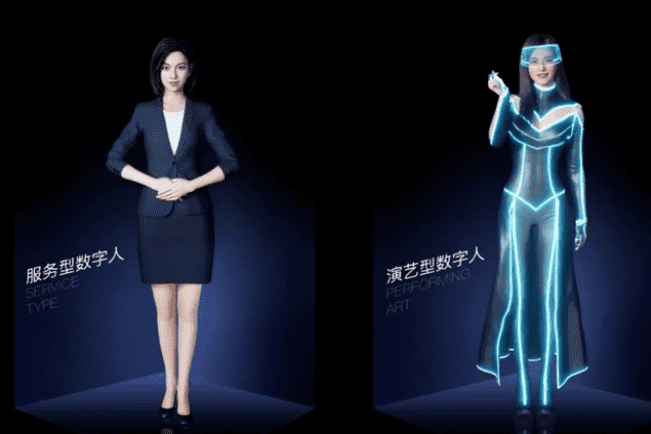

# 为什么大厂那么热衷于造数字人？

百度、阿里、腾讯这些公司都在忙着造人，是的你没听错，但他们造的都是虚拟数字人。比如最近在百度世界大会上展示超能力的希加加、度小小，还有阿里的东东，腾讯的星瞳，这些都是数字人，他们都是人类用计算机深度学习这样的手段创造出来的数字人。

元宇宙虚拟数字人

他们虽然存在于非物理世界当中，但是已经可以在很多场景下和我们进行互动，扮演不同的角色，比如带货主播、主持人、品牌代言人。看来又有人和我们抢饭碗了，今天我们来聊一聊，为什么大厂那么热衷于造数字人。

首先，在元宇宙烽火的带动下，数字人可以说是大厂进入元宇宙的一个入口。这两年呢，元宇宙的火旺已经是个不争的事实，目前关于元宇宙还没有一个统一的定义，不过大家有一个共识，那就是元宇宙是一种新型的文明形态，互联网更高级的形态，而数字人呢，就是这个新文明形态的一个入口。

是不是有点难以理解，简单来说，元宇宙给我们呈现的是虚拟世界和现实世界结合的那么一个状态，但是这两个不同世界的结合何其难？所以，聪明的人类一想，那不妨就先从人的数字化探索开始。如果说能实现人的数字化，那么就迈开了元宇宙探索的重要一步，所以大家都开始扎堆造数字人。

其次呢，之所以开发这些数字人，自然是因为他有商业价值，现在不少细分赛道数字人，赚钱都赚麻了，比如我们熟悉的B站洛天依，洛天依的商业变现，据说都超过了站里的很多真人up主。据说品牌合作订单都接到手软，在巨大的商机和商业价值的驱动下，不只是大厂，其实很多公司都加入到了造数字人队伍当中。
