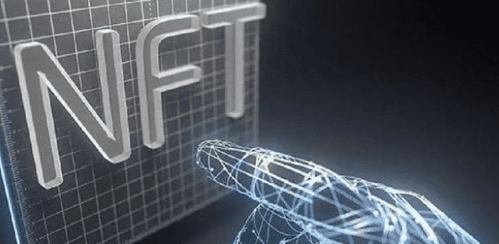

# 普通人如何在元宇宙中赚钱，用元宇宙技术变现呢？

元宇宙对普通人来说有没有赚钱的机会呢？有，现场体验感的升级，很多现有的商业模式可以借助元宇宙的技术，重构升级用户的现场体验感。

元宇宙

现在刷短视频看到小姐姐，你顶多隔着屏幕点点小爱心，在元宇宙可以走到小姐的面前搭讪。现在是隔着屏幕看球赛直播，在元宇宙可以身临其境感受现场的激情与欢呼声，客户与家人可以一起逛街，身临其境的体验自家房屋户型的不同装修风格，随意DIY家电，家具建材的搭配和使用体验，真正的实现所见即所得，给用户更爽的逛街体验和产品的使用体验，地段可能不再是核心，设计成为了核心竞争力。

对于我们实体零售的从业者来说，元宇宙的体验是我们重点关注和应用的商机，从时间、空间和体验上全面升级，门店的连接边界和用户体验感，那当下元宇宙还有哪些赚钱的机会呢？嘉伟老师说，她女儿的一个同学，初二的学生用游戏里的插件做了个装备，在元宇宙卖了18万美金，这就是讲NFT技术和自己的设计能力结合，在元宇宙商业变现的真实案例。

NFT

就像我们用现实世界里的钱给游戏充值，打怪升级，在打怪升级中赚到的装备也可以变现后，在现实世界里花。有绘画、设计能力，有古董藏品、IP版权，各种D一的高价值实物或事件等等的各种潜在的商机，可以发挥你的想象力、创造力，在元宇宙去赚钱。

NBA把投篮集锦视频剪辑成一段段十秒的短视频，用NFT传上去，确权后也是几十万美金一个短视频。推特的创始人把他发的第一段推特拍了张照片传到NFT上，NFT就给他确权了，然后开始交易，每次交易他都能拿10%，想到元宇宙赚钱，充分发挥你的想象力和创造力，用你的创造力将你脑子里的构思，用元宇宙技术设计出来变现。

