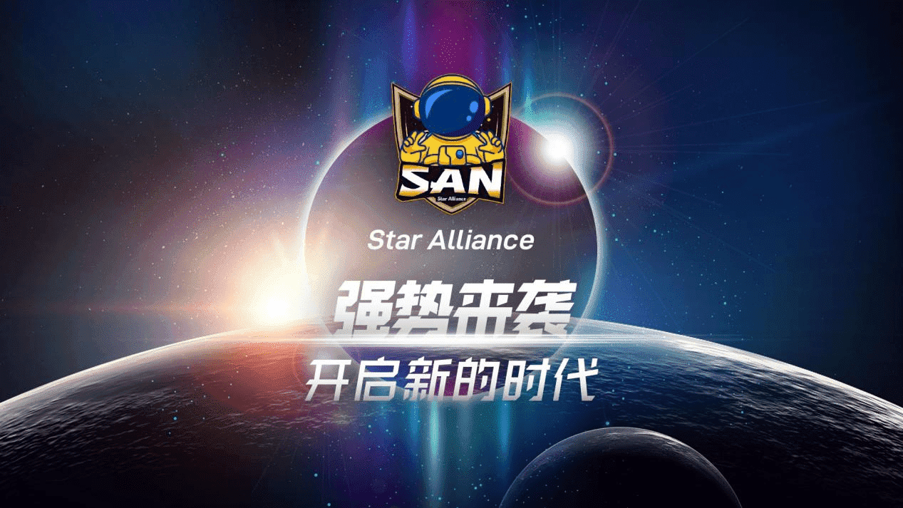
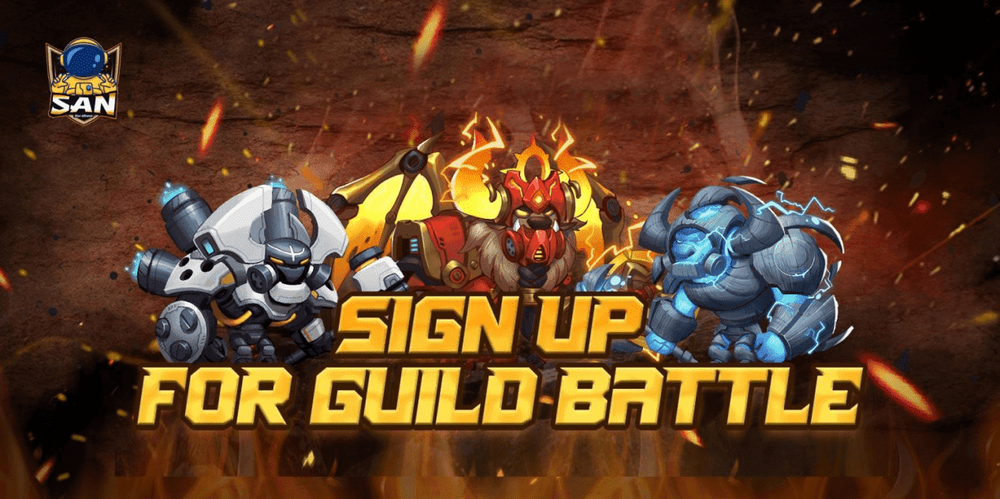

# SAN(StarAlliance)：元宇宙游戏的推动者，首创Fi+新理念游戏玩法 

随着科技的不断发展，特别是年轻一代的数字用户在此浪潮下，全球的数字原住民都在寻求全新的联结方式。仿佛一夜之间，“元宇宙”突然间成为热词，相关概念形成很多热点话题。在元宇宙的多个应用场景中，游戏无疑是最有吸引力的场景之一。

元宇宙游戏被业界普遍认为是最有可能实现“元宇宙”的领域，因为它本身就具有虚拟场景和玩家的虚拟化身。如今，游戏功能已超出游戏本身，游戏边界正在扩展，甚至不只是游戏了。目前元宇宙游戏平台有哪些呢？今天就为大家推荐最近热度很高的StarAlliance元宇宙游戏平台，感兴趣的小伙伴们看过来！

**一、关于StarAlliance**

SAN(StarAlliance)是由R8 FOUNDATION 打造的Web3.0下新的Fi+元宇宙平台。在 SAN(StarAlliance)的多个平行宇宙中，后续将联合首发一款具备创意性 和可玩性的链游，并由 DAO 社区经营全新的跨游戏、高自由的社交网络，同时 玩家可以化身为 SD 人物展开社交、冒险和创造，把 SAN(StarAlliance)建设的 丰富多彩。此外，还鼓励玩家成立自己的公会，边玩边赚。

SAN(StarAlliance)作为web3.0时代下的新fi+元宇宙游戏平台，立志成为全球最大的元宇宙游戏平台,并成为现实世界通向未来元宇宙的流量入口。SAN(StarAlliance)怀抱一个自由、开放的平台可以创造无限价值的信念,并作为去中心化自治组织中的利益相关者对SAN(StarAlliance)进行DAO自治管理,最终构建一个游戏开发者和玩家自由连接的、有无限可能的世界，将引领游戏资产新变革。并致力于与更具前瞻性和更优秀的创造者一起破除束缚，组建一个去中心化的元宇宙游戏世界。

**二、SAN的"Fi+"新理念**

随着GameFi的不断发展,越来越多的名人、高净值收藏家参与投资NFT，区块链游戏及NFT成为了加密领域“元宇宙”的出圈典型案例，同时成为了科技圈、投资圈，乃至各大官媒都不断讨论的热点话题，以及各大互联网科技巨头如 Facebook、微软、苹果等争相布局，国内腾讯、网易、百度等大厂也加速进场。

在巨大机遇面前，也意味着巨大的竞争压力。SAN(StarAlliance)再次背景下，在GameFi的基础上创新改进，提出了“Fi+”新理念重新刷新了我们对游戏的认知，网络游戏被赋予了新的时代意义。如今，DeFi、GameFi 和 SocialFi 的相互融合，演变成"Fi+"这一新理念，向元宇宙游戏的理想形态更进一步。在Web 3.0的支持下，公开透明的系统规则、均衡的资源分配、去中心化数据管理、虚拟世界的真实交互、游戏中的社交娱乐都会吸引越来越多的“圈外人士”初试元宇宙，与众多玩家一同游历广袤星际、寻找链游乐趣。

“Fi+”新理念让SAN(StarAlliance)成为一个互联、互通的元宇宙游戏世界。用户可穿梭在与其连接的各个游戏之中，还可以实现金融、社交、娱乐、创作、办公等游戏化场景。

**三、SAN(StarAlliance)NFT的价值**

SAN(StarAlliance)NFT的价值属性主要是体现在稀有性、实用性、流动性三方面：

1、稀有性：SAN(StarAlliance)NFT的星球土地资源、创世NFT及普通NFT不仅珍贵，而且也是限量供应，数量极其稀少。而且元宇宙多款游戏用的头像都是拥有独有的ID，赋予玩家的唯一属性。

2、实用性： SAN(StarAlliance)的创世NFT和普通NFT均为元宇宙重要角色，可参与战斗、产奶、挖矿等游戏活动赚取SAN代币；以及星球还是玩家的重要家园、公会成员的社区依托，星球内的居民共同作战、掠夺他方资源。

3、流动性：SAN(StarAlliance)NFT部署于ERC-721协议，元宇宙NFT可自由在交易市场流通，以及创世NFT为跨游戏角色，任意穿梭于元宇宙的三个游戏世界，流动性高、不受约束。

互联网改变人类生活，将人与人交流数字化，而SAN(StarAlliance)将会加速“元宇宙”将把人与社会关系数字化、游戏化。未来，SAN(StarAlliance)将不断升级和完善游戏内的设施，为元宇宙公民带来更多创意和有趣的游戏玩法。同时保障玩家的资产安全的信念,打造基于元宇宙概念和NFT游戏资产确权的新一代去中心化游戏平台。
