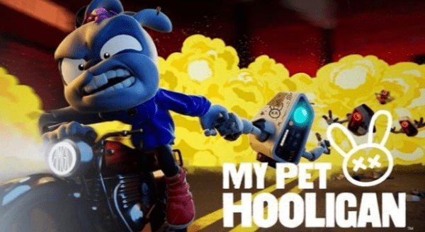
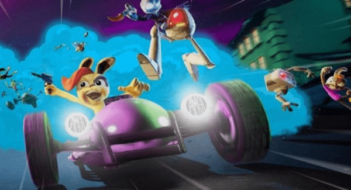
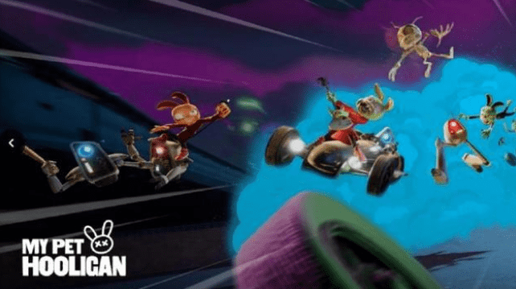

# 元宇宙最近很火，最先落地的是什么？

据VentureBeat报道，元宇宙游戏工作室AMGI完成了由Yield Guild Games、Bitkraft Ventures及Delphi Digital投资的一笔未透露具体金额的融资，该笔资金将用于开发可连接Web 3和好莱坞元宇宙的NFT游戏。

这款名为「My Pet Hooligan」的NFT游戏由前皮克斯和迪士尼动画师设计，除了「My Pet Hooligan」，团队还在制作支持玩家创建实时动画角色的APP「Immi」。团队承诺，将启用资金进一步构建“AMGI”元宇宙，即一个相互关联的虚拟世界。

除此之外，AMGI还在创作一款结合了「侠盗猎车手」和「疯狂动物城」的动作冒险元宇宙游戏「The Rabbit Hole」，该作基于Unreal 5 Metaverse架构“Interloop”而开发，展示了开放且迭代的元宇宙游戏世界。AMGI表示，工作室致力于推广“兼具高质量动画角色的免费、刺激且别具一格的游戏玩法”。

Interloop是支持不同项目、知识产权、游戏、叙事创作者共同构建以开发一个由资产、角色、IP和故事组成的丰富生态系统的架构，AMGI表示，元宇宙和 Web 3的互操作性对于健康的生态系统至关重要，Interloop将作为连接这些社区的“结缔组织”。

Yield Guild Games资产收购负责人Jeff Holmberg表示：“AMGI拥有一支创意团队，该团队的叙事创作能力令人惊叹，我们很高兴能与他们合作，以支持AMGI开发玩家所期待的元宇宙游戏「My Pet Hooligan」。”

AMGI表示，工作室的使命是将专有技术与高质量、以角色为导向的动画相结合，在好莱坞和Web 3生态系统之间架起一座桥梁，基于区块链验证独特数字物品技术，好莱坞正在创建NFT数字收藏品。
