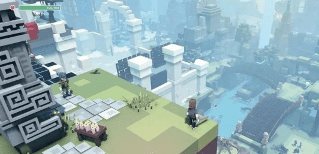

# 元宇宙游戏有哪些？元宇宙游戏怎么玩？

现在元宇宙的游戏有《堡垒之夜》、《Roblox》、《Axie》、《sandbox》以及《Decentraland》等等。今天给大家分享一下目前现在最火的《sandbox》和《Axie》这两个元宇宙项目，《sandbox》是一个体验和打造类的3D版游戏，和普通的游戏不同，玩家可以使用平台提供的编辑器来制作像素模型、制作游戏道具来获得收益。

游戏中一共有十六万六千四百六十四块数字土地，是沙盒平台类的数字资产，用户可以用SAND来购买土地，土地也可以在NFT平台上进行二次销售，平台每次发行土地的时候基本都是被秒光的，如果没有抢到土地可以在opensea的二级市场上购买已经登记出售的土地，购买后你可以在你的土地上自由地设计、运行自己的游戏了，你也可以购买其他装备或者资产来进行填充。

另外，你也可以把它租给其他的游戏开发者来获得租金等等，还可以玩《sandbox》官方预设的多个游戏，完成任务就可以得到sandbox奖励，以此来购买道具和资源。

但是对于创作者来讲，你可以用sandbox提供的GameMaker，也就是游戏编辑器来打造个性化的游戏世界，这个游戏编辑器非常容易的上手，它不需要任何的代码支持，只需要拖拽就可以完成一个元素的创作，创作者还可以创作道具来售卖，以此获得SAND的收益，搞好了这个收益还是很不菲的，和《sandbox》类似的还有一个游戏叫《Decentraland》也是类似这样的沙盒游戏，它的通证叫做MANA，也是一个很厉害的潜力股，不同的是《Decentraland》它是需要有一定的编程基础，才能够完成游戏的创作，入手有一丢丢小难度。
