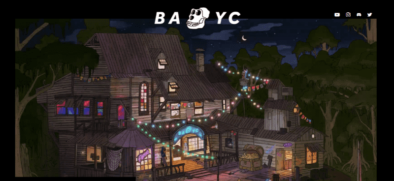
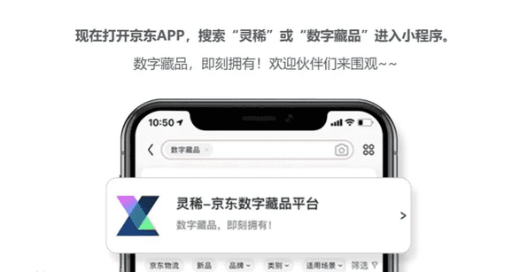
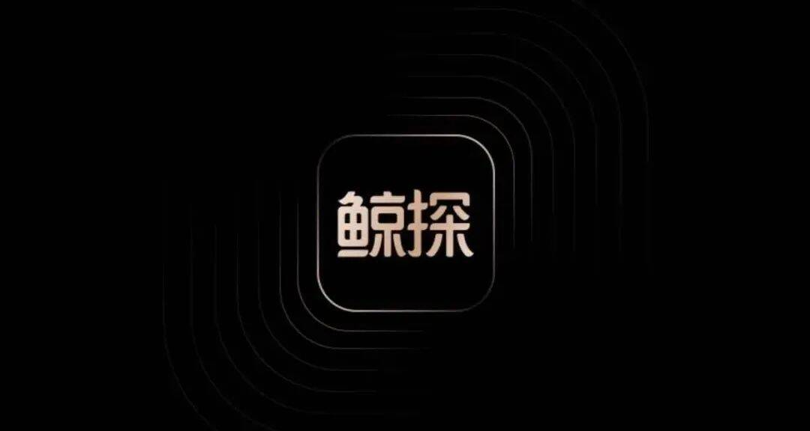
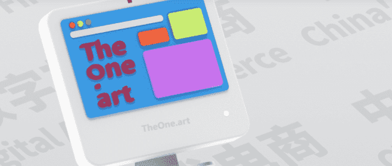
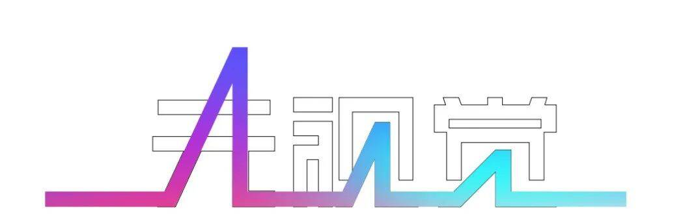
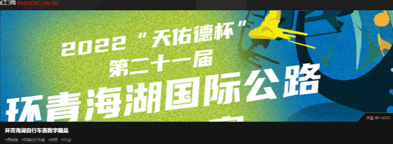
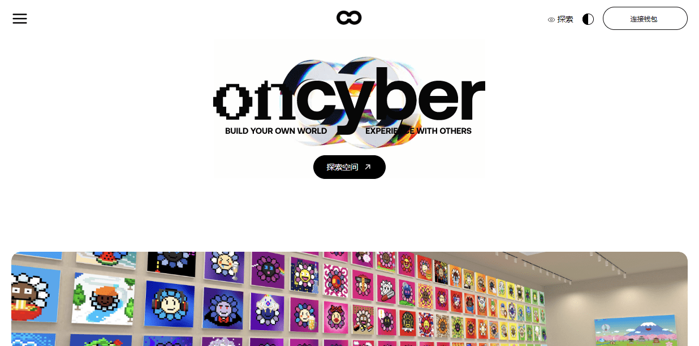
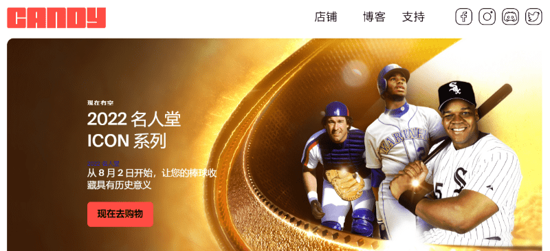
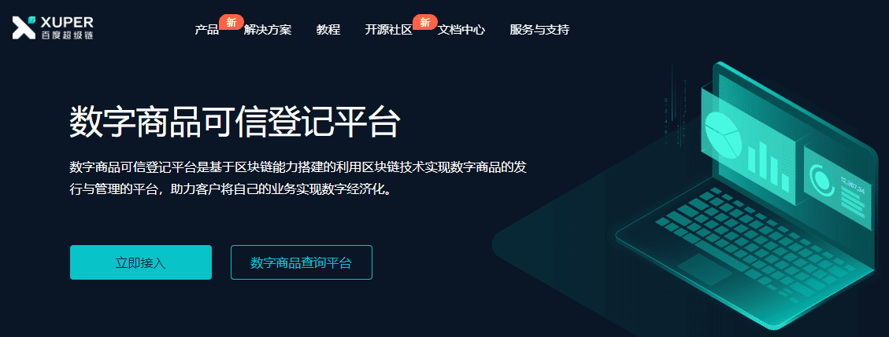

# 新手必看！较靠谱的NFT元宇宙数字藏品平台

**1、BAYC**

BAYC（无聊猿游艇俱乐部）是由10000个独特的无聊猿NFT组成的集合，这些NFT是生活在以太坊区块链上的独特数字收藏品。

一个有限的NFT集合，令牌本身可以兼作猿类沼泽俱乐部的会员资格。俱乐部开放！猿和我们在一起。

BAYC是10，000个无聊猿NFT的集合 - 生活在以太坊区块链上的独特数字收藏品。您的无聊猿可兼作您的游艇俱乐部会员卡，并授予会员专享福利，其中第一个是使用协作涂鸦板THE BATH。社区可以通过路线图激活来解锁未来的区域和福利。

这里没有粘合曲线，购买无聊的猿需要0.08 ETH；没有价格等级，BAYC会员资格对每个人来说都是一样的。每只无聊的猿都是独一无二的，并且以编程方式从170多种可能的特征中生成，包括表情，头饰，服装等。所有的猿都是兴奋剂，但有些比另一些更稀有。

网站地址：https://www.metabd.cc/navigation/bayc-com/

**2、幻核**

幻核是由腾讯推出的以NFT模式进行交易的区块链软件，正式上线了，用户们可以以数字收藏的模式进行交易，依托于区块链赚取最多的金币，了解区块链行情，每天都可以得到不同的收益。还支持进行商品买卖，扩充自己的收益额。

在本专题中包含了很多个版本，可以自由使用，没有门槛。2021年8月，腾讯上线数字藏品软件幻核A，首期限量发售300枚“有声《十三邀》数字艺术收藏品NFT”。

网站地址：https://www.metabd.cc/navigation/huanhe/

**3、灵稀**

京东灵稀是基于京东云提供的区块链技术服务 —— 京东智臻链打造的数字藏品交易平台。

每个数字藏品都有一张独一无二的“数字证书”，应用京东智臻链的区块链技术能力进行存证，具备唯一性、不可篡改性、不可复制性。平台上的所有藏品将全部采用链上发行、链上交易的模式，利用区块链技术助力数字藏品的流转。

在技术支持方面，京东“智臻链”为“灵稀”提供技术支持，“智臻链”和蚂蚁旗下蚂蚁链、腾讯旗下至信链一样都属于许可制区块链网络，在业内被称为“联盟链”。这也意味着藏家并不能基于区块链完全自由交易NFT，与国际主流玩法有一定区别。

网站地址：https://www.metabd.cc/navigation/jdlinxi/#

**4、鲸探**

2021年6月，阿里在支付宝小程序上线了“蚂蚁链粉丝粒”数字藏品平台，此后该平台升级为“鲸探”，鲸探的定位是满足用户对数字藏品的收藏、欣赏和分享的需求，致力于传统和现代文化艺术的推广。

通过蚂蚁链鲸探支持你热爱的数字藏品和艺术家，当你拥有蚂蚁链技术支持的数字藏品，它可提供收藏欣赏、向好友展示和赠送的功能。

网站地址：https://www.metabd.cc/navigation/jingtan/

**5、唯一艺术**

唯一艺术是国内首批数字艺术电商平台，平台于8月13日发起了“全球首届数字艺术品创作大赛”，获得了众多海内外艺术家的积极响应，获得了业内人士和媒体的一致好评。

唯一艺术平台于6月9日正式上线，一上线就有20多位艺术家签约入驻，首发作品百余幅。而在短短一周内，就有多幅画作被拍下，其中包括艺术家DZW画作《Disco Night-1》、艺术家朱涵远系列画作《乌托邦四重奏》等，其中艺术家朱涵远的系列画作《乌托邦的四重奏》（共四幅）均已全部售罄。 

网站地址：https://www.metabd.cc/navigation/theone/

**6、元视觉**

2021年12月26日，视觉中国发布公告称，公司打造的视觉艺术数字藏品平台——元视觉官方网站及小程序（元视觉藏品）上线。

元视觉帮助艺术家把“数字作品”转化为“数字资产”，增强视觉艺术数字藏品的变现能力，打造全球领先的基于区块链的更为活跃的、更具影响力的视觉艺术数字藏品的创作、分享与交易平台，构建平台、消费者、艺术家的多赢机制，为传播中国文化、增强中国文化影响力贡献自己的力量。

公司在合规、监管、法律等护航下，发挥区块链的存证、共享、协作、信任的优势，为数字版权的生产、保护、交易全流程赋能，推动版权产业变革升级，为实现数字版权、文化创意行业高质量发展注入新动能。

网站地址：https://www.metabd.cc/navigation/yuanshijue/

**7、红洞数藏**

红洞数藏是一款数字藏品移动服务平台，平台拥有丰富的数字藏品，可以收藏，欣赏，分享等等，可以帮助更好的文化推广。平台汇集了超多优质的好物，收藏的价值还是非常大的。

2021 年是元宇宙元年，从Roblox 上市到 Facebook 更名 Meta，从英伟达推出 Om- niverse 到众多一线企业组建元宇宙开放标准联盟，新时代的潮水正向我们加速涌来。我们认为，真正的元宇宙时代不应是寡头割据流量垄断的，而是群星璀璨开放互融的。

元宇宙时代的用户也不应局限于当下的互联网用户，而是包括了无数真人、虚拟分身、 Al 用户在内的百亿甚至千亿级的用户。这些用户既是元宇宙产品和服务的体验者，也是元宇宙生态和内容的创建者。每一天都有全新的需求出现，每一天都有海量的计算和渲染任务的诞生。

网站地址：https://www.metabd.cc/navigation/redcave/

**8、Cyber**

Cyber这是艺术家和收藏家在完全沉浸式体验（3D/VR）中免费展示其NFT的最简单方式。

为您的数字资产提供 3D/VR 体验，对于任何人来说，无论经验或资本如何，ONCYBER都是在沉浸式体验（3D / VR）中显示分散内容的最简单方法。

这里是内容栩栩如生的地方，在身临其境的体验中为您的数字资产注入更多活力，以反映您的品味和个性。

网站地址：https://www.metabd.cc/navigation/cyber/#

**9、CANDY**

Candy是一家下一代数字收藏品公司，为粉丝和收藏家提供数字资产。

Candy是美国职业棒球大联盟的官方NFT生态系统，球迷和收藏家将能够购买，交易和分享官方许可的NFT，以加深他们对这项运动的热爱。我们由世界级数字艺术家，设计师和技术专家组成的团队正在开发广泛的数字收藏品，从体育内容开始，扩展到艺术，娱乐，音乐等！

网站地址：https://www.metabd.cc/navigation/candy/

**10、百度数字藏品**

百度旗下区块链品牌百度超级链宣布上线首个数字藏品平台，致力于打造链接艺术创作者、艺术品机构与数字藏品爱好者的平台，提供更好的藏品发行、分享服务。

网站地址：https://www.metabd.cc/navigation/baiduszcp/

高性能、强稳定性，百度区块链拥有完备的技术栈，具有先进的区块链执行引擎，全球专利排行第五名，性能卓越，整体网络可达20wTPS。

轻松接入、便捷发布，提供全面的API接口，让您无需了解区块链或智能合约的底层技术就能轻松地发行和管理，助力不同业务场景的数字化。

创新开放、生态共建，开源的方式保证了技术的公开，数据信息可以在区块链浏览器上查看，具备完备的跨链能力，秉持中立公正的态度共建数字生态经济。

自主研究、合规可控，底层采用自研的区块链技术，支持数字商品发行的通用协议，合规可控，赋能实体经济，助力产业生态打造数字经济新优势。

不知道如何预约抢购NFT?不知道什么时候空投？NFT爱好者寻找组织？关注斗极元宇宙导航，带你玩转NFT元宇宙。
