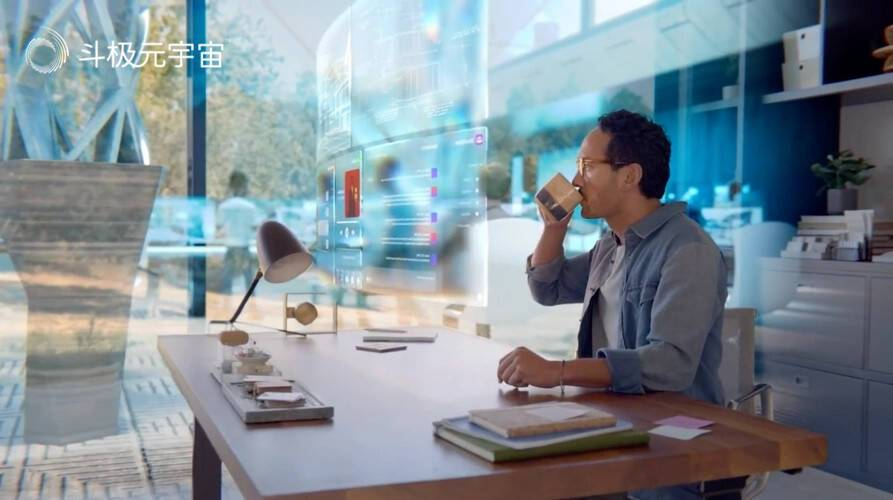

# 元宇宙的应用场景及其展望

“元宇宙”之所以引发科技界、企业界、资本界乃至政府部门的关注，是因为它给人们的生产生活带来便利，是“大数据”“自媒体”时代所不能比拟的。伴随着5G、区块链等基础设施的完善、智能终端的普及，以及虚拟现实、增强现实、扩展现实、云计算及数字孪生等技术的成熟，人们将迎来“元宇宙”，或者说现已生活在“元宇宙”的雏形中。

**一、元宇宙的应用场景**

从国内外相关企业发布的信息，可以看出元宇宙的大致应用场景，为消费（云端教育、智慧健康）、行业应用（如智慧制造、智慧文旅）、社会治理（如数字政府、智慧环保）等领域带来更多可能性。这是广义的元宇宙。

2019-2020年，歌手Marshamello和Travis Scott先后在《堡垒之夜》举办虚拟演唱会，吸引上千万观众。

2021年初，Soul App在行业内首次提出构建“社交元宇宙”。

2021年3月，游戏平台公司Roblox在纽交所上市，被称为“元宇宙第一股”；

4月，芯片公司英伟达（Nvidia）发布元宇宙虚拟工作平台Omniverse，CEO黄仁勋以逼真的1:1虚拟形象现身14秒，为渲染出来的虚拟画面，还展示了根据本人形象生成的虚拟人Toy-Me；

5月，微软首席执行官萨蒂亚·纳德拉表示正努力打造一个“企业元宇宙”；

8月，英伟达推出全球首个为元宇宙建立提供基础的模拟和协作平台；

10月，社交媒体网站Facebook宣布改名为Meta，要全力拥抱元宇宙。

8月，海尔发布制造业智造元宇宙平台，涵盖工业互联网、人工智能、增强现实、虚拟现实及区块链技术，实现智能制造物理和虚拟融合，融合“厂、店、家”跨场景的体验，实现了消费者体验的提升。

8月，字节跳动斥巨资收购VR创业公司Pico；

10月28日，美国社交媒体巨头脸书（Facebook）宣布更名为“元”（Meta），来源于“元宇宙”（Metaverse）；

11月，虚拟世界平台Decentraland公司发布消息，巴巴多斯将在元宇宙设立全球首个大使馆，暂定2022年1月启用。

11月，中国民营科技实业家协会元宇宙工作委员会揭牌。

2021年12月21日，百度发布的首个国产元宇宙产品“希壤”正式开放定向内测，用户凭邀请码可以进入希壤空间进行超前体验。

2021年12月27日，百度Create AI开发者大会发布元宇宙产品“希壤”，Create大会在“希壤APP”举办，这是国内首次在元宇宙中举办大会，可容纳10万人同屏互动。

2022年1月，索尼（Sony）宣布了下一代虚拟现实头盔（PS VR2）细节，以及一款适配PS VR2的新游戏。

2022年1月4日，高通技术公司在2022年国际消费电子展（CES）上宣布与微软合作，扩展并加速AR在消费级和企业级市场的应用。高通技术公司正与微软在多项计划中展开合作，共同推动生态系统发展，包括开发定制化AR芯片以打造新一代高能效、轻量化AR眼镜，从而提供丰富的沉浸式体验；并计划集成Microsoft Mesh应用和骁龙Spaces XR开发者平台等软件。

2022年2月14日，香港海洋公园宣布：香港海洋公园、伙拍The Sandbox合作布局元宇宙。

2022年4月25日报道，Facebook母公司Meta宣布，第一家“元宇宙”实体店将于5月开业，消费者可以在那里试用和购买虚拟现实（VR）头显和其他设备。

2022年4月26日，在渝举行的中国元宇宙产业发展高峰论坛上，重庆市元宇宙先导试验区正式揭牌。

2022年5月9日，“元宇宙首尔市政厅”向公众开放。

2022年5月25日，据媒体报道称，有淘宝内部人士向其透露：为了备战2022年的618大促活动，淘宝内部专门成立了元宇宙专项项目组。

2022年6月1日，世界牛奶日这一天，以“i牛奶 i生活 i未来”为主题的第三届北京牛奶文化节在“元宇宙”空间盛大开幕。

2022年6月6日，龙华元宇宙数字孪生舱体验日活动在深圳龙华区举办。

微软、Facebook母公司Meta及其他竞相构建新兴元宇宙概念的其他科技巨头，成立一个组织，以促进元宇宙产业标准制定，以便这些公司新推出的数字世界能够相互兼容。

2022年6月22日，由东方美谷集团与欧莱雅中国携手，为第三届BIG BANG 美妆科技创造营，打造中国首个美妆科技元宇宙路演——“BIG BANG EXPO@METAVERSE”在线上启动亮相，6月25日正式面向公众开放。

2022年6月30日，全国首个家居元宇宙平台在南康正式发布。

**二、关于元宇宙应用场景的讨论**

元宇宙的应用场景，有狭义和广义之分。狭义主要从沉浸式体验出发的界定，而广义的元宇宙，更多的是数字经济的范畴。

从用户角度看，元宇宙的发展主线比较清晰，就是创造高质量的沉浸式内容，给人们带来高性价比的时空拓展体验，包括娱乐方向的和生产力方向。作为沉浸式虚拟世界，元宇宙有两条建设路径：3D版和3维版。3D元宇宙通过算力工具建设，以便让虚拟世界变得更现实。3维元宇宙则通过影像工具建设，将现实世界变得更虚拟，如“美璟世界”。3D元宇宙是虚拟-现实，而3维元宇宙是现实-虚拟。

不能说VR就是元宇宙，就像不能讲抖音是移动互联网。因为有数以亿计的人没有这些设备，每天也在虚拟世界里参与，如在微信上聊天，又如打《王者荣耀》或《我的世界》等游戏。其实，VR不是元宇宙，就像不管是安卓还是苹果手机，都只是移动互联网的组成部分一样。元宇宙也不是虚拟世界或生成平台，正如微信不代表移动互联网一样。社交体验或虚拟体验，游戏体验，只是互联网上的众多体验之一。

元宇宙也不完全是工具，因为工具只是提供元宇宙实现的技术支持。如Metaverse本身不是游戏，但可以在APP里面玩游戏。

广义的元宇宙，覆盖物联网的多场景应用，包括社会治理、行业应用和消费等领域。

社会治理领域，主要包括智慧城市、智慧交通、智慧能源、智慧物流、公共卫生、区块链赋能实体经济、供应链金融和数字政府等。

行业应用领域，包括智慧农业、智慧环保，智慧文旅，智慧设计，云端教育，智慧制造等方面：智慧制造可进一步细分为：虚拟现场服务、企业协同合作和工艺合规检验等。

消费领域，包括智慧家居、智慧健康等，如VR技术用于医疗行业：2016年，上海瑞金医院成功借助VR直播技术直播了3D腹腔镜技术，开创了国内VR直播手术的先河。天生患斜视的James Blaha在体验Oculus Rift头盔时，发现这款头盔能够改善自己的斜视。后经两年实验，恢复了80%的立体世界。后来他成立了See Vividly公司，开发了Vivid Vision软件，为患有斜视或弱视的患者提供VR视力治疗。

《元宇宙与碳中和》一书，将元宇宙的应用领域分为四：消费、产业、工业和政务。其实，将产业与工业并列并不合适，因为产业包含了工业。从书的内容看，用产品或服务元宇宙可能更合适些。

元宇宙的应用场景，包括以下几个核心要素：

***虚拟身份：\***虚拟形象和虚拟身份是用户进入元宇宙的门票，捏脸和通用换装系统是元宇宙产品必备要素之一；

***沉浸体验：\***戴上耳机和目镜，就可以通过连接进入由计算机模拟的一个三维现实；

***开放创作：***允许每个用户进行内容生产和编辑，用去中心化方式实现持续不断创新；

***经济系统：***虚拟货币与现实货币接轨，由虚拟人在元宇宙的经济系统中做决策；

***多元场景：***以游戏为载体，吸引客户参与社交、教育、职场、娱乐、消费等场景。

**算力、游戏引擎和数字创意**是数字场景建设的三大要素：

算力（计算能力），是数字经济时代的生产力。高并发用户、多模态体验、高渲染精度、建模方式变化等的驱动下，未来虚拟场景搭建所需算力必然以指数级提升。

游戏引擎，是数字场景建设的工具箱。丰富的建模、渲染、算法能力、工具和数据能够在平台中不断积累、复用和迭代，从而推动各个领域数字场景建设的开发效率提升。

内容创意，是数字场景建设的图纸。PGC和UGC都将贡献大量数字内容创意，其中PGC专业创作者将是数字场景建设不可或缺的力量，UGC在元宇宙的建设中的重要性也在不断提升，实现数字场景多元化发展；创作者可以从现实世界文化以及经典IP中汲取灵感，创造出异彩纷呈的虚拟空间。

**三、元宇宙的发展前景**

展望未来，元宇宙的发展主要有以下前景。

首先，从市场规模来看，多个国际知名咨询机构公开表示看好元宇宙的未来。如普华永道预计，2030年元宇宙市场规模将达到1.5万亿美元；彭博行业估计届时元宇宙市场规模可以达到2.5万亿美元；摩根士丹利预计，未来元宇宙潜在市场空间将超8万亿美元。

其次，从产业创新前景看，元宇宙带来的产业创新前景包括两方面：将打破我们所习惯的现实世界及其规则，以全新方式激发产业技术创新；还将与不同产业深度融合，以新模式、新业态带动相关产业跃迁升级。

从应用前景看，当前主要在游戏、娱乐等领域，其他领域应用相对较少。未来，伴随元宇宙技术和产业成熟度的持续提高，其应用范围将逐步扩大，并不断深入。

2022年，data.ai（原 App Annie）发布《2022年移动市场报告》指出，社交应用的下一个重大变革可能会是虚拟人物和元宇宙，预计元宇宙游戏在2022年的应用商店年用户支出将超过31亿美元。根据摩根士丹利预测，2030年虚拟商品将带来500亿美元的额外收入。NFT和社交游戏有望在8年内将奢侈品集团的潜在市场扩大10%以上，并推动该行业的息税前利润增长25%左右。

除了直接的收入增长外。元宇宙作为线上产业，也能极大地增加品牌与消费者之间的互动，提升包括Z世代在内人群的消费体验。

目前与元宇宙联系最多的是VR/AR，但尚存在缺陷，特别是穿戴、视觉效果给人带来不舒适的体验，缺乏隐私保护的标准，需要新的内容生产平台等。元宇宙要“以虚强实”。现在业界对元宇宙的探索如同小马过河，也如同开卷考试，特点是答案满天飞。

无论是元宇宙还是数字孪生，本质上是一个虚拟空间。创造虚拟空间的初衷是强化物理世界，让我们在现实生活提高生产效率、降低生产成本。

终极目标不是“脱实向虚”，而应是“以虚强实”。例如，宇航员现在能上火星，却不能上金星，但未来人形机器人可以去。元宇宙的发展有利于人类进一步拓展星辰大海，希望虚的部分能够无限向内，实的部分能够无穷外拓。

为构建这样庞大的体系，需要巨大的算力支撑，包括持久和沉浸式的计算能力。让数十亿人访问元宇宙，算力至少是现在的1000倍，若让身体有沉浸感，算力大概是现在的100万倍，在短短的10年内是几乎不可能实现的。

元宇宙涉及庞杂的技术，欧美发达国家的强项在于操作系统，包括虚拟引擎、3D建模引擎和应用。美国版的元宇宙已有两条明确的发展路径：一个是谷歌3D地图。这是对现实世界1:1的高精度3D还原，以容纳更多地理信息，正是人类创造数字孪生世界重要工程的一部分。业内专家称其为“元宇宙地图”。另一个是英伟达的Earth-2超级计算机，是地球的数字孪生。英伟达推出Quantum-2平台有望为Earth-2超级计算机架构带来重要变化。

美国还在构建军事元宇宙，斥资超200亿美元购买了微软的元宇宙装备。

我国发展元宇宙的优势何在？在移动互联网时代，已涌现出一批成熟的应用场景，如短视频、直播带货、游戏等。

在元宇宙时代，我国可以把这些优势要素与元宇宙发展有机结合起来。我国多地在元宇宙领域布局，杭州成立了元宇宙专委会、网易元宇宙产业基地落户三亚、深圳成立元宇宙创新实验室。

有关部门在培育一批进军元宇宙、区块链、人工智能等新兴领域的创新型中小企业。
