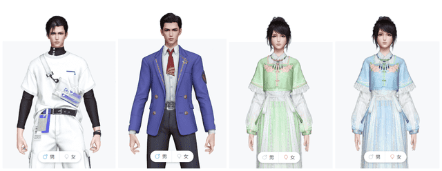

# 号称国内最接近元宇宙概念的项目之一？网易瑶台厉害在哪里？

元宇宙无疑是当下最火热的话题之一，因为其巨大的想象空间和广阔的商业应用场景，各行各业纷纷开始在元宇宙赛道下注，着手布局元宇宙。

网易瑶台便是基于元宇宙概念下的一个虚拟活动台，由网易伏羲打造，致力于用人工智能和科技创新打造全新的线上活动模式，通过复刻线下真实的会议、会展场地，增加智能捏脸、表情迁移等 AI 技术，为用户打造一个身临其境的、虚拟的、面对面的、有仪式感的在线活动体验。

作为目前国内最接近元宇宙形态的产品之一，网易瑶台成功上线并应用的背后是网易伏羲突出的研发能力和网易游戏多年的技术积累。

**注重沉浸式交互**

告别传统在线会议的低互动效果，致力营造活动氛围感和仪式感。用户可以自主操作虚拟人物，在拟真场景中面对面畅聊互动， 获得超越现实的沉浸式体验。区别于传统视频会议的单一呈现方式，“瑶台”系统支持按照需求设置多种风格的活动场地，并且能高精度复刻真实的会议场景，提供 PPT 共享、畅聊、同声翻译等全面的会务功能。

**个性化定制**

基于网易伏羲领先的AI技术，用户可以随心打造专属虚拟形象，并实时控制虚拟人物的面部表情和肢体动作。活动主办方可以量身定制虚拟活动场景和会务功能，满足多样化活动需求。

该技术可根据用户上传照片快速生成游戏捏脸参数，高度还原参会者面部特征，如发型、肤色、五官。与此同时，虚拟人的表情、动作会实时随着真实表情、动作的改变而改变，让所有参会者仿佛置身于现实会议中，直观感受对谈方的喜怒哀乐。这项技术此前已服务于《永劫无间》《逆水寒》《天谕》等多款游戏和应用。

**难忘的视觉体验**

依托网易游戏专业的美术能力，打造多个精美活动场景， 给用户一场身临其境的视觉盛会。

网易瑶台选取最常见的、用户需求量最大的活动场景，在系统内置了十几种模版。每一种场景目前都提供小规模的自定义功能，用户可按照自己的需求进行布展，得到相对个性化的场景。另外，瑶台也正在研发一个纯 UGC 系统，未来将实现线上布展的完全自定义模式，届时用户可以用瑶台的场景编辑器，随心搭建自己所需要的场景。

**多端支持**

支持多端访问（云游戏、PC客户端、移动端），用户可以随心选择参会方式。不同于传统活动存在线下诸多束缚，网易瑶台借助云游戏优势，最大限度缩减了操作流程。用户还可以直接在浏览器打开活动网址，输入参会码便可参会，体验面对面沉浸式社交体验，无需额外下载浏览器，对登入设备的要求也很低。

应用场景

学术教育：学术会议、专家讲座、学习角、毕业典礼

商业活动：在线展会、行业峰会、发布会、招聘宣讲、企业活动

社交娱乐：派对聚会、游戏互动、虚拟演唱会

网易瑶台沉浸式活动系统已经应用在线上发布会、大型会议、展览展会、艺术展、拍卖会等众多场景，服务包括华为云专属月  行业深耕”发布会、2022 中国国际大数据产业博览会、网易云音乐 IPO 大会、第 28 届国际低温工程会议、河南智慧文旅大会、MCON Festival 首届品牌元宇宙营销沉浸式峰会等多场景的活动需求。

（免责声明：本文转载自其它媒体，转载目的在于传递更多信息，并不代表本站赞同其观点和对其真实性负责。请读者仅做参考，并请自行承担全部责任。）
