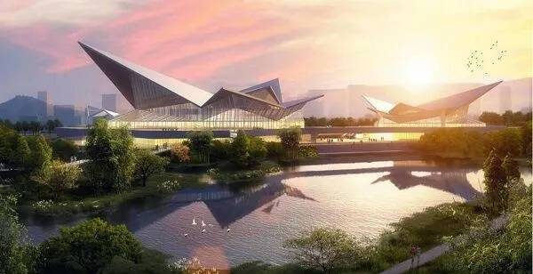

# 打造NFT商业新模式，陕西汉中规划建设全国首个元宇宙数字文创观光园区

位于陕南地区中心的汉中市，因汉水而得名，地理位置得天独厚，是连接关中—天水经济区、成渝经济区和江汉平原的重要交通枢纽。溶溶漾漾的汉江自西而来，在此转道向南，汇入长江。

六月初，“元宇宙藏品馆”公司收到汉中市政府的邀请，来此实地考察调研。双方进行了积极而热烈的沟通交流，滨江新区体现极大诚意，拟规划将最繁华的江边科创带进行数字实体产业开发。

“元宇宙藏品馆”数字艺文产业园区正是坐落于江湾之畔的汉中市中央文体区。园区占地面积约150亩，是包含元宇宙数字藏品馆、数字产业大楼、文旅酒店、艺文广场、人才公寓等项目为一体的科创产业集群。

“元宇宙数字产业园合作协议”签约仪式于2022年8月14日第六届丝博会期间举行。据元宇宙藏品馆首席运营官陈晓翼表示，园区的规划分为产业扶持与文创开发两大方向。其中数字产业大楼将作为未来科技人才培训基地与产业孵化基地，注重元宇宙数字产业项目的落地与培育。同时规划建设全国首个元宇宙数字文创观光园区，通过元宇宙数字藏品馆带动旅游、酒店与人才引进安置等相关产业发展。

元宇宙藏品馆作为一家前沿科技创新企业，拥有实力雄厚的研发技术团队，深耕区块链领域多年，在区块链加密技术和IPFS分布式储存技术上具有丰富经验。元宇宙藏品馆充分运用在NFT数字藏品领域的技术积累，抓住新一轮科技革命和产业变革机遇，积极推进元宇宙产业链条从虚拟人工智能领域向实体产业延伸。

元宇宙藏品馆一直致力于区块链产业与实体经济的连动，通过全新的商务模式带给消费者极致的体验。“元宇宙藏品馆”数字艺文产业园区将是结合科技与文化汇集的互动场域，未来更将成为NFT商业模式落地应用的实验基地，不仅提供场地扶持数字产业孵化，也欢迎全球科技研发团队来此创设企业，更以虚实整合模式为消费者提供独特的消费与游览体验。

元宇宙藏品馆研发团队包括去哪儿团队创始团队、优旅区块链技术团队、AR社交应用的AR/VR技术团队和过百人的3D团队。“元宇宙藏品馆”数字艺文产业园区项目，正是以这些顶尖科研团队为引领，依托汉中市的地理区位优势与传统文化积淀，助力打造“汉中全域全维高质量特色发展带”。

“元宇宙藏品馆”数字艺文产业园区建成后，将会成为驱动区域经济增长的重要力量
