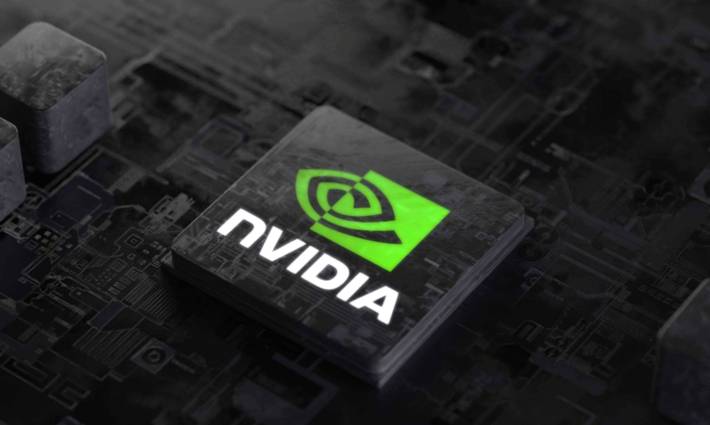
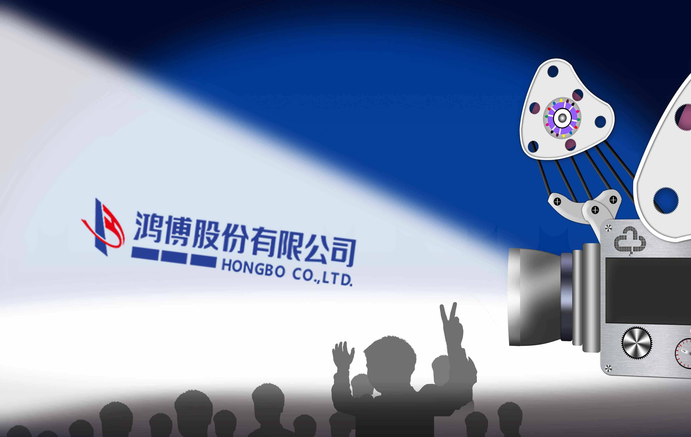

# “元宇宙”巨头落子A股？英伟达牵手鸿博股份打造北京智算中心

近日，鸿博股份有限公司(股票代码:002229)发布公告称已与美国公司英伟达(纳斯达克股票交易代码：NVDA)签署合作协议，共同成立北京人工智能创新赋能中心。该中心由鸿博股份全资子公司北京英博数科科技有限公司运营，鸿博股份将在未来三年持续向英博数科注资不低于3亿元人币以支持其进行AI智算中心和提供AI研发赋能服务所需各项设施的建设及运营。

**英伟达领衔四方合作**

据了解，此次参与签约各方，分别为A股上市公司鸿博股份及全资子公司北京英博数科，英伟达公司、中关村中恒文化科技创新服务联盟。其中最为引人注目的无疑是英伟达。

英伟达是GPU的发明者和技术领导者，具有国际顶级的创新研发能力和产业带动能力。英伟达的战略布局横跨AI算力中心、高性能计算、自动驾驶、智能机器人、智能制造、工业物联网、智慧城市、医疗健康、基因检测、新药研发、 ARVR、边缘计算、智能设备、文化创意等众多领域。值得注意的是，根据公告，本次的缔约方为英伟达公司本身，而非其分支机构。也就意味着，北京人工智能创新赋能中心很可能成为英伟达在中国布局落子的重要一步。

协议中的另一位参与者中关村中恒文化科技服务联盟的出现同样值得关注。根据该联盟对外公开信息显示：“中关村中恒文化科技创新服务联盟由科技部、文化旅游部等六家部委联合倡导推动成立。联盟作为中间环节，紧密连接政府、高校和市场。

**助力“东数西算” 推动人工智能场景化应用**

8月12日，科技部、教育部、工业和信息化部、交通运输部、农业农村部、国家卫生健康委等六部门印发《关于加快场景创新以人工智能高水平应用促进经济高质量发展的指导意见》，提出“统筹推进人工智能场景创新，着力解决人工智能重大应用和产业化问题。”

据了解，北京人工智能创新赋能中心项目落地后，将把产业共建作为重要发展方向。据了解，项目落地后，将大力投入智能医疗、智能制造、无人驾驶等重点产业的共同研发，这也是英伟达最擅长的领域。

**新一代超算中心 能耗为传统两百分之一**

公告发出后，全景网联系鸿博股份相关负责人，了解本次合作的具体建设规划。据介绍，本次合作将围绕超算中心建设展开。超算中心建设预期三年，首年建设一期。一期建设项目将引入20台英伟达 Superpod DGX A100超级计算机及配套设备，以向市场提供100P AI算力。

英伟达 DGX A100超级计算机及配套设备代表目前全球超级计算机的技术顶峰，同时在能耗方面具有极大优势。根据运营方测算，与同等算力的国产顶级设备相比，鸿博股份在本次项目中引入的由英伟达 DGX A100超级计算机组成的超算设备组将能耗其他设备的两百分之一。在提供市场急需的AI算力的同时，满足国家对能源高效利用、节能减排、以及技术环境可持续发展的要求。

据了解，超算中心一期将落户于北京国际大数据产业园。该产业园位于北京朝阳区三里屯街道，在环境设施、系统化管理、以及信息安全方面均代表业内领先水平，将为一期中心的运营提供强有力支持。超算中心一期预计于2022年10月落成并投入使用，提供当下市场急需的高效率AI算力。

**“生态网络”+“元宇宙” 鸿博能否吃得下**

8月8日，英伟达发布的二季度财报显示，数据中心收入为38.1亿美元，较上一季度增长1%，较去年同期增长61%，在各项业增长中位居前列，这也意味着数据中心业务已成为游戏业务外，英伟达拉动收入增长的又一重要引擎。英伟达创始人仁勋也在近年多次强调，超算中心将在公司未来业务发展中占有重要地位。而在中国国内，随着“东数西算”工程的大力推动，和人工智能产业场景创新、应用化、产业化的需求不断提升，对超级算力的需求缺口不断扩张。此时英伟达与鸿博股份联手落地北京人工智能创新赋能中心项目，一定程度上，可以视为其超算中心业务在中国布局的初步尝试。

作为A股上市公司，鸿博股份此前也曾试图涉足人工智能产业，但其对科语机器人的收购因故终止。但相比之下，英伟达在人工智能领域可以为合作伙伴提供更加丰富的资源。据了解，英伟达目前拥有全球最大的人工智能合作伙伴生态体系，在全球拥有超过12000家人工智能生态合作伙伴企业，在中国就拥有超过1300家人工智能生态合作伙伴企业。如此巨大的生态伙伴网络，也将成为超算中心项目巨大的市场空间。

英伟达的元宇宙与超算中心联动布局同样引人注目。英伟达被称作“元宇宙的基础”，是对元宇宙概念探索和尝试的全球先行者，其发布的针对元宇宙的Omnivrse平台被认为是“最突出的一步”。北京人工智能创新赋能中心项目的AI算力的将多大程度的参与英伟达的元宇宙建设，接触到多少英伟达对元宇宙的理解和技术成果，或将是本次合作中最值得期待的部分。

尽管鸿博股份本次与英伟达的合作提供了广阔的发展空间，但鸿博股份如何充分把握机遇仍未可知。从公告来看，本次项目并非由鸿博股份直接掌控，而是通过全新组建的全资子公司北京英博数科运营。这种架构下，子公司人员组建、运营能力以及市场和政策的各种变化可能都无形中加大了项目推进的难度。除此之外，鸿博股份的技术和资金实力能否充分消化英伟达这个“庞然大物”带来的丰富资源，也尚未可知。
