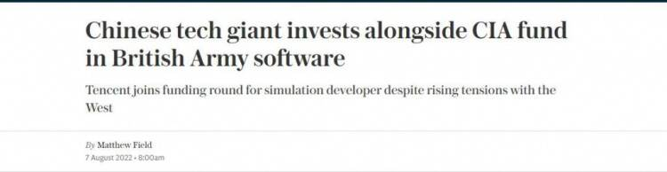
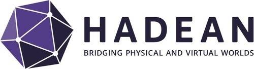
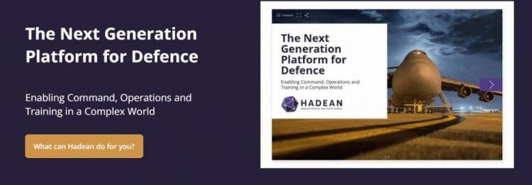
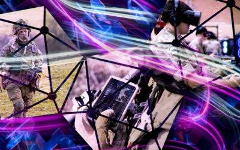

# 腾讯投资元宇宙新秀公司Hadean 将游戏技术引入英国陆军训练 

近日，英国《每日电讯报》，腾讯投资了当地一家名为Hadean的元宇宙新秀公司。

据知情人士透露， 除了腾讯外，由CIA资金支持的美国风投In-Q-Tel共同参与了本轮最新融资， 预计 Hadean将在本轮融资中筹得约1500万英镑（约1.2亿人民币）的资金。

对此，Hadean公司CEO Craig Beddis解释道：“腾讯在游戏和元宇宙等领域明显拥有强大的实力，这就是为什么我们会接受这笔投资。”

值得一提的是，此前Hadean其实还获得了来自英国政府未来基金（Future Fund）的投资（前英国财政大臣在疫情流行期间发起的创业公司救援基金）。期间，英国国家安全战略投资基金（NSSIF）也为其提供过建议。

据了解，成立于2018年的NSSIF，主要负责投资高度敏感的国防初创企业。并与英国政府通信总部关系密切，为这些初创公司提供接触英国情报界核心安全专家的机会。

当然Craig Beddis也表示，该公司始终清楚投资来源，腾讯等股东无法获得敏感技术。同时根据英国《国家安全与投资法》，由于腾讯投资占股太小，可能无法引发当地政府的国家安全审查。

这也意味着，基于投资Hadean这件事，英国政府、CIA支持的基金和腾讯意外成为了合作伙伴。那么，这家公司究竟是如何赢得多国基金与科技公司的青睐？

**从游戏到音乐，涉猎多个元宇宙领域**

据悉，Hadean 成立于 2015 年，为Web3.0和Metaverse重新设想分布式、空间和可扩展计算,其分布式云平台为Metaverse、企业组织和国防部门提供web3.0应用的基础。

此前，该公司与Epic Games、微软、我的世界等游戏公司都有过合作，共同开发可扩大规模以同时支持数千名玩家的技术。例如，曾在《EVE Online》中举办过14000名玩家参与的星际大战，打破了纪录。

但直到今年开始，这家公司才开始逐步涉足元宇宙领域。先是在4月，同区块链游戏公司GamesCoin合作，推出世界上第一个“Play to Own”的区块链游戏虚拟世界中心。

简单来说，玩家能够在不同的游戏和虚拟世界之间无缝移动，并通过 NFT 的形式获得所有权物品，自由携带、使用或进行交易。其自身基于以太坊推出的GamesCoin 代币，则能在整个世界中使用。

Craig Beddis也提到：“我们很高兴能与GamesCoin合作，通过建立第一个可以扩展到上千、甚至数百万用户的‘Play to Own’的游戏中心，我们正在释放巨大的潜力。”

到了6月，Hadean则与PIXELYNX合作，打造了世界上第一个音乐元宇宙“ELYNXIR”。事实上，后者正是由电子音乐人deadmau5和 Plastikman联合创建的元宇宙音乐公司。

在ELYNXIR上，用户可以参加虚拟音乐会，进入音乐艺术家设计的虚拟空间、赚取和售卖NFT代币。其中的社交和游戏均源自定制音乐生态系统，ELYNXIR只提供分发和托管。

除此之外，Hadean的“分布式计算”技术也得到了英国国防承包商和国防部的使用。今年7月，该公司进一步与英国军方签订合同，为士兵开发陆战训练模拟器。

**同官方合作密切，将游戏技术引入陆军训练**

2021年11月，Hadean宣布参与英国国防和安全加速器（DASA）的一个项目。在之后的12个月内，同Cervus公司一起与陆军总部的未来团队合作，提供联合解决方案，完成DASA的 “模拟未来战斗空间的复杂性 “挑战。

通常情况下，需要采用数据驱动的方法分析战局情景，以提供最佳决策，但当下的一些现有流程仍然效率低下。因此，英国官方希望利用Web 3.0技术来实现该过程的自动化，以提升效率。其中，Hadean负责高要求的计算，以便为并行模拟提供足够的动力。

Craig Beddis谈到该项目时表示：“正如社会互动以Metaverse的形式变化一样，军队的单一合成环境正变得更加复杂和身临其境。而我们的平台正在实现对防御场景的深入分析，为决策者提供实时的决策支持。如Hadean的可扩展性，为这些高要求的应用提供了必要的计算能力。”

今年7月，Hadean再度表示被选中参与支持英国陆军集体训练转型计划 (CTTP) ，帮助陆军建造和扩展云分布式模拟演示器，以将实时数据反馈整合到单个沉浸式模拟中。

借助Hadean的Web 3.0技术，可以将陆战训练环境中二维、三维和实时、虚拟和建设性（LVC）元素融合到一个沉浸式模拟中。为远程的物理和虚拟用户运行更大的场景，且不影响保真度或复杂性。而该计划将于今年夏天启动，预计2023 年春季完成。

换而言之，英国陆军将会拥有了一种安全、且可重复性极强的战术和计划演习方法。即可以模拟无穷无尽的现实场景，而无需花费成本在物理环境中设置。

同时，陆军也能够探索集体训练的新领域：处于不同地域实战环境的战斗小组，能够与在虚拟世界中演习的部队一起远程操作。

Craig Beddis表示：“能够在虚拟世界复制现实世界中所做的事情的能力，非常适合国防部门的培训。这里展示的技术还将有助于实现更大程度的多国实时、虚拟和建设性集体训练。”

对此，英国国防部集体训练转型项目高级负责人Mike Cooper说:“集体训练转型项目(CTTP)正在同陆军创新、以及Hadean公司合作，以在未来集体训练系统中开发新技术。而这次演示带来的成果，也能展示如何将商业游戏行业的技术引入合成环境平台，来支持训练的转型。”
