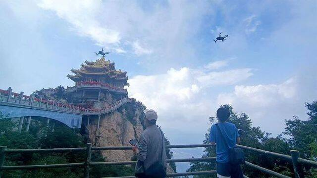
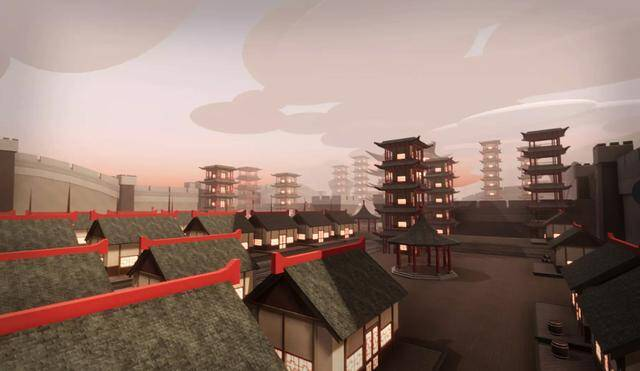

# 河南文旅元宇宙创造者大赛全攻略请接收 单奖最高50万

目前，由河南省文化和旅游厅主办、网易集团与河南省非物质文化遗产保护和智慧化中心承办的“行走河南·读懂中国”品牌推广暨元宇宙创造者大赛报名工作正在火热进行中。

**大赛内容：三维虚拟场景众创 + 游戏玩法共建**

本次大赛以“逐鹿中原 创造元豫宙”为创作主题，围绕设定的文旅选题方向，通过邀请全国三维场景开发者及公司、《我的世界》中文版游戏玩家参与众创或共建，实现河南景观景点、文旅IP等在网络世界的复刻或重现，创新传播“行走河南·读懂中国”品牌。

大赛有数字场景组和游戏场景组两个赛道。其中数字场景组面向全国三维场景开发者公开招募，共同建设河南首批文旅元宇宙数字资产，打造河南文旅的数字化地图，构建河南文旅虚拟世界框架——元豫宙；游戏场景组面向《我的世界》中文版游戏玩家，通过特邀高端专业团队定制河南文旅像素玩法，并邀请游戏内网友体验游玩，让更多人感受河南厚重文化和壮美山河的魅力。

**大赛进展：多家三维设计单位报名 选题景区数据采集进行中**

据大赛组委会负责人介绍，目前已经报名的三维场景设计制作企业，来自河南、北京、广东、上海、重庆、湖南、四川等十多个省市，大家都希望利用自己的技术优势，与河南众多优质的文旅资源相结合，创造出更好的合作空间。

大赛组委会数据采集团队在大赛选题景区之一的老君山采集美术数据

为了帮助各参赛单位更高效的创作，大赛组委会组织精干力量，先后对黄帝故里、老君山、太昊陵等多家选题单位进行了全景和美术数据采集。在报名后，部分众创和邀约定制单位已开始进入创作流程。

部分数据场景创造者在报名后已开始进行建模创作

**获奖名额31个！单奖最高50万！多项权益赋能创造者**

本次大赛游戏场景组将设置10名优秀共建奖，另外21个奖项名额全部为数字场景组参赛团队。其中特等奖一名，每名50万元，一等奖2名，每名30万元，二等奖6名，每名10万元，三等奖12名，每名2万元。

一位参赛的三维场景设计公司负责人认为，文旅+元宇宙发展前景广阔，虚拟数字场景作为元宇宙的底层基建，在未来发展中将迎来更大的需求市场，参与其中，奖金多少不重要，重要的可以有机会进入前景广阔的文旅市场。

组委会负责人表示，本次大赛除了除了创造“元豫宙”，希望能发现更多具备元宇宙新基建能力的企业，大赛主办方和承办方，将提供多项增值权益赋能创造者，包括河南文旅市场资源对接、网易美术供应商资格、媒体曝光传播、技术与学术辅导、作品著作权享有、企业品牌展示、获奖证书及参赛证书等等，帮助企业开拓市场。

**让网友来主导评选！评奖规则缜密精细**

据组委会负责人介绍，游戏场景组采用特邀共建模式，不参与评奖，数字场景组将按照竞争力、传播力、专业度三个评选维度，对参赛作品进行赋分，其中由网友主导的竞争力和传播力分数达70分。

竞争力方面，大众通过大赛组委会指定渠道进入大赛评分通道（网站、小程序等）进行投票，根据票数进行评分；传播力方面，将按照各个作品的渲染视频在抖音、快手、视频号、B站、微博、微信公众号等传播平台的互动表现，并按区间给分；专业度方面，大赛组委会邀请文化与技术专家组成评选团，专家团将根据参赛作品的文化内涵、艺术呈现和技术实现质量等标准进行评分。

元宇宙创造者大赛仍在报名阶段，并会继续根据参赛者的选题集中安排数据采集。
