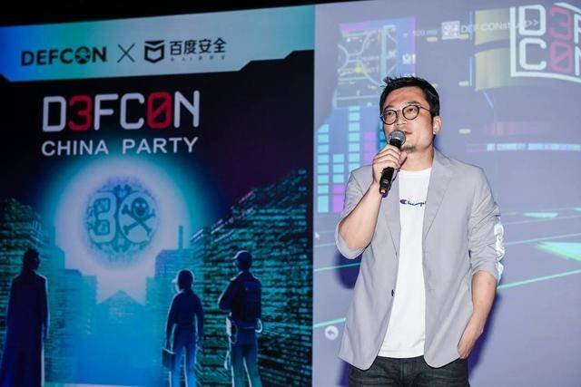
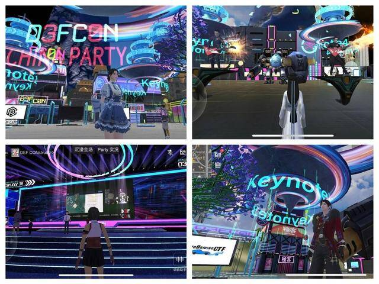

# 全球安全极客大会首登元宇宙 构筑网络安全新防线

近日，DEF CON 30 CHINA Party正式在百度希壤举办。作为全球首个元宇宙安全极客大会，本次活动由DEF CON与百度安全联合打造，以线上线下相结合的方式，为全球极客带来DEF CON 30零时差现场实时直播，呈现了一场趋势性的极客盛会。

对于DEF CON 30 CHINA Party首次登陆元宇宙，DEF CON创始人杰夫·莫斯表示，通过百度希壤实现元宇宙的连接，是极客们从未有过的尝试。这不仅是一种全新的方式，也是极客精神的体现。

同时，在网络安全社区的建设方面，百度副总裁马杰表示，随着网络安全被越来越多的人所重视，极客社区正在变得生机勃勃。保持热情，保持热爱，去探索最前沿的和最具脑洞的一切，也是极客们的“职责”所在。

值得一提的是，依托百度大脑在智能视觉、智能语音、自然语言理解、知识图谱的能力和百度智能云的强大算力，希壤打造了国产元宇宙产品，并为行业提供了云智一体的元宇宙基础设施平台和一站式解决方案。

有业内人士认为，随着中国极客群体的不断成长，一个更为开放安全社区的逐步成型，也推动着DEF CON在国内活动内容、会议形式的持续创新，并将更多中国本土化的元素融入到这一国际化的盛会之中。
