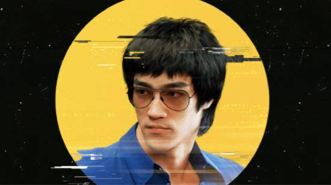
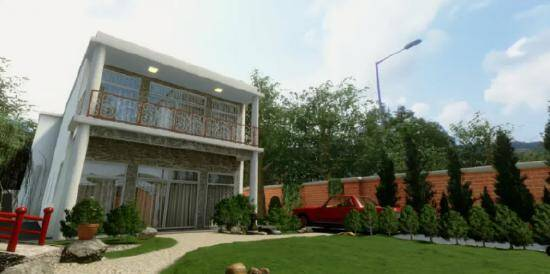
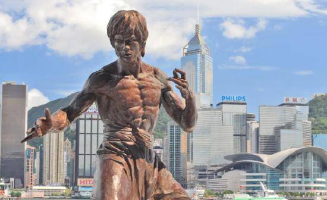

# 纪念武术传奇人物李小龙 “记忆的复兴：李小龙在元宇宙中的家”展览即将举行

为纪念李小龙这位武术传奇人物，" 记忆的复兴：李小龙在元宇宙中的家 "（ Revival of the Memory：Bruce Lee ’ s Home in Metaverse ）展览即将举行，让用户在 VR 中探索李小龙的香港老家，并参与一系列互动。

据了解，李小龙故居位于香港金巴兰道 41 号，又称 " 鹤巢 "，于 2019 年被拆除。然而，在香港专业教育学院（沙田分校）三名学生的努力下，李小龙的粉丝将能够通过元宇宙虚拟朝圣鹤巢。

据悉，该项目由李小龙俱乐部与 PRIZM 集团合作管理，将于 2023 年 7 月 20 日（李小龙逝世 50 周年）在全球推出。未来，该空间可用于为粉丝举办各种李小龙纪念活动。

李小龙俱乐部主席 Wong Yiu-Keung 表示：" 我们希望人们通过 VR 技术更多地了解李小龙的最后足迹，更多地了解他的水哲学。该项目与大学和企业合作，在此感谢三名希望以不受限制形式将李小龙精神代代相传的年轻学生。"

PRIZM 集团董事 Jeffrey Hau 表示：" 李小龙是东西方文化交流的代表，本次展览希望通过 Web 3.0 元素的赋能来复兴传统文化，并将李小龙精神传递给下一代。作为一家数字营销公司，PRIZM 将继续采用最新技术来推广文化场景。"
