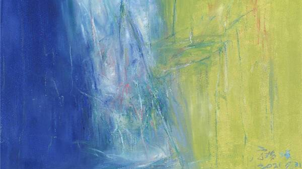
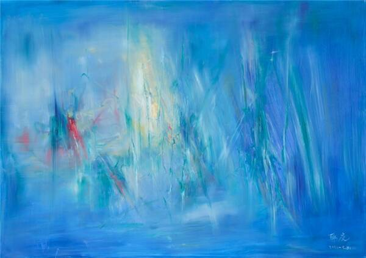
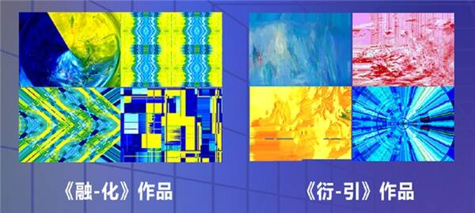

# 宁浩、韩庚首个数字藏品正式上线 《未知的边界》元宇宙展即将开幕

近日，宁浩、韩庚AI共创数字藏品《融-化》和《衍-引》系列数字藏品，在灵韵数字艺术平台正式发售。8月20日，灵韵数字艺术平台携手芭莎艺术共同打造的《未知的边界》元宇宙展也即将拉开帷幕。三位艺术家不仅首次尝试跨界艺术创作，更是首次触电数字艺术，消息一经传出便引发了众多数字艺术藏家的热烈讨论和关注。

《未知的边界》是由《芭莎艺术》主办的沉浸式新媒体艺术展，邀请到了艺术家吕顺、导演宁浩和演员韩庚倾情创作，其中宁浩、韩庚更是在艺术家吕顺的指导下首次跨界尝试油画创作，展览跳出传统平面框架，多元融合线下及新媒介渠道，利用声光电媒介的特殊性，及电脑编程代码的可塑性，对作品进行二次创作。

宁浩《融》

韩庚《引》

此次《未知的边界》携手灵韵数字艺术平台，以导演宁浩创作的油画《融》与演员韩庚创作的油画《引》为基底，通过算法对两幅作品进行数字衍生创作，生成宁浩《融-化》和韩庚《衍-引》系列数字藏品，并于8月12日，在灵韵数字艺术平台进行线上展出，使观众充分感受艺术与科技的深度融合。

灵韵数字平台是今年以来数字艺术平台中的一匹黑马。早前其发行的“灵韵虎-寅春”系列数字藏品，以数字赋能实体为平台宗旨，创新“数字+实体”相互赋能、多元增值的创新玩法，迅速赢得了众多藏家的关注与信赖，让“灵韵虎-寅春”系列接连创下上线即秒空的成绩。

此次，灵韵携手芭莎艺术《未知的边界》，更是脑洞大开，创意频出。歌手戴燕妮，也将作为“引导大使”倾情献声，完成元宇宙展厅的所有配音解说，新专辑里的歌曲也将作为《未知的边界》元宇宙艺术展部分展厅的BGM，“声临其境”带领参观者进入沉浸式的虚拟世界。

据悉，《未知的边界》线上艺术展，还策划了一系列藏家与艺术家共创的衍生活动。此外，成功购得藏品的部分藏家也将同时获得线下观展的资格。宁浩、韩庚与吕顺共同创作的两幅作品，将以拍卖形式售出，所得款项捐赠给慈善基金会。取之于艺，用之于善，回馈社会，才是艺术最有温度的表达。
