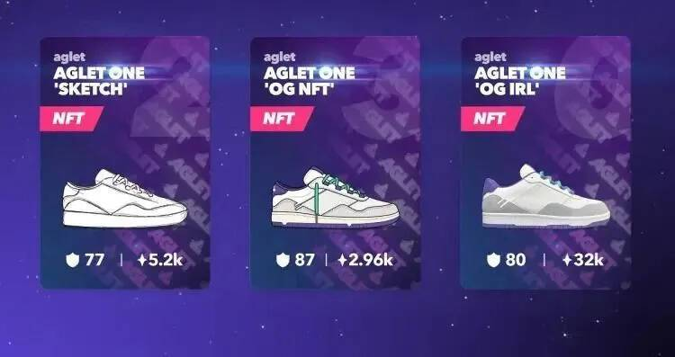
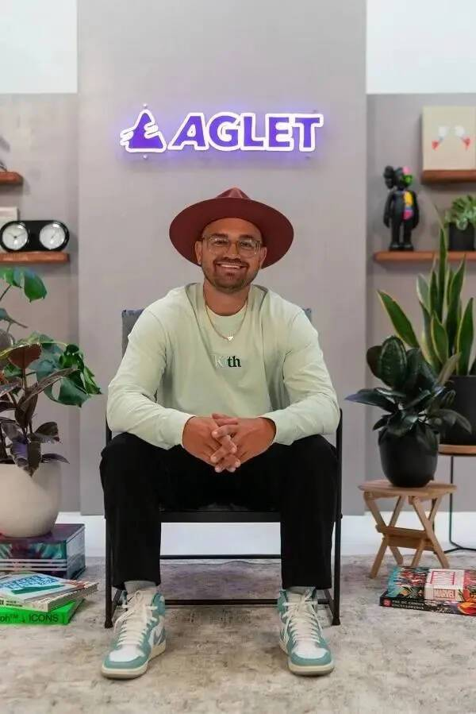
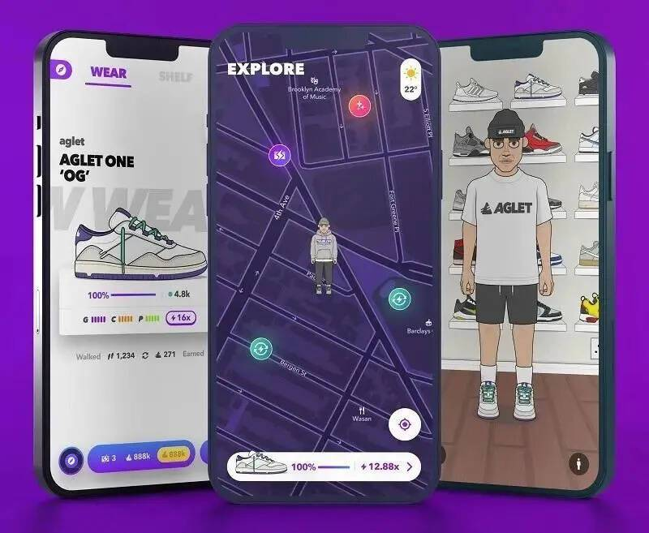
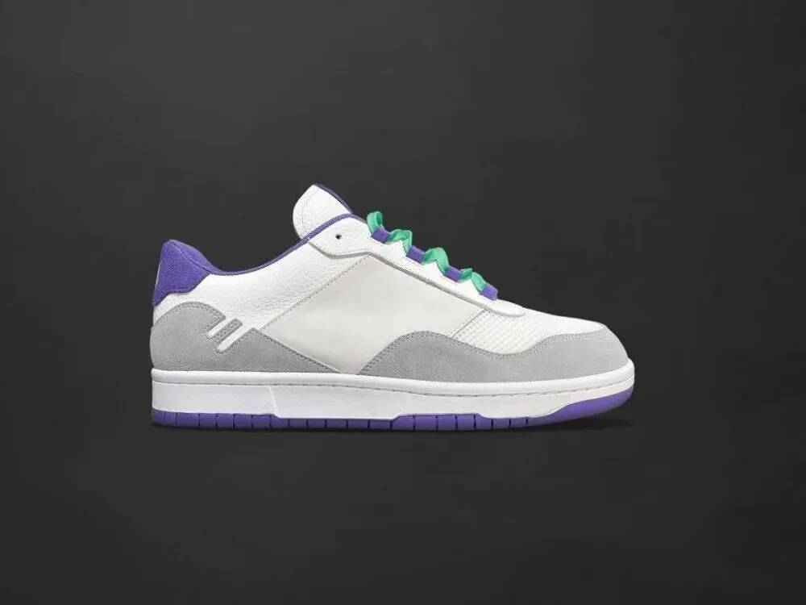
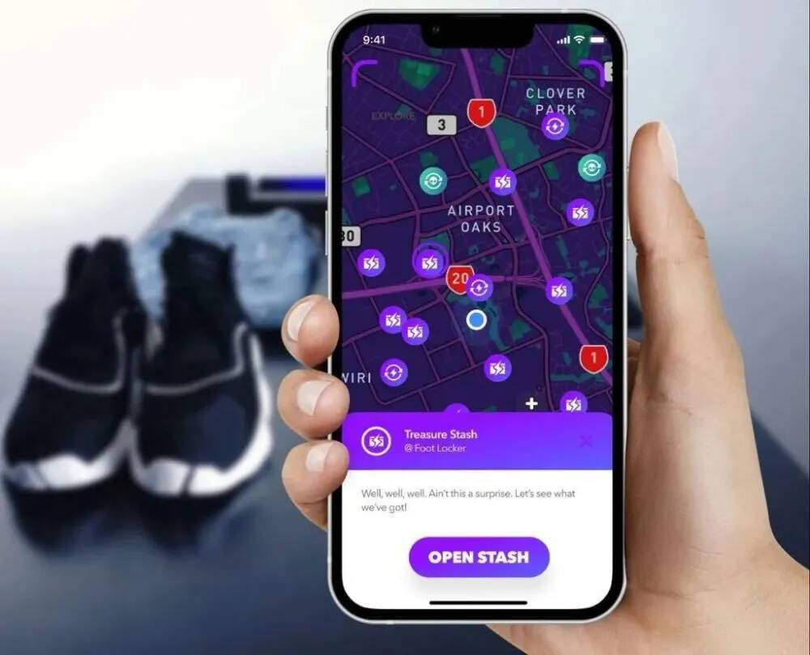

# 月活跃用户达350万！Aglet——海外年轻人的“球鞋元宇宙”。

虽然在2021年与元宇宙一起成为了“当红炸子鸡”，但NFT进入2022年以来的发展并不顺利。随着虚拟货币市场雪崩，很多区块链游戏以及NFT关联公司遇挫。

不过，外媒VB透露，最近有一款NFT游戏却让人们看到了希望。海外初创公司Onlife最近宣布，旗下“球鞋元宇宙（Sneakerverse）”《Aglet》月活跃用户（MAU）超过了350万，使其成为当下最热门的区块链游戏之一。

与很多爆款一样，大部分读者可能都没听过《Aglet》这个名字。不过Onlife公司CEO Ryan Mullins表示，自2019年创立之后，这家公司已经拿到了超过2400万美元融资。那么，《Aglet》到底是什么呢？

**以下是Gamelook编译的内容：**

MAU超过350万的《Aglet》：PMGO+NFT

《Aglet》是一个运动鞋世界，最初诞生于Web2世界，并且通过销售用区块链技术为独特数字物品进行认证的NFT拓展到了Web3领域。这款游戏之所以受欢迎，有一部分原因是现实中的限量款运动鞋很难买到。

Mullins曾是阿迪达斯数字创新负责人，他在提到游戏最近表现的时候说，“当我们宣布了NFT之后，它就爆发了，我们曾连续两周拿到日本市场应用榜单冠军，有3%的乌克兰人玩《Aglet》，它非常流行。随后在韩国也开始流行，我们如今已经拥有350万MAU，过去两月是非常不可思议的。”

Onlife公司CEO Ryan Mullins

Onlife的《Aglet》可以让玩家们购买虚拟球鞋，或者让用户走路以获得游戏点以购买虚拟球鞋，它的目标用户是经常在运动鞋限量款发行活动很难得到心仪鞋子的“鞋迷”。类似于《Pokemon Go》这款游戏将虚拟世界与物理现实相结合，包括虚拟和真实货物，与走路抓妖怪不同的是，《Aglet》只需要玩家走路，就有机会获得一些比较稀有的虚拟运动鞋。

“我们见到过对前景不看好的很多说法，为真的认为很多的增长可能来自于‘move-to-earn’以及‘walk-to-earn’类别，那之后就开始了爆发式增长。”

尽管市面上有很多加密市场即将崩溃的末日言论，但Mullins表示《Aglet》发展很好，它最初是一款游戏，用了两年的时间打造社区，这给了团队观察消费在行为、套利行为，然后引入NFT平台的机会，并且基于他们真正看到的实际竞技和行为打造了代币。

Mullins说，“我们一直都想做NFT，但我们希望对它有些耐心。”

他表示，该公司将在年底做自己的代币。“我们最初想做的是打造一个有趣且能够留住玩家的体验，基于这个体验的数据和心得，然后我们可以做出充分利用这个体验的NFT，很高兴看到它的不断升级。”

大量的NFT欺诈和庞氏骗局让NFT在全球范围内“臭名昭著”，因此Onlife不得不采取了非常不同的方向。很多的NFT公司发布的产品实际上没有任何价值，Mullins说，“我们考虑了产品市场匹配，这是每个投资者都希望知道的神奇资产。你的产品适应市场吗？在Web3领域的很多产品，我从未听到过这个概念，没有人谈过产品市场匹配。”

不过，将Web2与Web3、以及虚拟和物理现实结合的方式很适合该公司，《Aglet》通过NFT来打造了所谓的虚拟运动鞋收藏品。如今，《Aglet》成为了使用NFT增长现有业务的一种经典案例。

“我们对实现的增长感到兴奋”，在NFT发布之前，该公司已经拥有大约70万MAU。

在NFT发布之前，大部分活跃用户都不是加密技术爱好者，甚至都不是好奇者，他们对加密技术更多的是质疑，所以该公司让首个NFT获取变得简单，并且在做首批NFT的时候与（NFT Layer2解决方案）Immutable X合作。这次合作是有帮助的，因为他们可以用美元或者信用卡等法定货币购买，这样不需要加密钱包数量限制就能购买NFT。

尽管《Aglet》已经发布了很长时间，但Onlife直到5月5日才发布其NFT，自此之后，平均每用户游戏时间增长了200%，藏宝和地图活动参与度提升了250%，玩家间的互动增加了80倍。

该公司已经推出NFT十多次，价格范围在50美元至250美元之间，其中大部分都是秒售罄。Mullins表示，其中一部分艺术在于确保有足够的物品最大化销量，但不要过多以至于卖不完，二级市场也非常活跃，用户打开应用次数也明显增加。

“我们希望保持在最佳状态，我们不希望这成为一场纯粹捞钱的骗局，我们希望它通俗易懂，希望人们使用它，不只是为了得到一个NFT，而是因为游戏是有趣的，而NFT作为收藏品可以成为有趣体验的一部分。我们希望保持这种状态，我认为很多游戏在这方面都存在问题，因为它们的玩家只是为了赚钱才玩NFT游戏。”

《Aglet》发布NFT之后，内购也增长了80倍，它在日本和乌克兰等地成为了移动应用第一名，很多玩家表示玩法当中的步行对精神和身体健康都有帮助。《Aglet》最近向不断增长的粉丝社区公布了专属Aglet One球鞋，购买实体（IRL）鞋子的玩家有望在发布当天获得特制的NFT。

“在我们上周公布了NFT之后，亚洲和欧洲新玩家数出现大幅增长，《Aglet》最初是一个球鞋加密起家，但我们选择不那么关注加密资产，而更多地关注打造一种能够留住和留住玩家的体验。更重要的是体验和游戏的趣味性，以及人们继续玩下去，一旦有了强大的社区，你就可以在这些心得的基础上加入NFT。如今我们拥有了全球用户，我们开始能够兑现构建可玩现实地图的承诺，该地图集成了Web3特性，以创造我们对未来商业、文化和收藏的独特看法。

**从NFT到元宇宙，做注重游戏体验的区块链游戏**

在2019年，Mullins与工作室CTO Owen Batt联合创立了Onlife，在2020年12月融资450万美元，尽管没有公布最近一轮融资额，但该公司表示目前已经筹集了2400万美元资金，其最终目标是通过在线生活与现实生活的协调，支撑一个更具创造性和娱乐性的世界。

这就通过在世界地图上玩游戏的概念带来了增强用户日常生活的元宇宙体验，《Aglet》允许用户探索、收集和创造，同时赋予他们一起打造、交易和成长的能力，Mullins说，该团队的一个重要发现是，人们将对某些健身活动的热爱融合到了游戏里。

“这是一款免费游戏，如果不想，你完全可以不买NFT，对于很多没有资金可以消费的用户而言，我们的游戏更加平易近人。如果加密寒冬没有发生，很难知道我们可以多赚多少，但似乎很多玩家加入我们，是因为竞争对手的游戏玩起来太昂贵了。”

Mullins知道人们会嘲笑球鞋元宇宙，因为每个人都把自己的新应用叫做元宇宙，但他指出，在1990年代的网络热潮中，过度炒作导致的大震荡发生之前有很多错误的沟通，最终真正做事的公司成长为巨无霸。他表示目前是过度炒作阶段，但得益于所有人的努力，元宇宙在未来五年会成为更大的市场。

他同样不认为游戏行业应该是由单个寡头定义元宇宙的虚拟世界，因为元宇宙代表着“一个比所有人想象中更大的机会，不仅仅局限于虚拟世界。”

由于黄牛党使用恶意购物机器人，以及全球对限量款产品的需求总量增加，鞋迷们很少能够在现实生活中的限量版发售买到自己想要的产品。《Aglet》创造了一个游戏化的选择，让这些热情的消费在有机会挣到游戏币，与全球其他玩家竞争，然后在游戏环境中收集虚拟球鞋。就像《Pokemon Go》那样，你可以在穿着球鞋的时候打开该游戏走路，它会记录你穿着某个鞋子走了多远。

你可以穿着虚拟运动鞋走路，但它们是可以被穿破的。因此，你需要用虚拟游戏币购买更多球鞋。你的运动鞋可能会变脏，所以你必须去现实世界中的一个站点清洗或修理它们。你也可以找到宝藏，幸运的话还可以找到限量版运动鞋，当然，也可以从阿迪达斯或者Gucci这样的品牌购买商品。

《Aglet》试图在游戏、时尚、软件和媒体的交叉点上打造产品，通过这种方式，该公司想要改变人们在虚拟和现实世界中与品牌的互动方式。

该公司曾制作过一款物理运动鞋，并且在数秒内售罄，这推动了游戏内的虚拟运动鞋需求增长。

最近推出的带有NFT奖励的特别典藏版让《Aglet》回到了本源，三年前，该公司还只是一个叫做“Sneakercrypt”的想法和一些早期创意原型，希望将虚拟球鞋放到区块链上。然而，《Aglet》最终并没有那么注重NFT，而是重视用NFT、数字资产和新商业模式创造体验。在一份声明中，Mullins表示很高兴看到NFT领域爆发式增长，他很高兴能够在初期阶段主动参与到一些非常新颖的事情中。

玩家们可以使用游戏内Aglet地图寻找分散在现实世界场景中的虚拟运动鞋，同时还能够用走路得到的游戏币在Aglet商店购买物品。玩家必须探索外部世界，并使用《Aglet》应用内元宇宙完成后三款游戏内运动鞋的典藏，最先完成任务的50名玩家可以得到这三款运动鞋特制的NFT奖励。随后，NFT会发送到他们选择的加密钱包里，第一名完成收藏的玩家还可以额外得到一个运动鞋NFT。

人们可以通过物理活动获得资源，这些NFT还会迎来新合作，该公司为人们增加了游戏内化身以表达用户个性，Onlife还准备发布虚拟服装。“这让我们想到了空间商业，也就是元宇宙的能力和功能，我们需要确保它与已经在游戏里出现的核心行为关联。”
