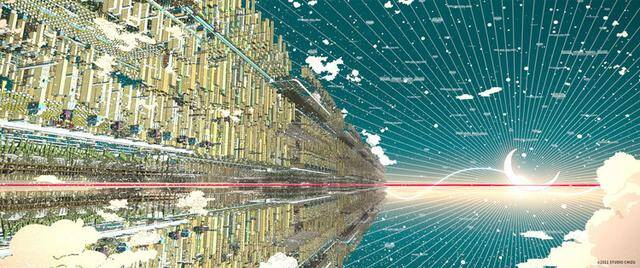

# 元宇宙世界观电影《雀斑公主》即将上映 发布元宇宙“迎新”狂想曲

知名动画导演细田守执导的最新力作《雀斑公主》8月26日即将登陆全国院线，今日奏响元宇宙”迎新“狂想曲，邀你重启另一个世界的大门，U世界设定曝光，科幻又不失浪漫，大片气质显露。

电影《雀斑公主》围绕一位名叫小铃的十七岁女高中生展开，自幼失去母亲的她和父亲相依为命。小铃原本最喜欢和母亲一起唱歌，但随着母亲意外过世，她就再也不唱歌了，也在不知不觉间与父亲产生了隔阂，渐渐地不再向现实世界敞开心扉。一次偶然，小铃以“贝儿”的身份进入了虚拟世界U，她凭借动听的歌声成为了U世界里的大明星，但一个神秘人物的突然出现打乱了贝儿万众瞩目的演唱会，以及她现实社会中平静的生活。

今日发布元宇宙狂想曲，，一首歌带我们进入想象力爆炸的虚拟世界”U“。将元宇宙世界观和故事内核进一步揭秘，青春动画大片超出期待新突破。高楼迭起，大厦林立。各个角色造型各异，服装多样，在U世界中自由飞翔。贝儿身着一袭红裙，站在鲸鱼背上高歌。巨型鲸鱼也悬浮在空中，承载着音响设备，彷佛一座巨大的舞台，在50亿观众舞台上纵情欢唱。

影片为将“U”这个全球性的世界变得更有说服力，更是集合了全球的人才：迪士尼的Jin Kim来设计主要人物贝儿，他因作为《冰雪奇缘》中的角色设计而闻名；英国知名建筑师Eric Wong创造了U世界；以及动画师汤姆·摩尔（Tomm Moore）的爱尔兰Cartoon Saloon工作室倾情加盟，共同打造了每一帧都是壁纸的顶级大片巨制，独特的科幻视角也彰显了国际动画电影制作水平的新高度。

目前，电影《雀斑公主》在烂番茄网站上已取得95%好评率，收获了来自《好莱坞报道者》《每日电讯报》等权威媒体的影评人对电影和主创的高度评价。电影《雀斑公主》由细田守编剧和执导、日本地图工作室制片，主要配音演员包括中村佳穗、成田凌、染谷将太、役所广司与佐藤健等，中国电影集团公司进口，中国电影股份有限公司发行、译制，将于8月26日在中国大陆上映。
