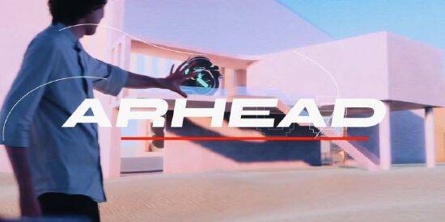

# 元宇宙构建平台Arhead 推出世界上首个XR真人秀节目“W3RLDS”

近日，元宇宙构建平台Arhead宣布推出世界上首个 XR 真人秀节目“W3RLDS”。

据了解，Arhead 是一个供内容创作者将创意内容货币化的虚拟世界构建平台。W3RLDS节目将联合 Web3 市场的 15 位世界顶尖人才，包括视觉艺术家、音乐家、开发人员等，通过该公司的生态系统构建沉浸式的元宇宙世界。

Arhead 将运行三个月的电视节目，直到元宇宙总决赛开幕。该节目的一些参赛者包括：

- Chiko Roko：一个为 NFT 玩具开发角色艺术品的平台；

- Scazy：一个由 Metazorian 构建的化身，结合了物理和数字特征；

- Enuriru：AR 艺术家与 Meta 和 Snapchat 合作；

- Laya Mathikshara：一位 14 岁的数字艺术家，其 Origin 数字艺术由美国太空和航空公司 SpaceX 在太空中发布。

据悉，W3RLDS 可以通过易于使用的平台创建数字空间，该平台为内容创建者和开发人员提供沉浸式工具包，并在不久的将来设置更高级别的复杂性和功能。Arhead W3RLDS 还将为粉丝提供具有AR 和 NFT 的数字空间。

消息传出之际，多家XR 公司利用沉浸式企业来促进与观众和 Web3 开发人员的互动，知名品牌、项目、公司甚至政府都在探索元宇宙在未来活动中的潜力。

许多音乐家和艺术家也加入了元宇宙，包括 Snoop Dogg、22Gz、MUSE、Steve Aoki、Ariana Grande、Justin Beiber 等，通过 VR 头显和顶级元宇宙平台（如Decentraland和 The Sandbox ）娱乐观众。
