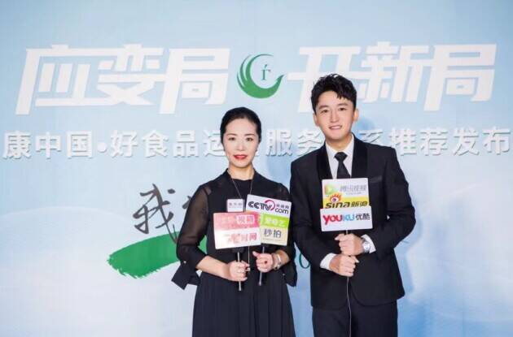

# 中国好食品布局全球市场，元宇宙生态全面启航

近日，中国好食品与晋莱科技、贝塔驱动元宇宙实验室就共同搭建全球元宇宙生态战略签约仪式，在北京(王府井)中国好食品总部举行。

“中国好食品”课题项目及运营服务体系是由中食协营养委员会功能性食品研究发展中心，中国世界贸易组织研究会农产品与食品流通促进(边贸)专业委员会等部委、协会共同倡导组建。

“中国好食品”定制评荐交易会组委会是国内对营养功能性食品做营养功能化论证评荐的权威机构。依托国家军事医学科学研究院、国家疾控中心、农科院、食药监局、中食协营养委功能食品研究发展中心、中国食品发酵工业研究院、微生物研究院等机构的专家，对企业产品进行论证评荐，通过论证评荐的产品，正式书面通知并发证、授牌，增加可信度，提升品牌价值。

民以食为天，食以安为基，安以数为根。“食品安全数字化管理体系”已成各界共识，安全需要数字来量化，要以消费者的真实感受反馈为依据。如何利用数字化技术让中国好食品走进更多的家庭，借助全新的元宇宙科技，让消费者的感官独特起来，让产地体验层次丰富起来，可以跨时空联动起来，是中国好食品元宇宙重要战略布局。

首先，“中国好食品”要让品牌IP更有张力和想象空间，通过数字化技术赋能好食品基地、民族品牌、大健康产品等，将其上链打造为数字藏品，用户可利用XR+3D实时渲染技术在元宇宙品牌展馆内观看产品的生产过程，了解品牌背后的故事，了解相关展馆和文化精粹，同时选购产品，而品牌方借助这种形式被更广大的民众所了解认知。

其次，“中国好食品”还将把传统文化与时尚潮流相结合，打造新时代的国潮元宇宙，用最先进的技术讲述中华老字号的民族品牌故事，用时尚的方式展现最原始的民生，用最具有想象力的产品让品牌故事灵动起来。

在未来，“中国好食品”也将战略携手晋莱科技、贝塔驱动元宇宙实验室专注于文创文旅。以北京王府井总部基地为核心、将全国各地方的5A景区、非遗特产、博物馆、艺术馆自身IP进行数字化运作，强化元宇宙地方场馆的运营和当地特色品牌融合，实现文创的数字化多元体验。
