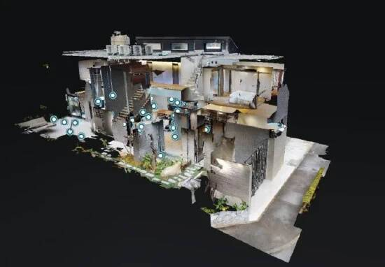
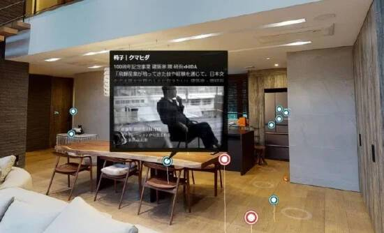

# Livin推出“元宇宙房展厅”服务 在VR中预览和比较房屋

日前，Livin 推出“元宇宙房展厅”服务，让用户在 VR 中预览和比较房屋。

据了解，Livin 是一家为住房相关公司和消费者提供网络匹配服务的公司，其经营着一个房地产服务比较网站“ LivinMatch ”。

据悉，元宇宙房展厅服务通过高质量的 4K 数字拍摄现有样板房和建筑物业的内部，用户可以查看已创建为数字孪生体的 VR 样板房，创建虚拟空间中的副本。用户无需VR 头显即可浏览网站或查看 VR。数字孪生采用了美国 Matterport 公司的空间数据数字合成处理技术。

通过这项服务，用户可以在任何地方一目了然地比较和考虑房屋建筑公司。同时不需要建造新的展厅，不仅现有的样板房，而且已经完成的房产都被拍照并张贴在元宇宙房展厅上。用户还可以在 VR 模型屋中插入文字和视频，并发布功能和性能等详细说明。

使用数字孪生技术在房地产行业中使用 VR 和 AR 的例子很多，例如使用 VR 观看房地产和使用 AR 提供建筑图像。
