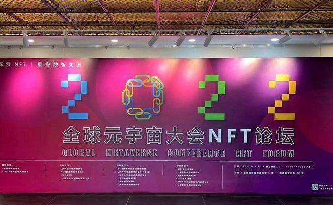
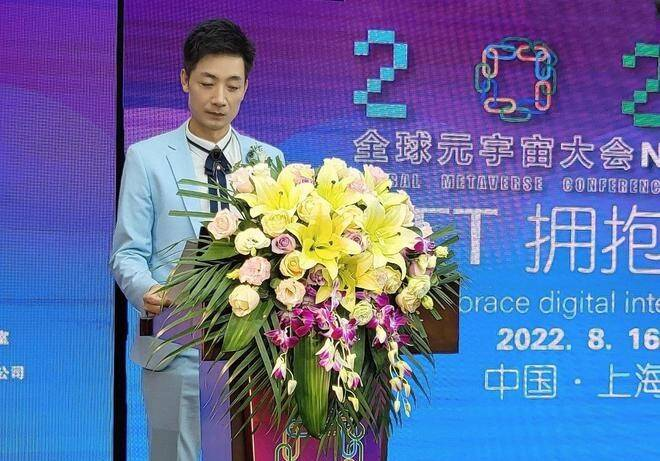
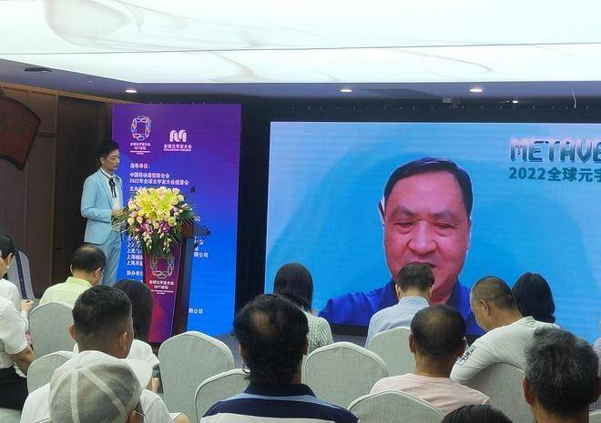
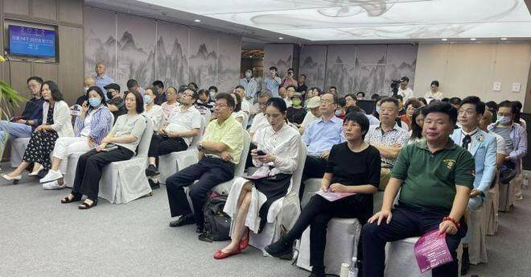
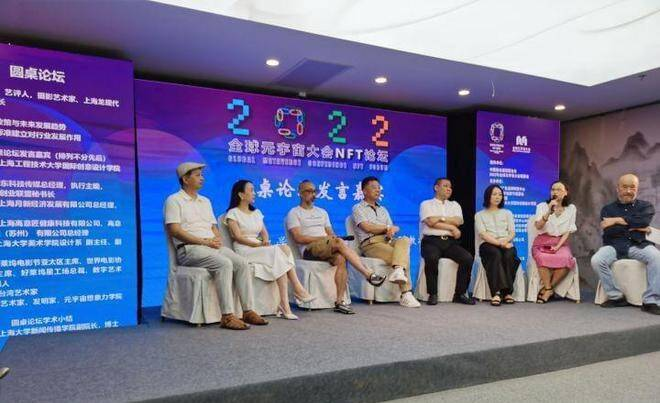
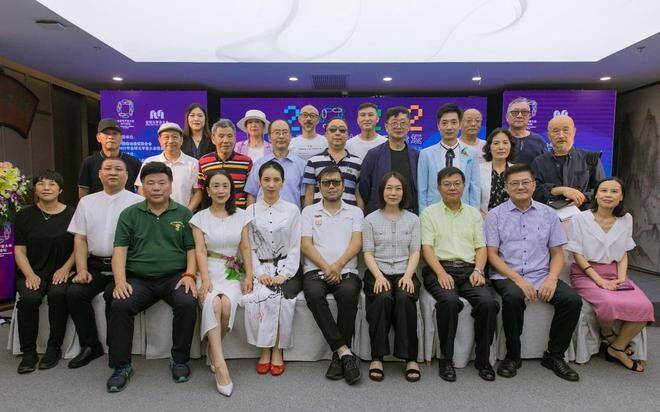

# 2022全球元宇宙大会NFT论坛在上海成功举行

数字赋能生机无限，数字经济带给了我们更好的未来。近期，NFT和元宇宙接连成为大热话题，而关于NFT产业的相关政策相继出台，为业界和学界关注NFT产业，探索发展新模式、新业态、新领域提供了政策引导。

2022全球元宇宙大会NFT论坛现场大幅海报

8月16日下午，由中国移动通信联合会、2022 年全球元宇宙大会组委会指导，上海大学广告品牌研究中心、ECI 国际数字创新节组委会、华东科技传媒、上海工程技术大学国际创意设计学院联合主办的“2022全球元宇宙大会NFT论坛”于8月16日在上海城隍庙新藏宝楼隆重举办。

会议特别邀请到了国家开放大学杰出校友、著名歌手、节目主持人王国权担任主持。

著名节目主持人王国权主持2022全球元宇宙大会NFT论坛

本次论坛以习近平总书记在“2021年世界互联网大会”关于开拓数字文化产业蓝海的重要指示精神为指导，围绕上海市人民政府在《上海市数字经济发展“十四五”规划》中提出，上海将在“十四五”期间培育包括数字内容、数字贸易在内的数据新要素为契机，以“探索NFT，拥抱数智文创”为主题，聚焦元宇宙、NFT、数字藏品、数字经济、数智文创、文创基金等热门话题，旨在为数智文创发展建言献策。本次论坛的初心是构建一批文旅元宇宙的“上海场景”，探索和制订若干文旅元宇宙的“上海标准”，用以对元宇宙博物馆展陈、文物收藏、非遗再生、数字藏品、数字资产交易、产业创新等切入，以虚强实、技术赋能，用数字化推动文旅深度融合发展，提升文旅新体验；以及为数字藏品和数字资产交易的先行先试做理论与实践的探索。

中国移动通信联合会执行会长、2022 全球元宇宙大会主席倪健中致辞

中国移动通信联合会执行会长、2022 全球元宇宙大会主席倪健中，中国移动通信联合会副秘书长、全球元宇宙大会秘书长谢安娜、上海大学广告品牌研究中心理事会理事长、上海大学传媒政策研究中心主任、博导教授、学科带头人郑涵出席论坛并致词。

2022NFT论坛现场嘉宾云集

针对全球元宇宙大会在上海举办之际，作为大会的重要载体NFT论坛特别荣幸邀请到了业界重量级人物及知名学者，包括上海大学品牌研究中心主任郜明教授、品牌数字化联盟-首届主席APEN 阿笔老师、上海标准化服务中心主任李德伟先生、上海大学 NFT工作室主任Philipp Lin教授、上海优迦文化传播有限公司 CEO黎音女士进行精彩的主题演讲，他们研究解读了NFT等资产数字化、数字IP全球化流通、数字化与品牌营销，以及数字确权保护等相关业态在上海先行先试的布局。

此外，率先在上海大学落户的全国高校首家NFT工作室，致力于洞察web3.0新浪潮中NFT带来的的变革性机会，上海大学NFT工作室将与行业工作室、外部专家共同探索NFT，凝聚新媒介共识，一起定义“中国NFT”。

NFT论坛还云集高校、企业知名嘉宾，邀请参与圆桌论坛环节的有：上海龙现代艺术研究院院长周兵、上海工程技术大学国际创意设计学院副院长顾艺、华东科技传媒总经理李岩、上海月新经济发展有限公司总经理杨立柱、上海高意匠净水科技有限公司张小平、上海大学美术学院设计系副主任汪宁、台湾艺术家周子荐等，他们从不同维度共同探讨NFT当下政策与未来发展趋势，以及NFT 通用标准建立对行业的影响。

2022全球元宇宙大会NFT圆桌论坛

通过本次论坛，上海九颂山河股权投资基金管理有限公司、上海大学广告品牌研究中心NFT工作室等单位发起成立NFT文创基金倡仪，加强NFT创作者和企业、机构与政府部门、企业品牌的联系和合作，搭建艺术品NFT孵化领域开发支持平台，同时还设立NFT探索奖、NFT创业孵化基金、NFT投资基金，以此来探索和推动NFT在中国的标准化健康发展，也将助力更多艺术家铸造中国特色NFTs艺术作品，与世界分享中国艺术的精彩，谋求为品牌数字化转型赋能，在创造和积累企业数字资产的同时，共享上海的海派文化魅力。

会上，全球元宇宙大会 ·上海站组委会副主席、ECI國際數字創新節影視創新委員會主席、爱国华人陈香梅展览馆筹备委员会执行主任、元宇宙供应链有限公司副董事长樊勇新 ，就筹建“爱国华人陈香梅展览馆”，推进实施国家文化数字化战略作了介绍。他说，陈香梅是著名爱国华人、著名侨界领袖、社会活动家、一生非常热爱和平，为中美两国和世界各国人民的友好、改善海峡两岸的关系等作出了杰出的贡献，陈香梅生前留下珍贵的资料和物品、旗袍、政要信件、名人字画、艺术品，将其相关藏品制作成数字化产品，如：数字画作、图片、音乐、视频、3D模型，发行纪念邮票和纪念币等，通过探索和创新数字藏品资产化，以跨媒介、跨领域、跨时空、跨文化的整合形式，推进国家文化数字化发展进程。

论坛部分嘉宾合影留念

会上，由上海大学广告品牌研究中心理事会理事长，上海大学传媒政策研究中心主任，博士生导师， 学科带头人郑涵教授、上海大学品牌研究中心主任郜明教授，向受聘人颁发上海大学广告品牌研究中心 NFT 工作室专家证书。

本次论坛以线上直播和线下交流相结合的方式举行，本次论坛的成功举办，推进了上海市在数字资产领域的探索，它必将为上海数字经济发展起到推波助澜的作用。
