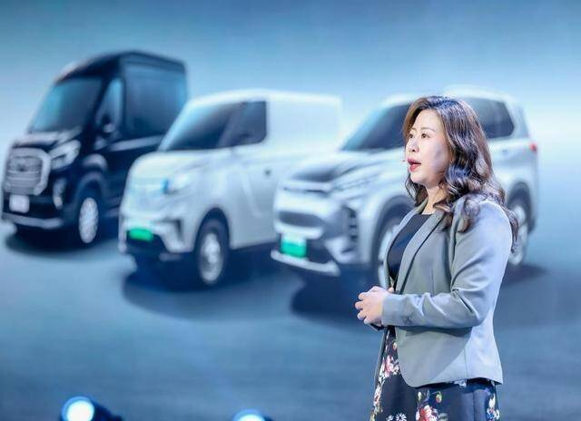
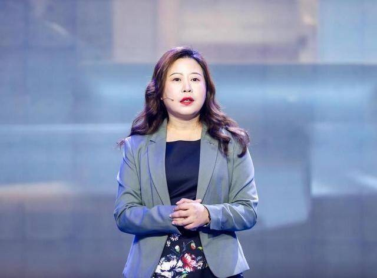

# 稳步推动数字化转型，上汽大通开启元宇宙之旅

时至今日，元宇宙的概念早已打得火热。那么放到汽车领域，元宇宙到底意味着什么?是新风口?是营销手段?还是与用户交流的新方式？不同回答的背后，是车企们对于元宇宙玩法的不尽相同。而上汽大通作为“中国汽车定制专家”，率先将C2B大规模个性化定制模式引入到了汽车行业，通过“蜘蛛定制”平台和用户直连，将个性化定制汽车带给更多消费者，这正是元宇宙的核心概念所在。

上汽大通副总经理华瑾女士

2021年11月19日，广州车展上，上汽大通发布了一款全新新能源车型MIFA 9。2022年5月9日，一台瑞雪青加黑色双色车顶专属配色的上汽大通MAXUS MIFA 9缓缓驶下生产线，这也是全球首台正式交付用户的全尺寸豪华智能纯电MPV。6月29日，全尺寸豪华智能纯电MPV上汽大通MAXUS MIFA 9震撼上市，MIFA 9全系共发布森林六座版、高山六座版、高山旗舰版三款“人人都是VIP”的六座系列，及绿洲七座版、草原七座版、森林七座版、高山七座版四款七座系列。七款车型售价区间为27.99-41.99万元，用户还可通过“蜘蛛定制”自由选配，定制独属于自己的Dream car。

实际上，MIFA 9是MIFA品牌的首款车型，MIFA是上汽大通MAXUS下面一个全新的专属新能源品牌，代表着上汽大通新能源的发展方向。这个品牌有两大特点，第一就是在研发之初，用户就参与到MIFA 9产品的全过程，包括从产品定义、开发、命名，到定价、配置、改进等环节，自带元宇宙性质;第二就是这个品牌完全采用了上汽集团这些年自主研发的技术，包括电池、电机、电控等，以及自动驾驶技术。

MIFA是上汽大通的一个全新品牌，是新能源的专属品牌。包含MIFA 9、MIFA 5、MIFA 6、MIFA 氢在内的家族产品矩阵，并命名其中文名为“前境”，意为一路向前、渐入佳境。肩负对绿色未来的无限使命，“前境”将以更丰富的产品阵容，陪伴用户探寻更美好的风景。上汽大通MAXUS也将借全新品牌不断夯实“全球发达国家首选中国车”的领导者地位，引领中国汽车品牌进阶向上。

其实，上汽大通在新能源领域的技术、研发、销售做得比较早，在国内的细分市场，以及在以欧洲为代表的出口市场均将产品力做到了领先水平，取得了出色的成绩。在双碳目标下，在大的政策背景、环境和生活的需求下，纯电动新能源为代表的产品、市场与用户需求，将进入一个新的高度。因此，上汽大通推出了全新的MIFA品牌，代表着上汽大通在新能源战略的决心和规划。

在上汽大通内部，已经成立了更系统、更全功能的MIFA事业部，从产品定义、技术研发，到渠道销售等方面都会由事业部来统一打造，更系统、更专项地集成和运用整个公司的资源。

众所周知，新能源化是行业的大势所趋，对于上汽大通MAXUS而言，MIFA品牌将是新能源的全新品牌。但基于产品特征与用户的使用场景，在接下来的5到10年内，上汽大通将持续传统能源+新能源双赛道并行推动。

未来上汽大通将加速推进电动化，特别是MIFA品牌，但是在MAXUS品牌下，上汽大通也会有传统能源产品推向市场，这与当前的细分市场和客户需求密切相关。在未来，纯粹的内燃机或许会消失，但随着内燃机效率的提升与技术的进步，混合动力依然会与纯电、氢燃料电池出现在不同市场，根据不同产品会有不同选择。另外，在2025年，上汽大通MAXUS的新能源销量占比要超过40%，相信后续比例还会进一步提高。

上汽大通副总经理华瑾女士表示，经过多年耕耘，上汽大通已经形成了欧洲市场、澳新市场、南美市场、中东市场和东盟市场五大核心市场，其中，在欧洲、澳新、南美三个重点市场，上汽大通MAXUS都成为了当地细分市场中国车企出口的代表品牌，包含在南美市场的皮卡，欧洲市场的新能源产品，挪威的纯电动MPV，英国的纯电物流车等。特别是在2021年市场缺芯的情况下，依然在海外市场取得了1-10月同比增长142%的成绩，这还不包括很多海外定单来不及交付。

后疫情时代，上汽大通的海外战略与国际化战略将更为关键。因此接下来推出的每一款产品，都将拥有国际版本，像MIFA 9便有欧洲车型同步发布。当上汽大通的产品在开发之初，便将欧洲的五星碰撞标准作为必须达到的标准。

此次发布的MIFA 9，无论是三电技术，还是智能辅助驾驶和智慧座舱，都集成了上汽大通在技术领域的最新成果。通过国内独创的友道智途和上汽大通的深度贯通模式，可以发挥两方的优势，其研发技术可在上汽大通MAXUS产品上快速落地。

其次，上汽大通还建立了全栈自研的核心算法能力，融合应用其“L3与L4自动驾驶”以及L2++智能驾驶辅助系统的解决方案，赋能上汽大通全系产品，为细分市场用户带来最佳智驾体验。

新发布的MIFA 9搭载的MAXUS–Pilot可实现高阶智能驾驶，完成点对点的辅助驾驶，全程智能控速、自动超车、进出匝道，在高速上肆意驰骋。市面上现有的“Pilot”驾驶辅助系统功能，MAXUS –Pilot都已实现。MIFA内置窄路通行模块，轻松应对胡同弄堂场景与停车。随心泊车则可以时刻扫描、监控车辆周围150平方米的环境，无论有没有停车线，只要捕捉到了足够大的空间，就能帮用户把车停好，停车方便，一步到位。

元宇宙是未来发展的趋势，而数字化则是元宇宙发展的重要一环。上汽大通通过数字化平台以及线下工厂的配合，全面打通从销售、制造、运输与售后过程的数据链，实现与用户的数字化直连，为消费者带来更多定制化产品。而上汽大通副总经理华瑾女士也表示，这只是上汽大通践行数字化的第一步，未来上汽大通将会持续拥抱数字化转型，创造元宇宙出行新方式。
