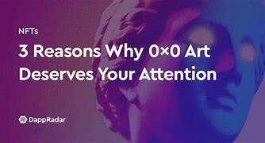

# 0x0 Art

完整描述:0x0艺术是基于人工智能的数字艺术创作、标记化、复制和认证服务、提供商。我们为艺术家提供基于ai的工具来创作原创数字艺术，将其原创数字艺术进行代币化转售，将其原创数字艺术复制用于其他目的，并为我们的用户已经创作和代币化的原创数字艺术提供认证服务。我们基于人工智能的服务允许用户从用户提交的文本中创造独特的艺术，使艺术家有可能探索他们的创作努力，而不是技术方面的

- 0x0艺术NFT是以太坊上10000个NFT的集合。
- 拥有0x0 ART NFT允许持有者通过其NFT的数字和物理版本获得被动收入。
- 持有0x0 Art NFT授予所有者免费将其NFT转换为一个或多个高质量印刷品的特权。
- 人工智能支持的平台可以根据文字制作艺术品。
- 公共造币于2022年6月29日开始。

0x0艺术NFT是10000个NFT的集合，授予持有人其数字和物理格式的版税。人工智能支持的数字艺术平台允许用户发行有限数量的原始NFT艺术品的认证物理副本。此外，0x0艺术NFT的持有者可以从二级市场销售中获得版税。

