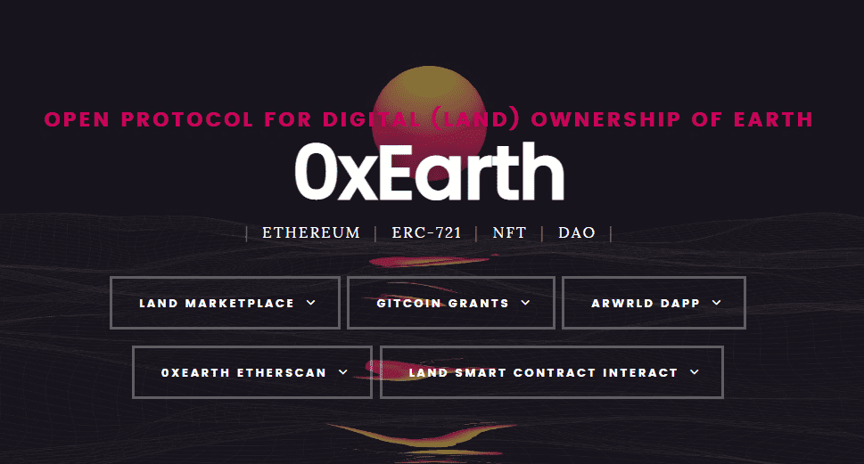

# 0xEarth

**你的土地**

> 把地球带到区块链

> 0xEarth将世界分成大约~(1英亩或4045平方米)的区块，为每个区块生成一个独特的不可替代的代币。意思是1中的1个唯一所有权。买你想买的房子所在的土地，甚至是你认为可以产生高租金价值的土地!

> 每一块土地都可以提供直接的收入流。您可以选择允许其他人以您决定的价格租用您的土地，同时始终保持所有权。

**完全去中心化的代币化土地。**

你的土地 将地球带到区块链0xEarth将世界分解成大约约（1英亩或4045平方米）的块，为每个块生成一个独特的不可替代令牌。意味着 1 个唯一所有权中的 1 个。购买您房屋所在的土地，您提议的土地，甚至是您认为可能在租金需求中产生高价值的土地！每个 LAND 都可以提供即时收入来源。您可以选择允许其他人以您决定的价格租用您的土地，同时始终保持所有权。完全分散的标记化地球之地。

