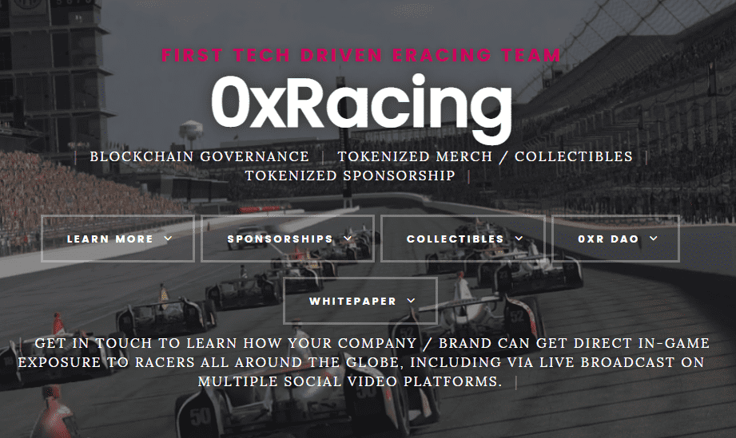

# 0xRacing

《0xRacing》是电子竞技、模拟赛车和赛车运动的交汇点。《0xRacing》正在以太坊区块链上通过DAO结构建立一个电子竞技模拟赛车团队。

网址：https://0xracing.github.io
            https://github.com/0xRacing/Whitepaper

虽然我们有一个更大的愿景和路线图，但我们一开始的核心焦点是电子竞技/模拟比赛赞助机会的代币化。目前的电子竞技机会依赖于内容创作者的视频/流媒体来传播品牌知名度。通过全球在线模拟赛车，品牌可以直接在赛车上传播知名度，就像在现实生活中一样。这不仅为视频/流媒体的观众带来了曝光度，而且可以直接接触到游戏中的世界各地的玩家。经常可以看到你与一些最优秀的职业车手比赛

0xRacing刚刚启动了动态ERC-721令牌0xR。此令牌捕获整个团队的赞助机会，然后在赞助期结束时转换为赞助证明令牌。我们最初的代币已经在DAI的OpenSea上上市了!

**第一个开放治理电子赛车队**

> 使用以太坊上的DAO，0xRacing是第一个开放治理赛车队。标记化投票，以添加新的驱动程序，发布新的商品和收藏品，并启用赞助机会。基于区块链意味着任何人都可以加入，而无需任何人的许可。

> 以太坊被吹捧为互联网的货币（最近一次是#DeFi运动）。将电子赛车团队的运营与互联网的新资金融合在一起，创造了前所未有的新自然机会。

> 在发布时，0xRacing将从多个车手开始参加电子赛车/电子竞技的顶级比赛。大多数主要的电子竞技平台都无法提供游戏内品牌推广机会。eRacing使每个车手能够在他们运行的每场比赛中使用自定义涂装，在0xRacing DAO下，这些涂装是标记化的。这意味着任何人都可以购买直接的游戏内/赛中赞助。开放前所未见的品牌知名度。

