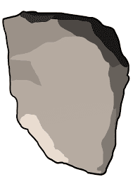

# 100 Immutable Rocks

EtherRock 于 2017 年推出，是以太坊区块链上首批加密收藏 NFT 类型的项目之一，在 CryptoPunks 之后不久推出。 只能获得 100 块岩石，而且每块新的原始岩石都变得越来越贵。 4 年后，岩石开始支持 ERC-721 标准，迁移到 Immutable X Network 并……转了 180 度。
这些虚拟岩石除了可以被带走和出售之外没有任何用途，并且让您对成为游戏中仅有的 100 块岩石中的 1 块的拥有者感到强烈的自豪感 :)

