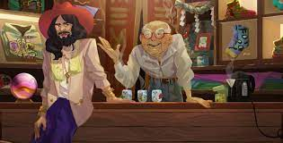

# 10KTF

世界知名工匠Wagmi San，以最精美的配饰而闻名，最近在新东京开设了一家名为10KTF的商店。
根据一天的不同，Wagmi San 可能会为 Apes、Cats、Robots、Loots 制作配饰……这完全取决于他的心情。 一个有荣誉感的人，他只为拥有父 NFT 的客户制作对象。 他的配件是 1 个只能创建一次的数字对象之一。
生活很好 但他仍然需要支付保护费才能让他的商店继续营业。 它比替代方案更好。 在去年夏天发生的事情之后，他不能让这种事情再次发生。

# 什么是空白

空白是由 Wagmi-san 制作的数字物品，可以带回他的商店，变成带有您想要的父 NFT 艺术的最终成品。 想要的父 NFT 必须是 10KTF 支持的集合，并且您必须在与空白相同的钱包中拥有父 NFT。

