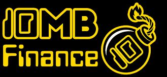

# 10mb Finance

10mb Finance 是在 Cronos 网络上与 1/10 USDC 挂钩的算法稳定币协议！
# 挂钩通过两种不同的方法进行维护：
1.铸币税，类似于 Tomb、Dark Crypto 和其他分叉，以及

2.分数抵押，有铸造和赎回，类似于 Frax 和 Iron Finance
10SHARE 代币是 Tomb fork 和 Iron Finance 部分的治理代币。 10mb 是挂钩令牌！

.png)

这个系统是同类中的第一个！我们对代币经济学、货币政策、交易税和预售分配做出了具体决定，以最大限度地提高系统的可持续性。

我们希望 10SHARE 代币的双重功能能够弥补两个组件系统的弱点。在许多情况下，Tomb 分叉的粘合机制并不能很好地恢复钉子。Iron Finance 的铸造和赎回系统应该会增强 Tomb 系统重新挂钩的能力。

Iron Finance 系统的主要根本弱点是其治理代币没有内在价值。因此，在赎回期间结合价格预言机问题，其价格很容易跌至零。然而，由于 10SHARE 池发出可赎回的 10mb，它将具有内在的价值来源，不应像 Titan 那样降至零。

由于该协议不断铸造 10mb 直到价格低于挂钩，因此对铸造系统进行了一些修改以提高抵押率。10mb 的赎回价值总价值为 0.1 USDC 的代币，但当 10mb 价格高于挂钩时，铸币价格会上涨。铸币价格的涨幅略低于现货价格，当 10mb 价格高于钉住价格时，这应该会成为向国库添加资金的动力。

