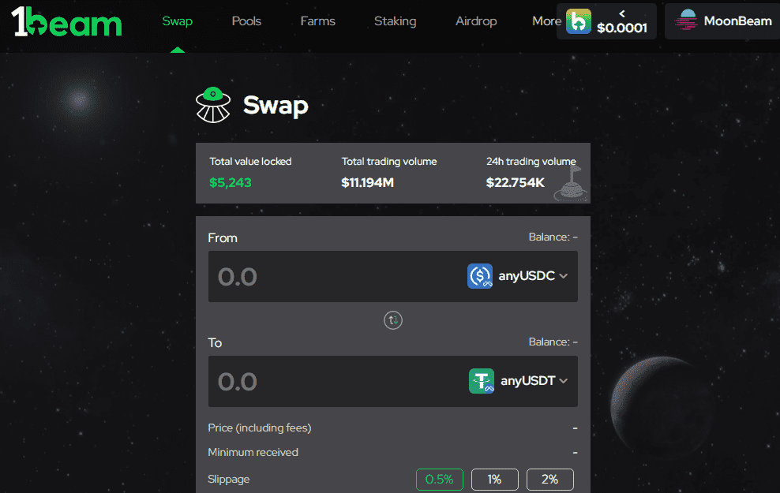

# 1Beam

1Beam正在月光生态系统上构建一个去中心化的应用生态系统。

我们的主要产品是1Beam stableDEX，这是一个去中心化的稳定币交易所，它允许用户以0.04%的互换费和接近零的滑移率高效地交换稳定币和挂钩资产 流动性提供者可以通过向基础流动性池提供资金来赚取利润。流动性提供者通过种植LP代币或通过持有代币获得1Beam代币(1Beam美元)奖励。

 1Beam是一种自动做市商(AMM)类型的去中心化交易，用于在<强>的稳定币之间进行交换

​    **什么是归属？**

- 1BEAM奖励将授予90天。您可以在以下位置找到您的归属奖励[质押](https://1beam.io/staking).
- 归属1BEAM也将以与1BEAM抵押人相同的方式获得协议费用（在任何DAI中）。
- 提前申索将收取50%的罚款，该罚款将分配给1BEAM储物柜。
- 

