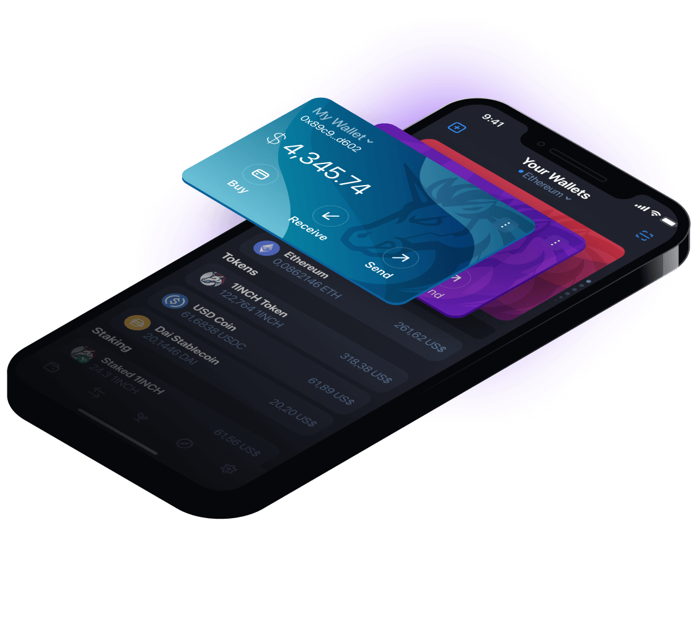

# 1inch Network

**1inch 网络结合了去中心化协议，其协同作用使 DeFi 空间中最有利可图、最快和受保护的操作成为可能。**
 1inch Network 的初始协议是一个 DEX 聚合器解决方案，可以搜索多个流动性来源的交易，为用户提供比任何单个交易所都更好的价格。该协议包含 Pathfinder 算法，该算法在 Ethereum、BSC、Polygon、Avalanche、Optimistic Ethereum、Arbitrum、Fantom 和 Gnosis 链上的 200 多个流动性来源中找到不同市场之间的最佳路径。在短短两年多的时间里，1inch DEX 聚合器已达到 100 万用户，仅在以太坊网络上的总交易量就超过了 140B 美元。

1inch 聚合协议促进跨多个流动性来源的经济高效且安全的掉期交易。
1inch Liquidity Protocol 是下一代自动化做市商，可保护用户免受抢先攻击，并为流动性提供者提供有吸引力的机会。
1inch 限价订单协议促进了 DeFi 中最具创新性和灵活性的限价订单交换机会。该协议的特性，例如动态定价、有条件的订单和额外的 RFQ 支持，支持各种实施，包括止损和追踪止损订单，以及拍卖。
1inch Wallet 是一个多链移动平台，提供易于导航的界面，具有安全存储、交易和质押功能。这款多功能钱包是从头开始构建的，旨在简化与 1inch 功能的交互。

