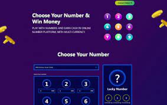

# 1x900

# 什么是 1x900？ 怎么玩？

什么是 1x900 是一款基于区块链的公平数字游戏。 玩家可以投注 1-9 范围内的任意随机数，成功尝试可获得 900% 的奖励。

<ul>
   <li>使用元掩码或钱包连接选择要连接的网络。</li>
   <li>我们支持多种网络，如BINANCE SMARTCHAIN（BSC）、AVALANCHE CHAIN（AVAX）、POLYGON CHAIN（MATIC）、TT（THUNDER CORE CHAIN）、FANTOM OPERA（FTM）。</li>
   <li>选择您喜欢的幸运数字，并在所选幸运数字下方输入您的投注金额。（总金额应大于最低投注金额，您可以投注任何数字，最少1个数字，最多1个数字一次）。</li>
   <li>点击“立即投注”。</li>
</ul>

