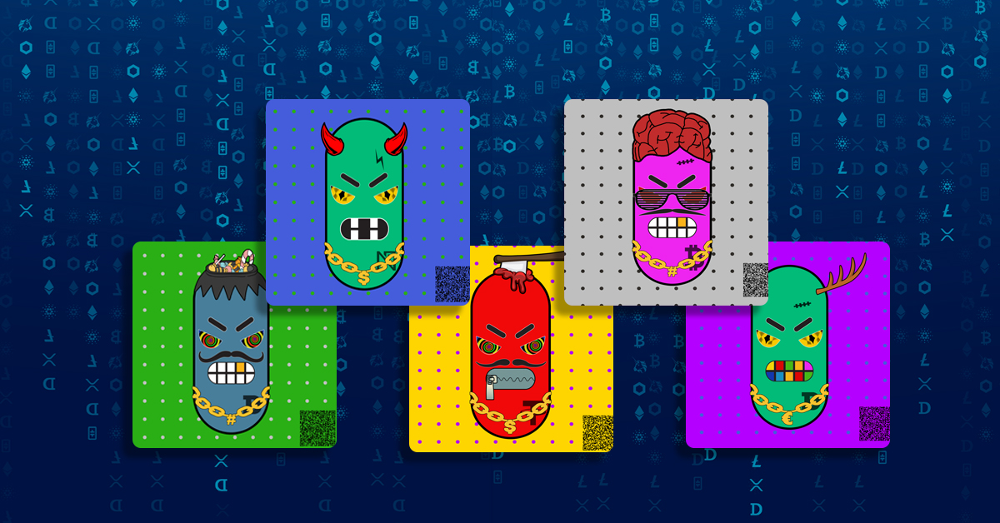
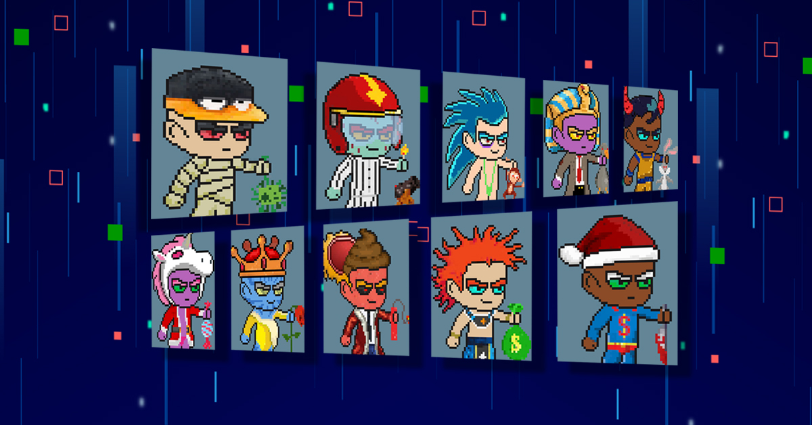

# 1xNFT

在 1xNFT，我们对一种称为不可替代代币或 NFT 的全新数字商品感到兴奋。NFT 具有令人兴奋的新特性：它们是独一无二的、可证明稀缺的、可交易的，并且可在多个应用程序中使用。就像实物一样，您可以随心所欲地使用它们！ 

1xNFT 使用NFTify平台，我们很自豪能够率先在[NFTify](平台上推出 10k NFT 愤怒的豆子系列。1xNFT 市场支持币安智能链，因此所有 1xNFT 集合都在币安智能链区块链上。

**Angry Beans**是 1xNFT 平台上的第一个 10k 合集。每个 Angry Beans NFT 都是以编程方式生成并由独特的组合组成。

**Crypto Guys**是一个有限的 NFT 像素艺术收藏 10000。每个 Crypto Guys 都以自己的方式独一无二，具有 170 种不同的特征，包括皮肤、衣服、眼睛、头部、嘴巴和物品。

**Crypto Guys有多少特征？**

Crypto Guys 在 1 个背景、8 个皮肤、43 件衣服、6 个嘴巴、20 个眼睛、50 个头、40 个右手物品和 2 个特殊左手中共有 170 个特征。 

Angry Beans and Crypto Guys 是 Binance smatchain 区块链上的 ERC-721 代币，元数据托管在 IPFS 上。不用说，他们制作了一张可爱的头像

