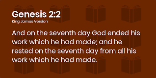

# 2+2 Genesis

2+2 是 NFT 领域第一个真正诚实的项目。&nbsp; 我们不是来交换狗和猫的照片，并假装我们这样做是为了“艺术”。

2021 年 11 月 3 日，二加二社区铸造了他们的第一个 Genesis NFT。NFT 建立在以太坊区块链上，成本为 1ETH。二加二是一个独特的铸币厂，因为其价值并非来自提供未来的 P2E 或模仿的个人资料图片。价值来源于社区，在这里您可以找到通往 web3.0 的门户

# **将军厅**

持有 Gen 1 NFT 可以让您独家访问充满志趣相投的人的不和谐。Discord 小组名为 Gen Hall，其社区决心在web3.0的各个方面取得成功你就是你身边的人，沉浸在二加二社区中，你可以利用你在区块链上的经验。

加密还处于早期阶段，并不是每个人都有机会与朋友或他们的家人谈论令人困惑的加密世界。二加二将军馆张开双臂欢迎您。内部成员正在建立并利用 Gen Hall 提供的联系。

.png)
