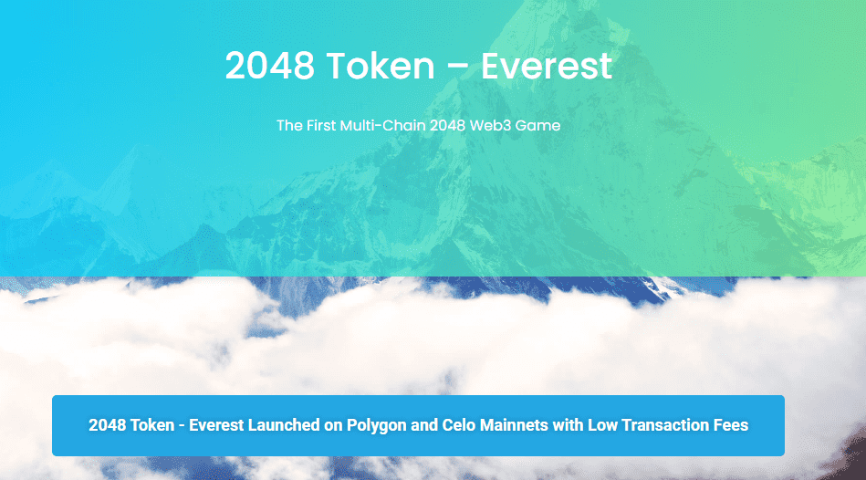

# 2048 Token - Everest

2048令牌-珠穆朗玛峰是世界上第一款可玩可赚的web3多链2048游戏。游戏是基于由Gabriele Cirulli创造的最初的2048网页游戏，但改编为区块链(目前Polygon和Celo主网)作为web3游戏。玩家的信息，如高分，等级，回合等保存在区块链。玩家可以通过保存区块链会话获得2048个token。现在你可以在全球2048名玩家中玩和排名，同时挖掘2048代币!

当前所有关卡的挖掘率都被有意设置得很高，以奖励早期玩家。在接下来的15个月里，合同规定每3个月降低一半的费率!所以，不要错过早早加入并赚得更多的机会。

早期访问版本还允许您邀请朋友(在他们注册期间使用您的ETH地址作为推荐地址)，并获得额外的2048代币。推荐的人越多，你赚的代币就越多。

#### 您可以在注册期间邀请朋友使用您的ETH地址作为推荐人地址，以便您获得所有推荐人获得的代币的额外5%。目前所有级别的挖矿率都被故意设定为高，以奖励早期玩家。合同中规定的费率将在未来15个月内每3个月减半！

