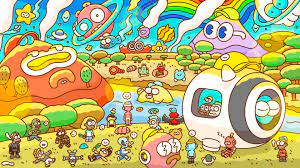

# 3Landers

3Landers 是一个以社区、冒险和协作为中心的可收藏 NFT 项目。 每个 3Lander 都作为独特的、不可替代的代币 (NFT) 驻留在以太坊区块链上，由特征和底层“DNA”的独特组合组成。 持有 3Landers NFT 让您成为 3Lander - 一个世界和社区的成员，通过合作、冒险、建设、创造和梦想建立有意义的长期联系！

## 什么是 3Landers 生物群系？

本质上，3Landers Biomes 是 3Land 已知最远区域的隐藏陆地 NFT。尽管这些 NFT 土地的确切数量未知，但每个生物群落都将包含丰富的自然资源。更重要的是，这些资源对于 3Landers 未来的冒险至关重要。要获得其中一个生物群系，您需要烧掉一个冒险包 NFT。

## 我怎样才能获得 3Landers Biomes 之一？

如前所述，您需要烧掉一个冒险包 NFT 才能获得一个生物群落。但是，您不需要持有任何 3Landers NFT 来燃烧冒险包。从美国东部标准时间 5 月 5 日上午 10 点开始，您将有超过一周的时间来领取这些生物群系。请注意，索赔过程现在正在3Landers 的官方网站上进行

完成后，您将以 ERC-721 代币的形式收到 3Landers Biome(s) 的“未公开”版本。这些生物群落将在 OpenSea 和 LooksRare 上的一个名为 3L-Biome 的新 NFT 集合中。据该团队称，Biomes 的发布日期将在 5 月 7 日美国东部标准时间上午 10 点进行。揭晓后，你应该可以在 TraitSniper 上看到这些生物群落的稀有度排名。

