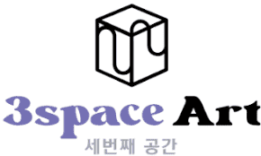
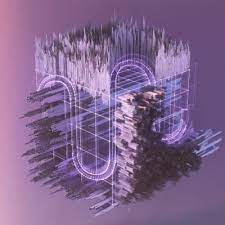

# 3space Art

3space Art 是一个数字艺术平台，艺术家和收藏家有机会在线下活动和展览中展示数字艺术。 3space 利用不可替代的代币 (NFT) 将每件艺术品与艺术家和收藏家进行身份识别，以便与分发、复制、表演、公开展示或衍生作品相关的凭证和商业收益将被授予 NFT 持有者（或创作者） .

我们的目标是通过为艺术家、项目和收藏家创造一个富有成效的空间来见面、开展自主项目并建立一个合作社区，从而在现实世界中传播数字艺术。

