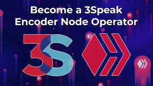
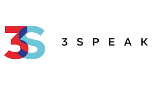

# 3Speak

**3Speak 是互联网上言论自由的大本营。**

我们之所以存在，是因为硅谷已经竭尽全力去平台化和废除个人（其中许多人拥有大量追随者），因为他们的政治信仰或他们上传的内容类型，而不是因为他们违反了任何法律。言论自由受到威胁，3Speak 热衷于确保那些违反硅谷任意规则的人有一个可以安家的地方。我们欢迎那些仅仅因为有些人不喜欢他们所说的话而被沉默、废除货币和关闭的人。我们的政策是，攻击性的能力是言论自由的基石，而言论自由反过来保护社会免于陷入混乱和内战。每个人都有权发表自己的意见，无论其他人可能会觉得它多么冒犯（当然，只要它不是煽动暴力或非法的）。我们特别欢迎那些谈论加密货币和其他对机构构成威胁的新兴技术的人。这些内容创作者中的许多人都被沉默了，因为有钱有势的组织不想受到挑战。但我们也相信选择的自由！我们也鼓励公民记者也加入我们，发布那些经常被主流媒体忽视或编造出来的内容。我们相信公民记者是未来，我们邀请他们来加入我们的公民记者计划，让您为独立新闻事业的新职业做好准备。

