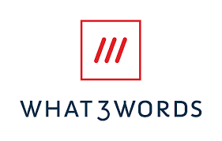
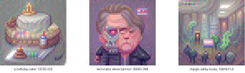

# 3Words V2

**3words是由其铸币者生成的 NFT 集合。**

作为一个造币者，你可以选择一个 3 个单词的短语，然后一个文本到图像的模型将生成网络与该提示相关联的内容。

当提交短语时，它被赋予一个属性：perplexity

因为3words困惑可以被认为是：

以前说过这句话的可能性

虽然生成高困惑度提示*非常容易，但困惑度越高，生成的图像就越像噪声，所以要小心。

也许二级市场会想要噪音？只有时间会证明一切，但现在我们知道我们喜欢像素。

