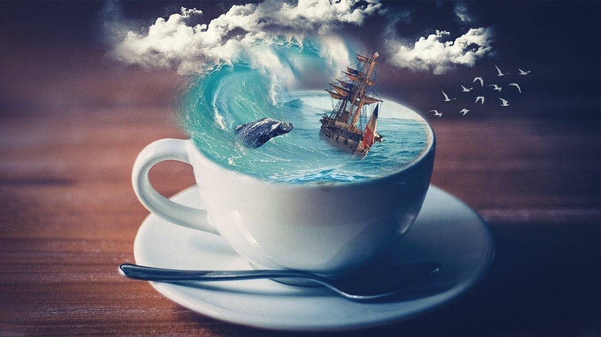

# A Cup of Sea

当您走过蔚蓝的海水和普里的金沙时，您会发现海滩嗡嗡作响，嘈杂的声音。家人站在岸边等待他们的亲人从昨晚的狩猎中归来。时髦的酒店和他们快乐的游客。骑马和骑骆驼的人带着游客在他们身上行走以谋生。有人说：“来水里洗手吧，海水会洗去你所有的罪孽”。最后，在暴风雨的天空和波涛汹涌的大海之后，还有什么比陆地的景象更吸引人的呢？食物，对吧 那么，来点茶、咖喱角和 jhalmuri 怎么样？ // 系列目前仅限于 10 件，其中 4 种内容。 ?不提供创作商业商品、商业发行或衍生作品的权利。版权归创作者所有。

